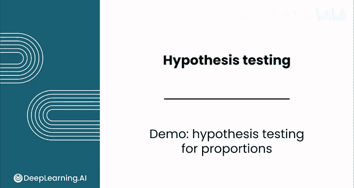

# 146：比例假设检验演示 🔍



在本节课中，我们将通过一个实际案例，学习如何对比例进行假设检验。我们将使用之前接触过的森林火灾数据集，检验“非常小的火灾”比例是否超过50%，以评估新的火灾控制措施是否有效。

## 概述

假设葡萄牙公园管理局实施了一套新的火灾控制措施，他们希望验证“非常小的火灾”（燃烧面积小于0.5公顷）的比例是否已成为所有火灾中的大多数。如果比例确实超过0.5，则说明新措施有效，达到了改善目标。我们将通过假设检验来回答这个问题。

上一节我们介绍了假设检验的基本概念，本节中我们来看看如何将其应用于比例数据。

## 数据准备与假设设定

数据集中的 `is_small` 列标记了火灾是否属于“非常小的火灾”：取值为1表示燃烧面积小于0.5公顷，取值为0则表示大于等于0.5公顷。根据本课程早先的实验分析，这两类火灾的比例看起来相对平衡。

我们的目标是执行假设检验，以判断真实比例是否确实大于0.5。

以下是需要建立的假设：
*   **零假设 (H₀):** 总体比例 p = 0.5
*   **备择假设 (H₁):** 总体比例 p > 0.5

这是一个右尾检验。

## 计算样本统计量

与构建置信区间时类似，进行比例检验也需要计算一组描述性统计量。

首先，计算样本比例。你可以使用求平均值函数，因为0和1的平均值就是比例为1的样本所占的比例。
```python
sample_proportion = data['is_small'].mean()
```
计算得到的样本比例约为 **0.478**。

接着，计算样本比例的补数 (1 - p̂)。

然后，使用计数函数计算样本量。
```python
sample_size = data['is_small'].count()
```

## 计算检验统计量与P值

与均值的假设检验类似，接下来需要计算检验统计量。请注意，比例的检验统计量公式与均值的有所不同。

你需要用样本比例减去假设的总体比例，但除以的标准误等于以下公式的计算结果：
```math
标准误 = \sqrt{\frac{p_0 \times (1 - p_0)}{n}}
```
其中，p₀ 是假设的总体比例（此处为0.5），n 是样本量。

检验统计量（Z值）的计算公式为：
```math
Z = \frac{\hat{p} - p_0}{标准误}
```
计算得到的检验统计量约为 **-1**。这意味着样本比例大约比假设的总体比例低一个标准误。

该检验统计量服从标准正态分布。因此，你需要根据样本数据和备择假设的结构，确定出现更极端值的概率（即P值）。想象一下标准正态分布曲线，这个检验统计量落在均值左侧约一个标准差的位置。而我们的备择假设是寻找右侧的极端值，所以P值将会比较大。

以下是计算P值的方法。同样，你可以使用正态分布函数（例如 `scipy.stats.norm.sf`）并将其应用于你的检验统计量。由于备择假设是“大于”，你需要计算Z分数大于检验统计量的概率。
```python
from scipy import stats
p_value = stats.norm.sf(z_statistic)  # sf是生存函数，即1-CDF
```
计算得到的P值大于任何合理的显著性水平（例如0.05或0.01）。

## 结论与解读

由于P值较大，我们没有足够的证据拒绝零假设，即无法得出结论认为真实比例大于0.5。

这意味着公园管理局需要继续实施其控制措施，并收集更多数据，才能确信新措施能有效地将小火灾的比例提升到0.5以上。

**重要提示**：你不能使用为均值设计的Z检验或T检验函数来进行比例检验。因为它们使用的是均值的标准差公式，而非比例的标准差公式，这将导致错误的结论。

未能拒绝零假设是可以接受的。有时，没有发现效应与发现效应同样具有信息价值。

## 总结

本节课中，我们一起学习了如何对单个比例执行假设检验。我们完成了从设定假设、计算样本统计量、推导检验统计量到计算P值并做出决策的全过程。关键点在于使用正确的标准误公式，并理解检验统计量在正态分布下的含义。


接下来，你将学习如何进行双样本检验，即比较两个均值或两个比例。