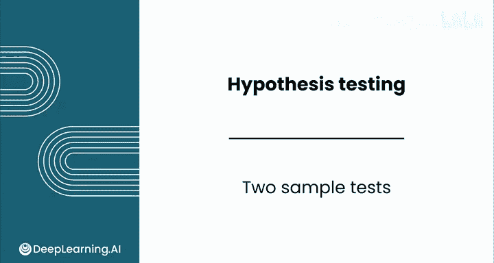
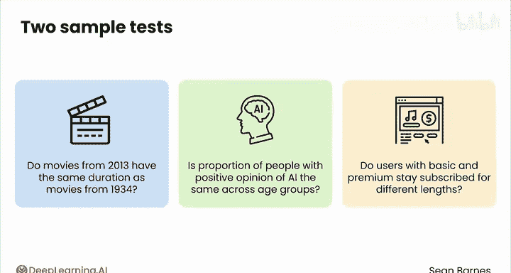
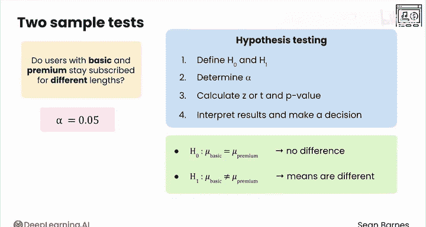
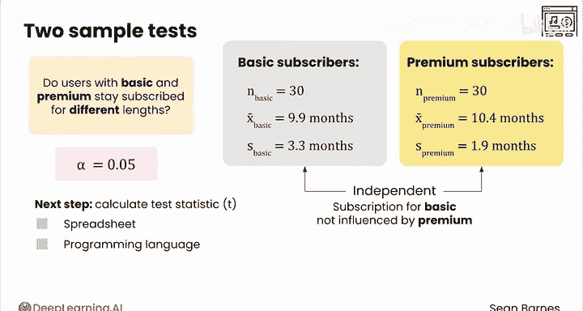
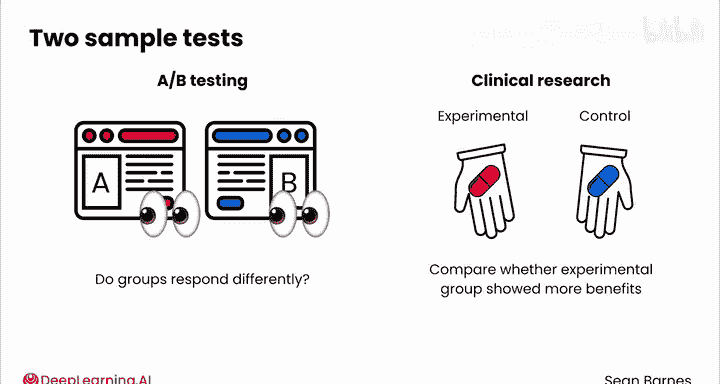

# 147：双样本检验 📊

在本节课中，我们将学习如何直接比较两个样本，而不是将一个样本与某个假设值进行比较。我们将通过一个音乐订阅服务的例子，探讨如何判断基础订阅用户和高级订阅用户的平均订阅时长是否存在差异。

## 概述

很多时候，我们感兴趣的是直接比较两个样本，而不是将一个样本与某个假设值进行比较。例如，你可能想比较周末和工作日的平均配送时间，或者比较2013年电影和1934年电影的平均时长是否相同。

在本课程中，你已经见过一些需要直接比较两个样本的情况。例如，两个不同年龄组中对AI持积极看法的人比例是否相同？基础订阅用户和高级订阅用户的订阅时长是否不同？

让我们继续使用音乐订阅服务的例子。假设你想确定基础订阅用户和高级订阅用户的订阅时长是否不同。你并不确定这些值具体是多少，你只是想看看它们是否不同。你将遵循与往常相同的流程：首先定义假设，然后确定显著性水平，接着计算检验统计量和P值，最后解释结果并做出决策。

## 假设设定

以下是设定假设的方法。

首先，零假设。你的现状是两组之间没有差异。因此，你可以将其写为 **H₀: μ_basic = μ_premium**。

你的备择假设是这两个均值不同。因此，你可以使用双尾检验，假设为 **H₁: μ_basic ≠ μ_premium**。

或者，如果你假设其中一组的平均订阅时长高于另一组，你可以制定一个单尾检验。

## 显著性水平与数据

假设你接受α为0.05，即有5%的假阳性几率。

现在你已准备好计算检验统计量。假设你有两个样本：一个是基础订阅用户样本，另一个是高级订阅用户样本。每个样本有30名订阅者，并具有以下描述性统计量：

*   基础用户的样本均值 **x̄_basic = 9.9 个月**
*   基础用户的样本标准差 **s_basic = 3.3 个月**
*   高级用户的样本均值 **x̄_premium = 10.4 个月**
*   高级用户的样本标准差 **s_premium = 1.9 个月**

在这种情况下，两个样本是独立的，这意味着基础订阅的时长与高级订阅的时长是相互独立的。

## 进行计算

下一步是计算你的检验统计量，它服从T分布。你已经了解了如何进行此检验的理论，但计算标准误和确定自由度的数学过程稍微复杂一些。在实践中，你将使用电子表格或编程语言来进行此检验。

因此，让我们看看如何在电子表格中进行此检验。

这里有一些模拟30名高级订阅用户和30名基础订阅用户的生成数据。这次，你不需要计算任何统计量，如均值、标准差等，因为电子表格函数 `T.TEST` 会为你完成这些工作。`T.TEST` 函数的输出就是P值。因此，你不需要执行任何计算检验统计量的中间步骤。

`T.TEST` 函数有几个参数。请记住，你可以使用帮助菜单来查看它们。

作为提醒，此检验的零假设是基础用户的平均订阅时长等于高级用户的平均订阅时长，备择假设是两个均值不相等。对于此检验，你可以从默认的显著性水平0.05开始。

`T.TEST` 函数有四个参数：

*   **array1** 代表第一个类别的样本数据，即基础订阅的订阅时长。
*   **array2** 代表第二个类别的样本数据，即高级订阅的订阅时长。
*   **tails** 参数指定你想使用T分布的**单尾**还是**双尾**来计算P值。在本例中，你需要双尾，因为你提出的是“相等与不同”的双尾检验。
*   最后，你必须指定 **type** 参数。这个参数非常重要，因为它对你的数据设置了一些假设。
    *   值为 **1** 表示**配对检验**。你将在下一个视频中了解更多关于配对检验的内容，它们适用于“前后”数据，例如测试同一个人在升级高级订阅前后的订阅时长。
    *   值为 **2** 表示**等方差双样本检验**。这做了一个很大的假设，即两个总体的方差相同。你可能不会经常使用这个选项。
    *   值为 **3** 表示**异方差双样本检验**。在这里，你不假设两个总体的方差相同。

你认为哪个选项在这里最合适？你会想要最后一个选项，即 **3**，代表异方差双样本检验。

## 结果解读

这个T检验给出的P值为 **0.604**。你不需要计算任何样本统计量或检验统计量，这非常方便。

你如何解读这个P值？这个P值相当大，大于你设定的显著性水平0.05。因此，你**无法拒绝零假设**，结论是你还没有足够的证据支持“两组不同类型的订阅用户倾向于订阅不同时长”这一观点。

## 重要假设与常见应用

重要的是要记住，这个检验假设样本是独立的。这意味着基础用户的订阅时长不受高级用户订阅时长的影响，反之亦然。一般来说，进行这个检验似乎是合理的，但你可能无意中引入偏差。例如，如果你的公司提供促销费率鼓励基础用户升级，这可能会缩短这些用户的订阅时长，同时延长高级用户的订阅时长。

双样本假设检验在实践中比单样本检验更常用，因为你经常对比较两组感兴趣。

*   在**A/B测试**中，你创建产品的两个不同版本，并将这些版本展示给不同的组，然后计算各组对每个版本的反应是否不同。
*   在**临床研究**中，你通常有实验组和对照组。你给实验组新的治疗（如新药），给对照组安慰剂。然后你想比较实验组是否比对照组显示出更多益处。

## 总结

本节课中，我们一起学习了如何进行双样本T检验。我们了解了如何设定比较两个独立样本均值的假设，如何在电子表格中使用 `T.TEST` 函数进行计算，以及如何根据P值解读结果并得出结论。我们还讨论了检验的独立性假设及其在A/B测试和临床研究等领域的常见应用。

那么，如果你对比较两个以上的样本（如几个年龄组）或配对样本（如患者治疗前后的改善情况）感兴趣，该怎么办呢？除了目前所见的检验之外，还有许多其他类型的假设检验。请跟随我进入下一个视频了解更多内容。