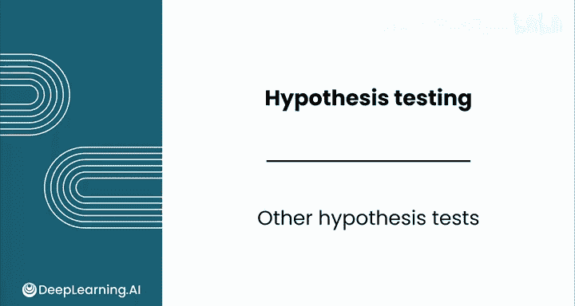
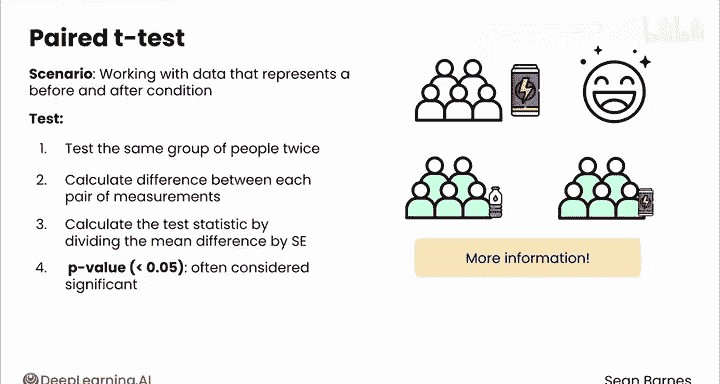
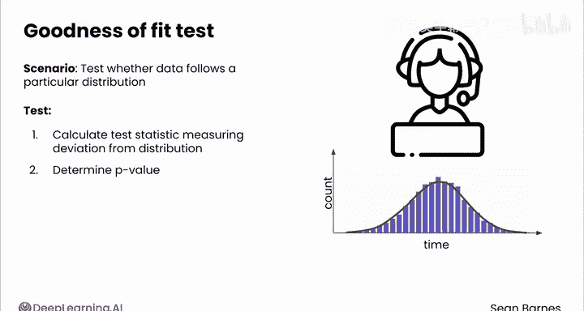

# 148：其他假设检验 📊

在本节课中，我们将学习几种不同类型的假设检验。每种检验方法都用于回答不同种类的问题。虽然无法在一天内掌握所有检验方法，但通过本视频，你将了解针对不同问题应选择哪种检验方法。

请注意，你无需死记硬背本视频中介绍的每种检验方法。当需要使用时，你可以查阅其具体细节。你已经具备了进行和解读这些检验所需的基础知识。

## 方差分析（ANOVA）检验

上一节我们介绍了比较两组数据（例如基础版和高级版订阅用户）的检验方法。本节中我们来看看，当需要比较三个或更多组数据时该怎么办。例如，你可能有一个包含基础版、高级版和企业版的分层订阅模型。

使用之前学过的检验方法进行多组比较会变得复杂，因为执行的检验越多，误差累积的可能性就越大。如果你遇到这种情况，就需要使用**方差分析检验**，也称为 **ANOVA**。

以下是方差分析检验的基本步骤：

*   计算每个组的均值以及总体均值。
*   比较组均值与总体均值的差异（组间变异），以及个体得分与其组均值的差异（组内变异）。

ANOVA 中的 **P 值** 告诉你，如果各组之间没有真实效应，你观察到这些组间差异的可能性有多大。通常，小于 **0.05** 的 P 值表明组间差异是显著的。

## 配对 T 检验

有时，你可能会处理代表“前后”状态的数据，这时可以利用一种特殊的检验方法。假设你想测试学生在饮用某种特定能量饮料后，情绪是否有所改善。

一种方法是随机抽取一组饮用能量饮料的学生，再随机抽取另一组只喝水的学生，然后比较他们的情绪。但你实际上有一个更有效的选择：你可以对同一组人进行两次测试。先让他们喝水并评估情绪，再让他们喝你的能量饮料并再次评估情绪。

在这种情况下，你实际上掌握了更多关于效应强度的信息，因为你不必考虑人与人之间所有可能的变异性。此时，你可以执行**配对 T 检验**。

以下是配对 T 检验的基本步骤：

1.  计算每对测量值之间的差值（后测值减去前测值）。
2.  通过将**平均差值**除以**标准误**来计算检验统计量。

此处的 P 值表示，如果处理（如喝能量饮料）没有效果，你偶然观察到这么大差异的可能性。同样，通常认为小于 **0.05** 的 P 值是显著的。

## 卡方检验

你也可能会处理分类数据。之前学过的假设检验都基于数值数据。假设你想确定客户满意度评分是否因地区而异。

为了检验这个假设，你可以使用**卡方检验**（另一个来自希腊字母的检验）。以下是卡方检验的基本步骤：

*   创建一个**观测频率**表。
*   在假设没有关系的前提下，计算**期望频率**。
*   **卡方统计量**衡量你的观测频率与这些期望频率的偏离程度。

一个小的 P 值表明，观测频率与“如果没有关系”情况下的期望频率存在显著差异。

## 拟合优度检验

许多统计方法假设你的数据服从**正态分布**。或者，如果你知道数据服从该分布，那么通常可以使用更小的样本量。因此，你可能会有兴趣检验这个假设是否成立。

你可以使用**拟合优度检验**。假设你想知道呼叫中心的客户服务时间是否服从正态分布。

在拟合优度检验中，你将计算一个检验统计量，用于衡量服务时间分布与正态分布的偏离程度，然后根据该检验统计量确定 P 值。同样，一个小的 P 值表明你的结果具有统计显著性，并且你的样本数据很可能不服从正态分布。

## 总结

本节课中我们一起学习了多种假设检验方法。你现在已经具备了回答各种商业问题的能力，能够判断一个观察到的效应是反映了真实情况，还是很可能源于随机机会。完成本课的练习评估和实践实验后，希望你能加入本模块下一节也是最后一节课，学习如何使用生成式人工智能来执行和解读假设检验。