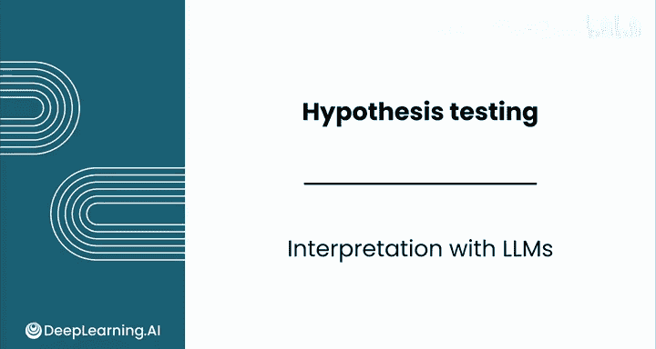
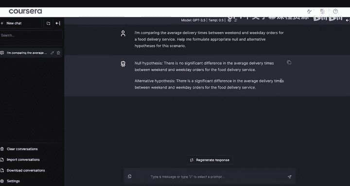
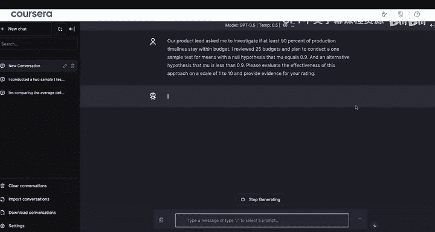
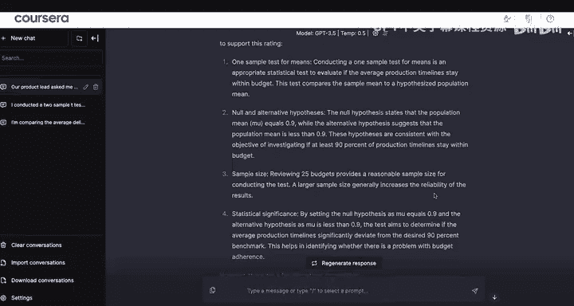
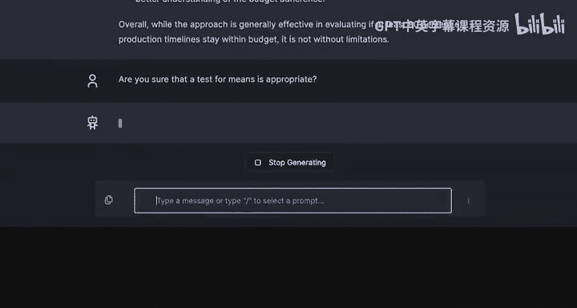
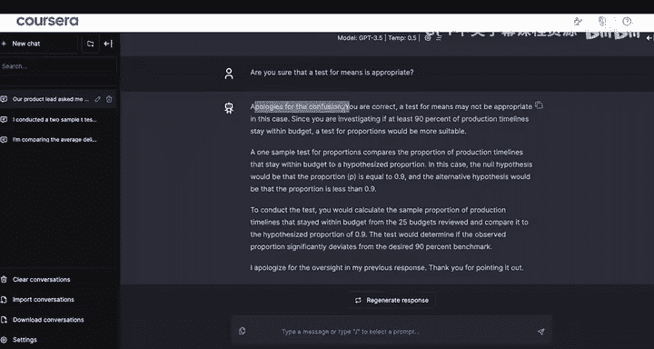
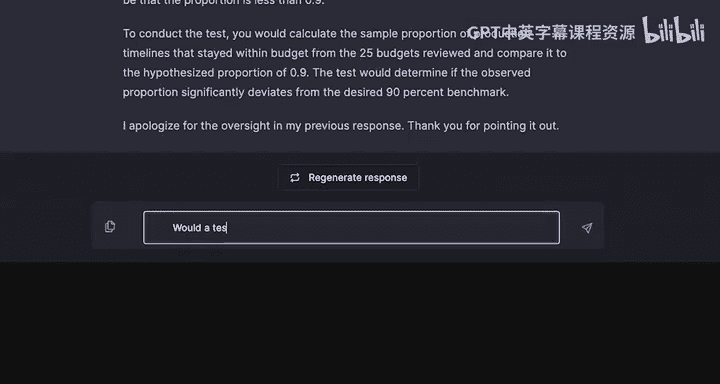

# 149：使用LLM辅助假设检验 📊



在本节课中，我们将学习如何利用大型语言模型来辅助数据分析中的假设检验过程。假设检验涉及复杂的操作和多种选择，LLM可以成为分析师的有力助手。

## 概述：LLM在假设检验中的角色

假设检验是数据分析的核心环节，但过程可能复杂且容易出错。我们将探讨LLM如何帮助分析师完成假设检验中的关键步骤，包括**假设的制定**、**结果的解释**以及**方法的验证**。


---

## 1. 使用LLM制定假设 🎯

上一节我们介绍了LLM在假设检验中的总体作用，本节中我们来看看如何用它来精确地制定研究假设。正确的假设是检验的基石。

假设你正在为一家外卖服务公司工作，需要比较周末和工作日订单的平均配送时间。你需要为此场景制定合适的原假设和备择假设。



你可以向LLM提出以下请求：
```text
请为“比较周末和工作日订单的平均配送时间”这一场景制定原假设和备择假设。
```


LLM可能会给出如下回答：
*   **原假设 (H₀)**：周末订单和工作日订单的平均配送时间没有显著差异。
*   **备择假设 (H₁)**：周末订单和工作日订单的平均配送时间存在显著差异。

这个回答为**双尾检验**提供了基础。但如果你从司机那里听到传闻，认为周末的配送时间更长，并希望对此进行验证，你就需要进行**单尾检验**。

你可以继续追问LLM：
```text
如果我想检验“周末的平均配送时间是否更长”，请提供单尾检验的假设，并使用数学符号表示。
```

LLM会更新其回答：
*   **原假设 (H₀)**：μ_周末 ≤ μ_工作日
*   **备择假设 (H₁)**：μ_周末 > μ_工作日

其中，原假设中的“小于或等于”符号并不影响检验的执行方式，它只是标准的数学表述。

---


## 2. 使用LLM解释检验结果 📈

制定好假设并完成检验后，理解统计结果的实际业务含义至关重要。LLM可以帮助你将复杂的统计输出转化为通俗易懂的商业语言。

假设你进行了一项双样本T检验，比较两个客户细分群体的平均购买金额。你得到的检验统计量 `t = 2.45`，P值为 `0.018`。

你可以请LLM解释这些结果：
```text
我进行了一项双样本T检验，比较两个客户群体的平均购买金额。检验统计量是2.45，P值是0.018。请用商业术语解释这些结果意味着什么。
```

LLM可能会解释：
检验统计量2.45表明两个群体的平均购买金额存在显著差异。P值0.018意味着，如果原假设（即两个群体平均购买金额相同）成立，我们观察到如此极端差异的概率仅为1.8%。这为拒绝原假设提供了强有力的证据，即在业务上，这两个客户群体的消费行为确实存在可区分的差异。

如果你对P值的概念仍感困惑，可以进一步询问：
```text
请详细解释P值0.018的含义。
```

LLM会补充说明：
P值 `0.018` 表示在原假设为真的前提下，观察到检验统计量（此处为2.45）或更极端值的概率是1.8%。这个概率很低，因此我们倾向于认为原假设可能不成立。

---

## 3. 使用LLM验证分析方法 ✅

LLM不仅能帮助制定计划和解释结果，还能作为“第二双眼睛”来审查你的分析方法。但必须注意，LLM也可能犯错，需要你保持批判性思维。


设想一个场景：产品负责人要求你调查是否至少有90%的项目预算在计划时间内完成。你审查了25份预算，并计划进行**单样本均值T检验**，设定假设为：
*   H₀: μ = 0.9
*   H₁: μ < 0.9



为了验证这个方法的有效性，你可以向LLM提问：
```text
我计划用单样本T检验（均值检验）来验证“至少90%的项目预算按时完成”这个命题。我的原假设是μ=0.9，备择假设是μ<0.9。请评估这个方法的有效性（1-10分），并给出评分理由。
```

LLM可能会给出7/10的评分，并指出“总体均值假设为0.9”。**这里就出现了关键错误**：90%是一个比例（百分比），而不是一个均值。检验比例应该使用**比例检验**，而非均值T检验。



此时，你不应全盘接受，而应质疑LLM：
```text
你确定均值检验适用于这个场景吗？
```

LLM可能会纠正自己：
“抱歉造成了混淆，你是对的。由于你在检验一个比例（90%），使用单样本比例检验（例如z检验）会更合适。”

你可以继续追问以确认：
```text
那么，使用比例检验是否能得到更准确的结果？
```







LLM会肯定这一点，并指出比例检验在标准差和检验统计量的计算上与均值检验不同。

这个例子提醒我们，在使用LLM辅助决策时，必须对其输出保持警惕，并用领域知识进行交叉验证。未来，你可能会使用比本演示中（基于GPT-3.5）更强大的模型，但审慎核查的原则始终不变。

---

## 总结

本节课中我们一起学习了如何利用大型语言模型辅助假设检验的三个关键环节：
1.  **制定假设**：LLM可以帮助将业务问题转化为精确的统计假设，包括单尾或双尾检验的设定。
2.  **解释结果**：LLM能够将统计量（如t值、P值）翻译成直观的商业结论，便于向非技术人员传达。
3.  **验证方法**：LLM可以作为思维伙伴，帮助审查分析方法的适用性，但分析师必须保持批判性，识别并纠正其可能出现的错误。


记住，LLM本质上是语言的统计模型，并非全知全能。在数据分析的每一步，都需要你——分析师——进行最终的判断和核实。在接下来的课程中，我们将看到能够编写和运行代码的LLM如何进一步帮助执行实际的假设检验。