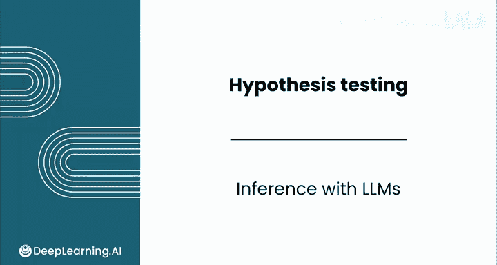
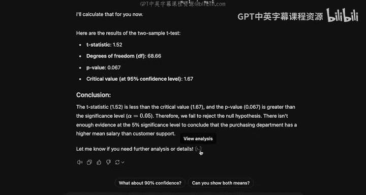
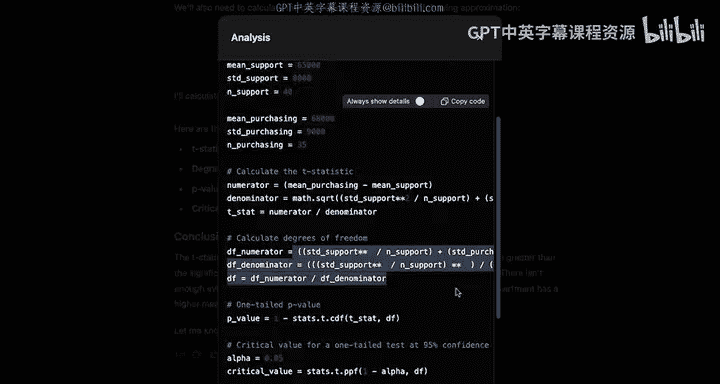
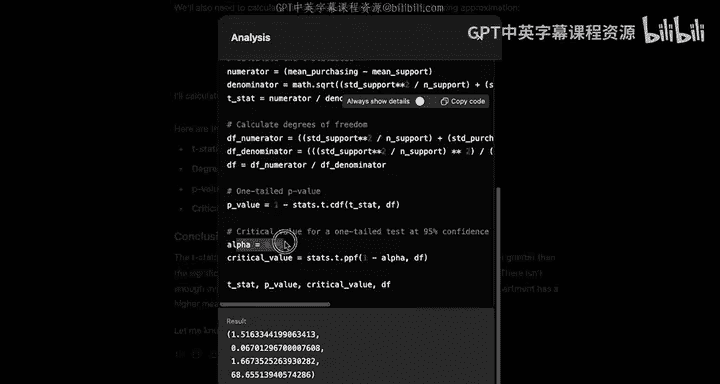
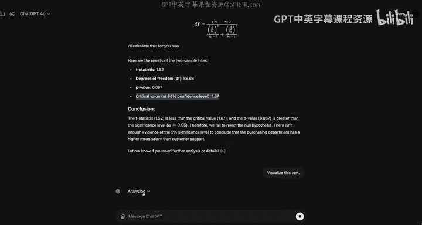
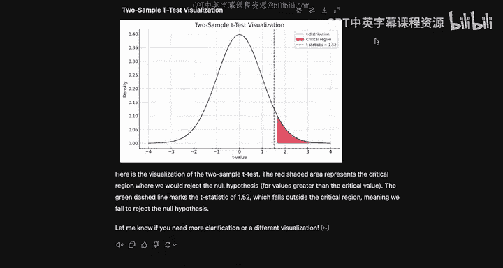

# 150：使用LLM进行统计推断 📊

在本节课中，我们将学习如何利用大型语言模型（LLM）来执行统计推断任务，特别是假设检验。我们将通过一个具体的薪资比较案例，演示LLM如何编写并运行代码来完成双样本T检验，并解释其结果。

---

## 如何让LLM执行假设检验任务

上一节我们介绍了假设检验的基本概念，本节中我们来看看如何让LLM实际执行一个假设检验任务。

假设你需要比较两个部门的平均薪资。客户支持部门的平均薪资为65000美元，标准差为8000美元，样本量n=40。采购部门的平均薪资为68000美元，标准差为9000美元，样本量n=35。你需要执行一个双样本假设检验，以判断采购部门的平均薪资是否更高。

“执行”在这里意味着LLM需要**编写并运行代码**，进行实际计算。如果你使用传统的大型语言模型，当你要求它执行此类检验时，它通常只会列出步骤，你需要自行完成计算。然而，我们使用的是具备高级数据分析功能的ChatGPT，它能够直接为你执行这些步骤。

---

## LLM执行双样本T检验的过程

以下是LLM执行检验的步骤概述：

1.  **定义假设**：
    *   零假设（H₀）：采购部门的平均薪资**等于或低于**客户支持部门。
    *   备择假设（H₁）：采购部门的平均薪资**高于**客户支持部门。
    *   这是一个**单侧检验**，因为我们只关心采购部门薪资是否“更高”。

2.  **选择检验方法**：LLM将使用**双样本T检验**。

3.  **计算检验统计量**：LLM会应用公式来计算t统计量。该公式与你之前见过的其他例子相似。
    *   **检验统计量公式**（近似）：`t = (mean1 - mean2) / sqrt((sd1^2/n1) + (sd2^2/n2))`
    *   **自由度公式**：LLM会自动计算一个复杂的合并自由度公式，这省去了你手动计算的麻烦。

4.  **生成结果**：LLM会输出计算结果，包括：
    *   t统计量（约1.52）
    *   自由度（约68）
    *   P值（约0.067）
    *   临界值（定义了拒绝域的边界）

---

## 验证LLM的代码执行

在解读结果之前，你应该验证模型是否确实运行了代码来计算这些统计量。你可以点击“查看分析”按钮来检查模型实际执行的代码。

在代码中，你可以看到：
*   模型定义了计算所需的各种统计量（均值、标准差、样本量）。
*   它执行了计算检验统计量和自由度的代码。
*   它使用**累积分布函数（CDF）** 和**补集规则**来计算P值，这与你在其他假设检验中使用的方法一致。
*   它还定义了显著性水平α，并计算了前面提到的临界值。

---

## 结果解读与可视化

根据你的知识，如果显著性水平α设为0.05，而得到的P值为0.067，那么这个结果是否具有统计显著性？

虽然P值相对较低，但它**没有达到**我们设定的0.05的显著性水平。因此，**我们无法拒绝零假设**。结论是：没有足够的证据表明采购部门的平均薪资显著高于客户支持部门。

为了更直观地理解，我们可以要求LLM将此次检验可视化。它会编写代码生成一个类似于本课程中常见的图表。

生成的图表显示：
*   **T分布曲线**
*   红色区域代表α=0.05时的**拒绝域**
*   垂直线代表**检验统计量（t=1.52）**
*   从图中可以直观看出，检验统计量并未落入红色拒绝域内。虽然这个t值相对罕见，但尚未达到我们的显著性阈值。

---

## LLM的实用性与注意事项

你已经看到大型语言模型如何帮助你执行假设检验。它们非常有用，但你必须确保在每一步都仔细检查其输出。

---

## 课程总结与后续安排 🎉

本节课中我们一起学习了如何利用LLM执行统计推断中的假设检验，并通过案例进行了实践。

出色的工作！这标志着本模块的结束，你也即将完成这门课程。从直方图、均值、中位数、众数开始，你已经学习了如此多的内容，我为你感到骄傲！

接下来，你将：
1.  完成一个使用大型语言模型的练习实验。
2.  完成本模块的评分评估和实验，运用你的假设检验技能分析钻石价格数据。
3.  完成本课程的**顶点练习**。在这个练习中，你将扮演一名数据分析师，与一组心脏病专家合作研究心脏病。你的目标是帮助分析与心脏病相关的风险因素，以协助预防工作。你需要综合运用本课程所学的所有知识——从描述性统计到概率分布，再到推断性统计——来完成一份全面、严谨的分析。

完成评分评估、实验以及顶点练习后，我将在最后一个视频中与你见面，讨论你作为数据分析师的下一步计划。

继续努力，我期待在评分评估和顶点练习的另一边见到你！😊