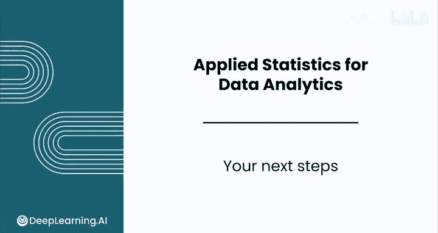

# 151：数据分析基础 🎯

## 概述

在本节课中，我们将回顾你在数据分析基础课程中所取得的成就，并展望下一步的学习计划。你将了解到从基础统计概念到实际应用的全过程，以及如何继续提升你的数据分析技能。

---

## 回顾学习历程 📊

恭喜你完成了这门课程的顶点项目以及整个课程。

你在统计学领域取得了令人瞩目的进步，这绝非易事。

从最初思考是否能在同事间发起新的生日车传统开始，你已经走过了很长的路。

上一节我们介绍了数据分析的基本流程，本节中我们来看看你具体掌握了哪些核心技能。

以下是你在本课程中学习到的主要内容：

*   计算集中趋势、变异性和偏度。
*   在电子表格中模拟概率分布。
*   使用大语言模型（LLM）进行计算。
*   计算置信区间和进行假设检验。

你现在已经准备好，在数据分析中运行严谨的统计分析。

---

## 持续学习与下一步 🚀

数据分析领域还有很多知识需要学习。

这项工作最吸引我的一个方面是，即使工作多年，我每天依然能学到很多新东西。

因此，我希望你能加入本系列的下一门课程。

下一门课程是 **《使用Python进行大规模数据分析》**。

在Python编程课程中，你将学习以下核心内容：

*   Python编程语言的基础知识。
*   如何使用Python进行数据分析、数据清洗和可视化。
*   如何使用`pandas`和`seaborn`库。

你将运用所学的所有统计学知识乃至更多技能，来创建严谨、可扩展且美观的分析报告。

---

## 总结与展望 ✨

本节课中我们一起回顾了你在数据分析基础课程中的学习成果，并规划了下一步的学习路径。

你已掌握了从描述性统计到统计推断的一系列关键技能，为进行实际数据分析打下了坚实基础。

我的最后一个问题是：

我能在下一门课程中再次见到你吗？

毫无疑问。

再次祝贺你完成这门课程，我们下一门《Python数据分析编程》课程再见。