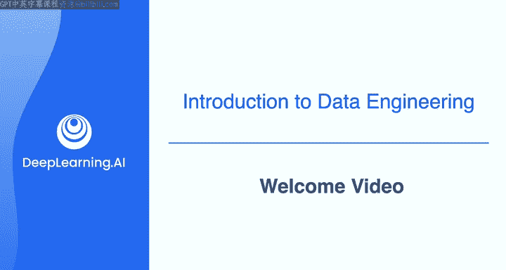
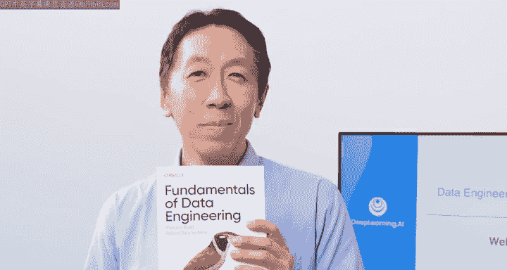
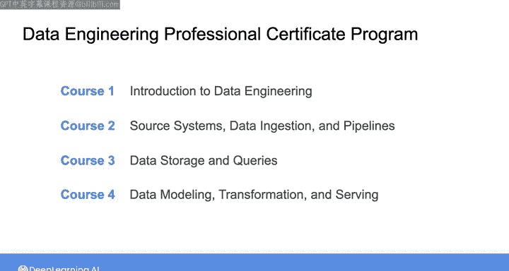

#  001：欢迎来到数据工程 🚀

在本节课中，我们将学习数据工程的基本概念、其重要性以及本系列课程的整体结构。数据工程是构建和管理数据基础设施的关键学科，它支撑着现代企业的数据分析、机器学习和人工智能应用。

---

## 概述

过去十年，几乎所有行业都实现了数字化。数字通信无处不在，数字数据正在取代纸质文件，成为医疗保健、金融、制造、教育、科技等几乎所有行业存储信息的主要机制。

然而，这股数据浪潮也带来了风险，以及如何存储和处理所有这些数据以创造价值的新挑战。无论您的组织是希望改善客户服务，还是在竞争中脱颖而出，拥有良好的数据管道都变得越来越关键。这也是数据工程师需求激增的原因。

## 认识你的讲师

我们很高兴欢迎乔·雷斯（Joe Reis）作为本专业课程的讲师。乔是一位拥有数十年经验的数据工程师和数据架构师，曾为多家公司提供数据服务。他还是一位教授、播客主播，并且是这本写得很好的畅销书《数据工程基础》的合著者。

乔曾将自己描述为一位“正在康复的数据科学家”。这个昵称源于2010年代中期，当时数据科学变得非常热门和流行。乔的背景是机器学习和分析，他注意到许多公司在招聘数据科学家时，并没有为他们提供成功所需的适当支持和基础架构。数据科学家常常没有数据来进行“科学研究”。

反复看到这种情况后，乔开始意识到，帮助数据科学取得成功同样重要的是数据工程。数据工程是关于构建基础架构、确保数据质量，并为数据科学家提供成功手段的学科。因此，虽然乔从数据科学起步，但他转向了数据工程，以帮助数据科学家解决这些问题。

## 数据工程的价值

当数据工程到位时，数据科学家提出一个问题并得到答案的时间可以从一周或一个月缩短到五分钟或一小时。这带来了巨大的效率差异，有时甚至决定了快速开发能否得到支持。

近年来，随着公司将数据视为宝贵的资产，他们开始投资构建基础部分，以将价值实现时间从几天、几周、几个月缩短到几小时、几分钟，有时甚至是几秒钟。

当你的数据只是笔记本电脑上的一个小CSV文件时，问题还不大。但一旦超出这个小数据集，构建和管理数据管道的工程复杂性就会产生巨大影响。

## 以数据为中心的AI

随着当今AI的兴起，采取以数据为中心的方法比以往任何时候都更加重要。以数据为中心的AI是一门系统化地设计数据以构建成功AI系统的学科。

对于数据工程师而言，这意味着无论数据规模大小——从笔记本电脑上的小CSV文件到存储在数据仓库中的海量数据集，甚至是如今用数万亿标记训练的大型语言模型——设计数据以使AI和机器学习算法获得成功所需的数据，都是一个令人兴奋且快速发展的领域。

## 本课程的学习内容

数据工程师的工作非常重要，也是一项专业技能。本课程旨在传授框架和原则，让你学会像数据工程师一样思考。

我们很高兴与亚马逊云科技（AWS）合作，在本课程中提供实践练习，帮助你在云上开发构建数据系统的技能。如今，大多数数据工程师都在云上构建系统，而AWS是目前使用最广泛的公有云。熟悉在AWS上构建系统将成为你作为数据工程师的一项宝贵资产。

本课程将数据工程的基础原则（与平台无关）与实践动手练习相结合。

### 课程适合人群

*   如果你是一名有抱负的数据工程师，那么本课程适合你。
*   如果你已经是一名数据工程师，并希望进一步提升技能，本课程也适合你。
*   如果你在与数据工程相关的领域工作，例如数据科学、机器学习、软件工程、分析或其他数据相关角色，本课程同样对你有益。

### 先修要求

唯一的先决条件是你需要有使用数据和Python的工作经验。如果你有一些SQL和云工具的经验会更好，但这并非必需。我们将向你展示需要了解的内容，并提供建议的学习资源。

## 课程结构

本专业课程包含四门课程：

1.  **第一门课程**：我们将纵览全局，形成数据工程的心理框架，并启动一些云数据管道。
2.  **第二门课程**：我们将专注于从源系统摄取数据、数据运维以及数据管道的编排。
3.  **第三门课程**：全部关于云中的数据存储，以及存储如何成为数据工程生命周期所有阶段的重要组成部分。
4.  **第四门课程**：关于为最终用例进行数据建模、转换和服务。

有很多内容需要涵盖，我们期待与你分享这一切。

---

## 总结

本节课我们一起学习了数据工程的兴起背景及其在数字化时代的关键作用。我们认识了讲师乔·雷斯，了解了他从数据科学转向数据工程的历程，以及数据工程在支持数据科学和以数据为中心的AI方面的重要性。最后，我们概述了本系列课程的结构、目标受众和先修要求，为后续深入学习做好了准备。

让我们继续观看下一个视频，正式开始学习。