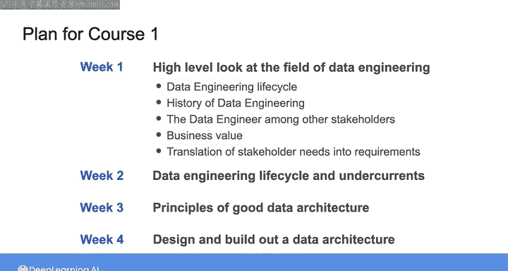

#  002：数据工程导论（第1课）📊

在本课程中，我们将学习数据工程的基本概念、核心原则以及如何从宏观角度思考数据系统的构建。我们将首先了解数据工程师的角色、数据工程生命周期，并探讨如何将业务需求转化为系统设计。课程强调先建立正确的思维框架，再深入技术实现。

---

## 课程背景与目标 🎯

想象你刚被一家电子商务公司聘为数据工程师。首先，祝贺你获得这份新工作。

这家公司最初雇佣了数据科学家，希望进行数据分析以了解客户兴趣、行为和购买习惯，并希望利用大语言模型开发机器学习工具来自动化客户支持的各个环节。

然而，当数据科学家开始工作时，他们发现完成分析或机器学习任务所需的数据基础设施根本不存在。他们开始研究数据架构和系统以帮助构建所需的基础设施，同时也向管理层解释，构建数据基础设施并非他们的专长。为了确保成功，公司还应雇佣一名数据工程师。于是，你加入了公司。

这个故事听起来可能有些夸张，但在现实生活中，我亲眼目睹过无数次完全相同的场景。

事实上，我曾是故事中描述的那种数据科学家。我发现自己陷入了一种境地，需要快速学习如何构建数据基础设施的各个方面，以便将公司的数据和系统调整到可以开始进行我被雇佣来做的数据科学项目的状态。那是很多年前的事了，当时数据工程师这个角色甚至还不存在。

因此，也许雇佣我作为数据科学家的公司不知道他们真正需要什么，是可以被原谅的。当我深入设计和构建数据系统时，我对所学到的东西既感到不知所措，又感到兴奋。

我发现，无论你试图完成何种下游任务（例如数据科学、机器学习，或在应用程序中为用户提供嵌入式分析等），构建健壮数据基础设施所需的核心技能集在很大程度上是相同的。随着时间的推移，这套核心技能集被称为数据工程。

---

## 数据工程师的角色与职责 👨‍💻

回到我们的场景。你刚被聘为数据工程师，你的公司希望你构建能够实现其目标的数据系统。

为了实现这一目标，你需要能够将公司利益相关者的需求转化为系统需求，然后选择正确的工具和技术集来构建该系统。

这听起来可能相对简单，但我经常看到数据工程师在深入理解他们的系统将如何为组织创造价值之前，就直接投入到系统的实施中，选择工具和技术。采取这种方法可能导致灾难性后果，例如浪费公司的时间和资源，甚至可能让你丢掉工作。

因此，在这些课程中，特别是在第一门课程中，我们将花大量时间从宏观角度审视问题。

我们将讨论一套适用于你所有数据工程项目的原则，以构建成功数据系统的思维框架。

别担心，我们也会深入实践层面。在这些课程的实验练习中，你将使用前沿工具和技术在 AWS 云上构建数据系统。

---

## 第一周课程计划 📅

以下是第一周材料的学习计划。

我们将从高层次审视数据工程领域。我们将从数据工程生命周期和一点历史开始，并探讨数据工程师在公司其他角色和利益相关者背景下的定位。

之后，我们将探讨作为数据工程师如何为业务增加价值，然后讨论如何收集利益相关者的需求并将其转化为数据系统的需求。这个主题将在整个课程中反复讨论。

现在，我想暂停一下，在我们开始第一周学习时，非常明确地告诉你：本周你不会编写任何代码，也不会使用任何云工具。

相反，本周的重点是如何像数据工程师一样思考。这可能与你报名参加此类课程的预期感觉有些不同。

但请相信我，能够像数据工程师一样思考，是在这个领域取得成功的第一步。这就是为什么它是第一周材料的重点。

有了足够的高层次知识和正确的心态，成功数据工程的其他所有方面才有可能实现。没有它，任何技术知识或编码技能都无法拯救你。

正如我之前所说，在整个专项课程中，我们肯定也会深入技术层面。所以别担心，这将在本课程的第二周到来。

---

## 后续课程展望 🔮

在第二周，我们将深入探讨数据工程生命周期的每个阶段。第二周的材料也包含大量理论和数据工程领域的高层次导向。因此，你将在第一周“像数据工程师一样思考”的知识基础上继续学习。

然后，你将在周末的实验中，在 AWS 上动手实践云数据管道。

在第三周，我们将专注于良好数据架构的原则。

在第四周，我们将把所有内容整合起来，根据利益相关者的需求，设计和构建一个能够交付价值的数据架构。

---

## 总结 ✨

在本节课中，我们一起学习了数据工程师的角色起源、核心职责以及从宏观视角规划数据系统的重要性。我们明确了在深入技术细节之前，建立正确的思维框架和业务理解是成功的第一步。第一周的重点是培养“像数据工程师一样思考”的能力，为后续的技术实践和系统构建打下坚实的基础。在接下来的视频中，我们将开始深入了解数据工程生命周期。