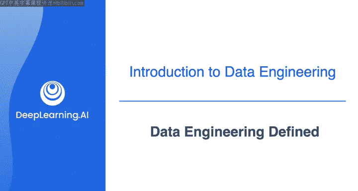
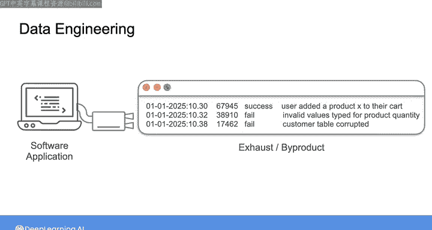
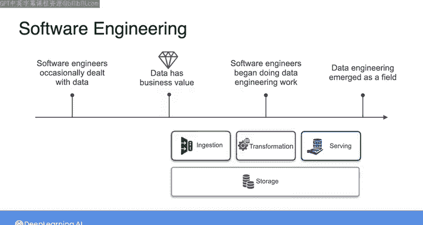
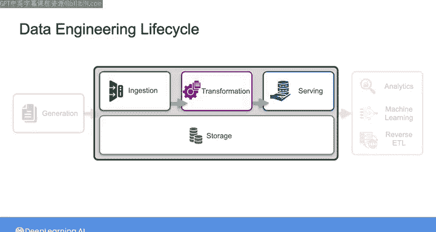
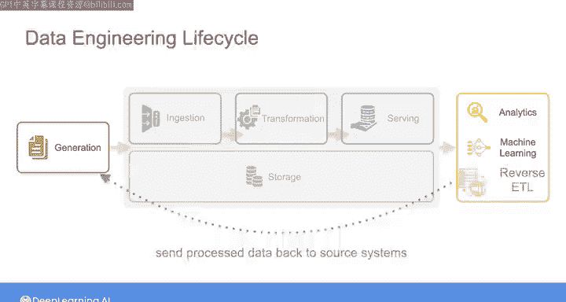
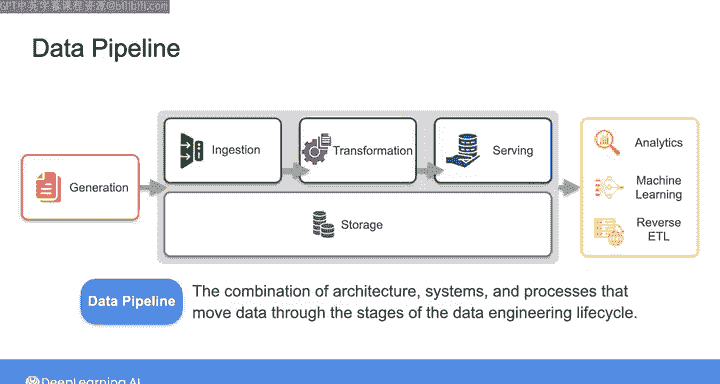
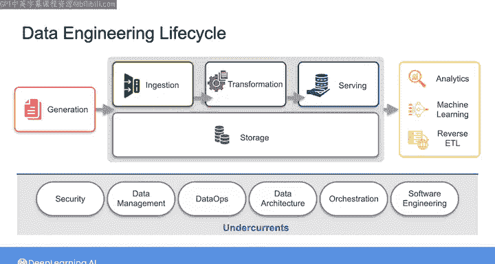

#  003：数据工程定义 📘

在本节课中，我们将学习数据工程的定义及其核心概念。我们将探讨数据工程如何从软件工程的一个分支演变为一个独立的、至关重要的职能领域，并理解数据工程生命周期及其关键组成部分。

---

## 数据工程的演变

我见证了数据工程领域随着时间而发生的变化。

最初的数据工程师是软件工程师，他们的主要工作是构建组织所需的软件应用程序。

不久之前，由软件应用程序生成的数据大多被视为一种副产品或“废气”。我的意思是，假设你有一个像这样的软件应用程序在运行，它会将应用程序内的各种事件记录到日志中。

那么，记录在日志中的数据可能被认为对故障排除或监控应用程序健康状况等事情有用，但它本身并没有被认为具有多少内在价值。

因此，我画了一个从应用程序延伸出来的小排气管，然后数据就会像汽车的废气一样被生成，或者仅仅是应用程序的副产品。

然而，随着时间的推移，随着组织开始认识到数据的内在价值，以及由软件应用程序生成的数据量（由用户上传或通过各种记录的数字化创建）持续增长，同样的软件工程师越来越专注于构建专门用于摄取、存储、转换和为各种用例提供数据的系统。

随着数据工程在许多处理数据的组织中成为一项基本职能，数据工程师的角色便诞生了。

---

## 数据工程的定义

在我的合著者 Matt Hausley 与我合著的《数据工程基础》一书中，我们提出了以下数据工程的定义：

**数据工程是开发、实施和维护相关系统和流程，这些系统和流程接收原始数据，并产生高质量、一致的信息，以支持下游用例，如分析和机器学习。**

**数据工程是安全、数据管理、数据运维、数据架构、编排和软件工程的交叉领域。**

在课程的这一点上，我意识到这个定义可能有点令人困惑，或者至少听起来需要进一步解释这里出现的术语。

不过不用担心，在本课程中，我们将深入探讨这个定义中所有内容的细节，以便你理解其含义以及在实践中是如何体现的。

---

## 数据工程生命周期

除了数据工程的定义，为了可视化数据工程的生命周期，我们在书中整理了这个图表。在整个课程中你会经常看到这个图表，所以我想花点时间介绍一下它。

你可以将数据工程生命周期视为由一系列阶段组成。

在左边这里，你有**数据生成**和**源系统**。这些源系统可能是任何类型的软件应用程序、用户生成的数据、传感器测量数据或其他东西。无论如何，生命周期始于数据生成。

然后在中间这里，你有**摄取、转换、存储和提供**。我用一个方框框住了这些阶段，以表明这些是作为数据工程师你将重点关注的**生命周期阶段**。

你会注意到，**存储**位于摄取、转换和提供之下，并横跨整个方框的宽度。这是为了表明数据存储是上述每个阶段不可或缺的一部分。

在实践中，你构建的数据系统可能不像生命周期图表看起来那么简单，但根据我的经验，在可视化任何数据系统的共同元素时，以这种方式思考生命周期是有帮助的。

在图表的右侧，你有**最终用例**。这些是你的组织中的利益相关者实际从数据中获取价值的方式。这些包括分析、机器学习，或者称为**反向ETL**的东西（基本上是将转换或处理后的数据发送回源系统，为使用这些系统的组织内个人提供额外价值）。

---

## 数据管道

在本课程中，我将频繁使用术语**数据管道**，来统称数据从源系统生成到最终用例所经历的各种步骤。

你可以将数据管道视为**架构、系统和流程的组合**，它们推动数据经历数据工程生命周期的各个阶段。

作为数据工程师，你将管理数据工程生命周期，从从源系统获取数据开始，到为分析和机器学习等用例提供数据结束。

简单来说，数据工程师的工作就是从某个地方获取原始数据，将其转化为有用的东西，然后使其可用于下游用例。

---

## 数据工程的底层要素

在数据工程的定义中，我说数据工程处于安全、数据管理、数据运维、数据架构、编排和软件工程的交叉领域。

在《数据工程基础》一书中，我们将数据工程的这六个组成部分称为**数据工程生命周期的底层要素**。

因此，在这个数据工程生命周期图旁边，我喜欢把这些底层要素写在下面。这些底层要素不是像上面那样的生命周期阶段，而是**贯穿整个生命周期**。

所以现在解读这个图表的方式是：上面是数据工程生命周期的各个阶段，包括数据生成、摄取、存储、转换和提供；下面是你的底层要素，包括安全、数据管理、数据运维、数据架构、编排和软件工程。现在，这些底层要素中的每一个都与上面的所有生命周期阶段相关。

在本课程的第二周，我们将放大这里显示的每个阶段和底层要素，让你清楚地了解所有这些部分是如何组合在一起的。

---

## 整体视角的重要性

正如我在上一个视频中提到的，作为数据工程师，很容易直接跳入实施阶段，并尝试不同的工具和技术。这样做很容易忽视你工作的更高层次目标，以及你究竟打算如何为你的组织提供价值。

在整个课程中，我们将探讨如何整体地思考整个数据工程生命周期及其底层要素，以便你能成功地将利益相关者的需求转化为系统要求，并为你的业务提供真正的价值。

在我们继续前进之前，我认为有必要简要回顾一下数据和数据工程的历史，以了解我们是如何走到今天的。

话虽如此，下一个视频是**可选**的。你不需要记住任何这段历史也能在这些课程中取得成功。所以，如果你更愿意直接开始学习如何作为一名数据工程师开展工作，那么你可以跳过它。

否则，请加入下一个视频，快速了解数据和数据工程的历史。

---

## 总结

本节课中，我们一起学习了数据工程的核心定义及其演变过程。我们明确了数据工程是开发、实施和维护系统与流程，将原始数据转化为高质量信息以支持下游分析、机器学习等用例的学科。我们引入了**数据工程生命周期**模型，它涵盖了从数据生成、摄取、存储、转换到提供服务的各个阶段，并强调了贯穿始终的**数据管道**概念。最后，我们了解了构成数据工程基础的六大**底层要素**：安全、数据管理、数据运维、数据架构、编排和软件工程。理解这些整体框架是后续深入学习具体技术和实践的基础。