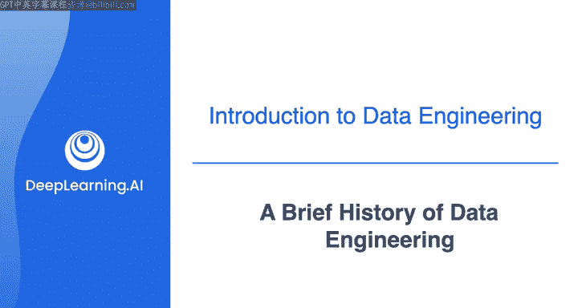
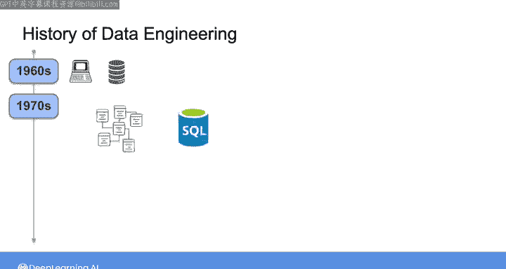
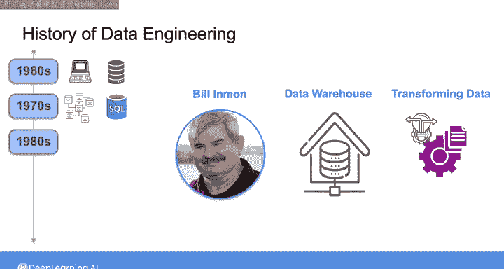
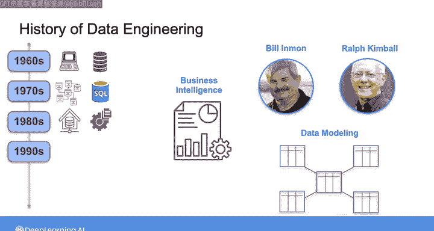
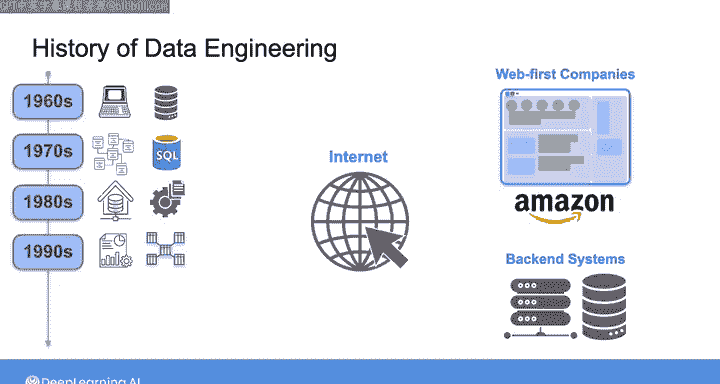
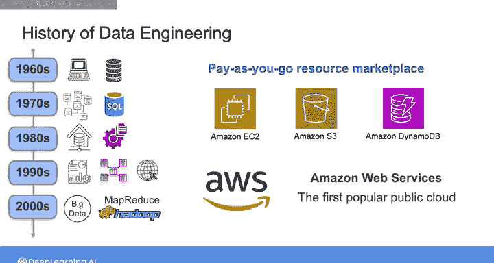
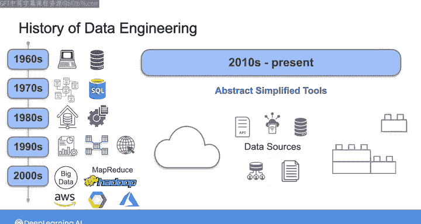

#  004：数据工程简史 📜 | 吴恩达《数据工程》课程 第1.3课

在本节课中，我们将回顾数据工程领域的发展历程，了解数字数据如何从早期计算机系统演变为今天复杂而强大的生态系统。理解这段历史有助于我们把握数据工程的核心任务与价值。

## 概述：无处不在的数据

首先需要明确一点：数据无处不在。数据构成了信息的基本单元，其形式可以是文字、数字，或是更为短暂的现象，例如来自遥远恒星的光子，或是拂面的微风。这些不同形式的数据可以被记录下来，例如作为大脑中的记忆、纸上的文字，或是数字形式——就像我正在为你录制的这段视频。从某种意义上说，数据自时间伊始就以某种形式存在了。

然而，在这些课程中，当我谈论“数据”时，我指的是**数字记录的数据**，即可以存储在计算机中或通过互联网传输的数据。

## 数字数据的开端：1960s-1990s

上一节我们明确了数据的定义，本节中我们来看看数字数据的早期发展。

数字数据的故事真正始于20世纪60年代，随着计算机的出现。那时，第一批计算机化数据库被引入。随后在70年代，关系型数据库兴起，这促使IBM的工程师开发了**结构化查询语言**，简称 **SQL**。

到了80年代，我的朋友Bill Inman开发了第一个数据仓库，目的是将数据转换为能够支持分析决策的形式。90年代，随着数据系统的增长，企业需要专门的工具和数据管道来进行报告和商业智能。正是在这种背景下，Ralph Kimball和Bill Inman分别开发了他们用于分析的数据建模方法。

90年代中期，互联网成为主流，催生了亚马逊等全新的“网络优先”公司。随后的互联网热潮导致了网络应用的快速增长，以及支持它们的后端系统（即服务器数据库和存储解决方案）的出现。

## 大数据时代的来临：2000s

互联网热潮之后，泡沫破裂，留下了雅虎、谷歌和亚马逊等少数幸存者，它们成长为强大的科技公司。起初，这些公司继续依赖90年代传统的关系型数据库和数据仓库，但这些系统无法处理它们当时面临的爆炸性数据增长。由此，**大数据时代**开始了。

《牛津词典》将大数据定义为“可能通过计算分析以揭示模式、趋势和关联的极大数据集，特别是与人类行为和互动相关的”。另一个著名而简洁的描述是数据的 **3V 特性**：速度、多样性和体量。这意味着大数据以**高速度、广多样性、大体量**的形式涌现。

2004年，谷歌发表了一篇关于**MapReduce**的论文，这是一种超大规模的数据处理范式。这篇论文的发表构成了数据技术以及我们今天所知的数据工程文化根源的“大爆炸”时刻。

谷歌的MapReduce论文及相关出版物启发了雅虎的工程师，他们在2006年开发并随后开源了**Apache Hadoop**。Hadoop的影响怎么强调都不为过。对大规模数据问题感兴趣的工程师被这个新的开源技术生态系统的可能性所吸引。随着各种规模和类型的公司的数据增长到许多TB甚至PB级别，**大数据工程师**的时代诞生了。

大约在同一时期，亚马逊为了跟上自身爆炸式增长的数据需求，创建了一个可扩展且灵活的计算环境，即**亚马逊弹性云计算**，简称 **EC2**。他们还创建了无限可扩展的存储系统，包括**亚马逊简单存储服务**，即 **S3**。他们也开发了高度可扩展的NoSQL数据库——**亚马逊DynamoDB**。

亚马逊决定通过**亚马逊网络服务**将这些核心数据构建模块提供给内部和外部使用，**AWS**也因此成为第一个流行的公共云。AWS发展成为一个极其灵活、按需付费的资源市场。现在，开发者无需为数据中心购买硬件，只需从AWS租用计算和存储资源。

随着AWS成为亚马逊高利润的增长引擎，其他公共云也很快跟进，包括**谷歌云平台**和**微软Azure**。公共云作为构建数据系统的媒介，可以说是21世纪最重要的创新之一，并引发了一场软件和数据应用开发与部署方式的革命。早期的大数据工具和公共云为今天的数据生态系统奠定了基础。没有这些创新，就不会有我们今天所知的数据格局和数据工程。

## 数据工程的普及与演变：2010s至今

在2000年代末和2010年代初，小型初创公司首次能够使用与顶级科技公司相同的尖端数据工具。

与此同时，另一场革命发生了：从**批处理计算**（即以块或批次的形式处理和分析数据）向**事件流处理**的过渡。这使得将数据作为连续的单事件流进行处理成为可能。伴随着这一转变，一个**大型实时数据**的新时代到来了。

尽管“大数据”一词曾广受欢迎，但作为一个概念，它已经失去了势头。即使拥有强大而复杂的开源大数据工具，管理它们也是一项繁重的工作，需要持续的关注。公司通常需要雇佣整个大数据工程师团队，花费数百万美元来“照看”这些系统。大数据工程师常常花费过多时间维护复杂的工具，而用于交付业务洞察和价值的时间可能相对较少。

如今，数据流动速度比以往任何时候都快，体量也越来越大，但大数据处理已经变得如此普及，以至于不再需要一个单独的术语。每家公司都致力于处理其数据并从中获取价值，无论实际数据体量大小。换句话说，**大数据工程师现在就是数据工程师**。

2010年代见证了云优先、开源和第三方产品的出现。这使得大规模处理数据比大数据时代简单得多。与此同时，数据源和数据格式在多样性和体量上持续增长。数据工程日益成为一门关于互操作和连接各种技术（就像乐高积木一样）以实现最终业务目标的学科。

这把我们带到了今天。如今，数据工程师的角色在价值链上的位置比以往任何时候都更高，并且还在继续上升。我的意思是，作为今天的数据工程师，你有机会站在巨人的肩膀上，使用前人开发的工具和技术构建强大、可扩展的数据系统。你也有机会为这些工具和技术的开发做出贡献，并构建未来的数据解决方案。

构建稳健的数据系统现在已成为各行各业商业战略的核心。因此，作为一名数据工程师，你可以直接参与实现业务目标，为你的组织创造价值。

## 总结与展望

本节课中，我们一起学习了数据工程从早期计算机数据库到现代云生态系统的演变历程。我们看到了数据如何从简单的记录演变为驱动商业决策的核心资产，以及数据工程师角色如何随之演变并变得日益重要。

在接下来的视频中，我们将开始探讨这在实践中是如何体现的，例如数据工程在组织中如何与其他角色和利益相关者协同，如何识别最终用户及其需求，这如何与业务价值相关联，以及如何将利益相关者的需求转化为系统要求。请加入下一节视频，一起看看数据工程如何融入你组织的其他部分。