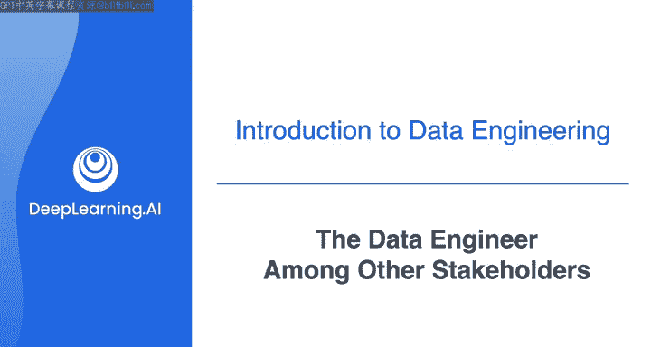
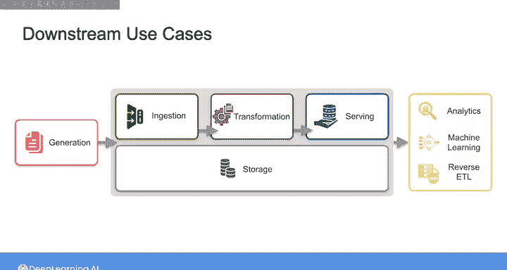
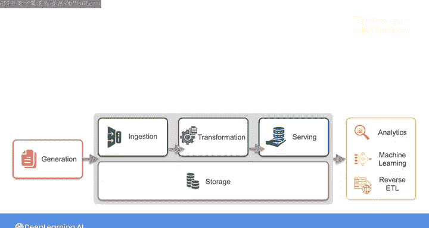
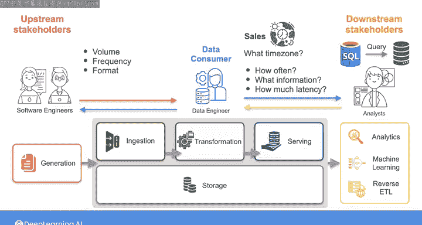

#  005：🤝 数据工程师与其他利益相关者

在本节课中，我们将要学习数据工程师在工作中需要与哪些关键角色进行协作。你将了解到，数据工程师的工作并非孤立进行，而是需要深入理解上游数据提供者和下游数据使用者的需求，才能成功地将原始数据转化为有价值的信息。

正如之前所述，数据工程师的职责是从某处获取原始数据，将其转化为有用的内容，并使其可用于下游用例。但这无法在真空中完成。为了准确地将原始数据转化为对下游消费者有用的内容，你必须深入理解他们的需求。如果你能成为一名成功的数据工程师，你将以一种为下游用户增加价值并帮助他们实现目标的方式提供数据。

我们已经提到了一些潜在的下游用例，即**分析**和**机器学习**。在这些用例中，下游数据消费者可能是分析师、数据科学家、机器学习工程师，或是你组织中需要做出数据驱动决策的其他人员，例如销售人员、产品或营销专业人员或高管。

## 理解下游利益相关者

上一节我们介绍了数据工程师的核心职责，本节中我们来看看如何与下游数据消费者进行有效协作。

例如，假设你的下游数据消费者是一位业务分析师，他们需要能够对数据库运行SQL查询，以便为各种类型的分析生成数据。他们将使用这些数据来制作仪表板、分析趋势并预测某些指标的方向。

为了成功地为这位分析师服务，你需要与他们讨论以下事项：

*   他们需要多频繁地查询数据库以刷新仪表板？
*   每次查询需要检索哪些信息？基于此，你可以考虑是否需要在数据表之间进行某些连接（`JOIN`）或执行其他聚合操作，以便在他们的查询之前预先运行，从而加快查询速度。
*   他们能容忍的指标延迟是多少？例如，查看过时一天的数据是否可以接受，还是他们需要接近实时的数据？

除了这些要求，你还需要确保你与这位分析师就他们工作所需数据的定义达成一致。例如，如果他们正在寻找“给定一天内的总销售额美元金额”，这听起来很直接。但假设你在一家为全球客户服务的公司，与你的分析师就使用哪个时区以及确切使用什么开始和结束时间来界定每一天达成一致，就非常重要。

这只是一个例子，但正如你所想象的，根据你的最终用户及其用例，你需要考虑的因素可能会有很大差异。

作为数据工程师，积极参与理解公司的整体战略非常重要，这样你才能更好地理解从你提供的数据中可以提取哪些商业价值，以及哪些业务指标是下游利益相关者所关心的。

## 理解上游利益相关者

在了解了如何服务下游用户之后，我们还需要考虑数据的来源。除了下游利益相关者，你还需要考虑上游利益相关者。

上游利益相关者是那些负责你摄取原始数据的源系统的开发和维护的人员。你的上游利益相关者通常是构建你所使用的源系统的软件工程师。这些可能是你公司内部的软件工程师，也可能是负责你正在摄取数据的第三方源的开发人员。

现在情况发生了转变，你成为了数据消费者，而源系统所有者为你提供服务，就像你在为业务分析师服务的例子中看到的那样。

在这种情况下，你需要与源系统所有者沟通，以了解在生成数据的**数量**、**频率**和**格式**方面可以期待什么，以及任何其他会影响数据工程生命周期的事项，例如数据安全和法规遵从性。

如果你能与这些源系统所有者建立正确的关系，通常你可以与他们合作，影响原始数据如何从这些源系统提供给你。通过开放的沟通渠道，他们还可以提前让你知道何时可能出现数据流中断或其他变化，例如数据中的模式（`schema`）变更。

在某些情况下，源系统可能位于你的组织外部，基本上不受你控制。即便如此，如果你能与这些系统的所有者建立联系，你可以更好地理解生成你所消费数据的应用程序。

## 课程总结

本节课中我们一起学习了数据工程师在将原始数据转化为有用信息并服务于用例的过程中，需要与所构建系统的上下游利益相关者进行协作。

回顾一下，以下是关键要点：

*   **与上游源系统所有者沟通**：花时间与他们联系，以更好地理解你正在摄取的数据，以及任何可能中断你数据管道的事项，例如服务中断或数据变更。
*   **与下游利益相关者沟通**：花时间理解你所提供的数据如何为你的组织增加价值，以及这与你所服务的利益相关者的个人目标有何关联。

谈到商业价值，这实际上是一个有点模糊的概念。因此，在我们开始为你的系统收集需求之前，我想就商业价值及其与你作为数据工程师角色的关系再多说几句。就像我之前提供的简短历史课一样，下一个视频是可选的，所以如果你更愿意直接开始为你的系统收集需求，可以随时跳过。