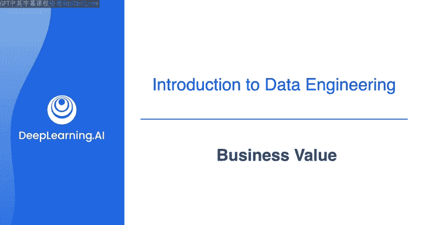
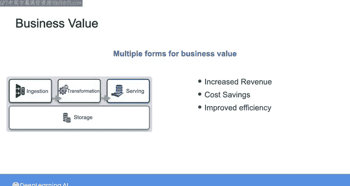

#  006：商业价值 💰

在本节课中，我们将探讨数据工程师如何为组织创造商业价值，以及理解这一概念为何对你的职业成功至关重要。

我创建这些课程的目标，是为你作为一名数据工程师在工作中的成功奠定基础。因此，让我们稍作停顿，设想一下成功是什么样子。任何公司雇用你担任数据工程师，都是因为他们相信你能为组织增加价值，这与其他任何员工并无不同。

最近，我与我的朋友比尔·英蒙进行了交谈，他是数据领域的意见领袖和知识最渊博的人士之一。当我询问他对于刚进入这个行业的人有何建议时，他强调了寻找并交付商业价值的重要性。以下是比尔所说的话：

> “我给他们的建议，就像给银行劫匪的建议一样：去有钱的地方。如果你想在我们的行业中获得长期巨大的成功，就去寻找商业价值。不要纠结于每一个新出现的技术、每一个新奇的事物。去有商业价值的地方，因为在一天结束时，商业价值驱动着我们在技术领域所做的一切。我们很容易迷失并纠结于技术，技术本身并没有错，我自己也是一名技术人员，我热爱技术。但你现在需要考虑的首要事情是……如果你不在乎成功，只想去做一些看起来有趣的、花哨的事情，那就尽管去做吧，但不要期望从中获得任何巨大的回报。就像威利·萨顿在解释为何抢劫银行时说的：‘因为那里有钱。’所以，你做技术，就要寻找商业价值。”

因此，作为一名数据工程师，你需要寻找商业价值。但是，作为一名数据工程师，增加价值究竟意味着什么呢？根据我的经验，商业价值在某种程度上可以说是“因人而异”的。我的意思是，例如，假设你的组织希望你的数据工程师工作能帮助实现收入增长。在这种情况下，如果你的经理或领导层认为你的工作有助于公司收入增长，那么恭喜你，你很可能会被认为为组织增加了价值。另一方面，如果你的数据工程师工作被认为只是花费了大量资金，而投资回报很少或没有，那么你可能需要开始寻找另一份工作了。

但在许多情况下，商业价值并不仅仅是简单的盈亏，它可以有多种不同的形式，正如我们在上一个视频中看到的那样。在你的数据工程师工作中，你将与各种利益相关者互动。通常，正是这些利益相关者自行决定你是否在增加价值。一般来说，这意味着他们是否认为你在帮助他们实现目标。请注意，在所有这些例子中，我谈论的是你的工作如何被感知，而不是你实际做了什么。你为业务和利益相关者提供的价值量，将由你为之提供价值的对象来决定。因此，一般来说，当你满足利益相关者的需求时，你就是在为他们提供价值，无论这种价值是以收入增加、成本节约、工作效率提高的形式出现，还是以帮助产品成功发布等其他形式出现。

在成功识别了组织中所有利益相关者的数据需求之后，一个常见的情况是发现他们的集体需求远远超出了你创建解决方案的能力或资源。因此，你需要确定优先级，弄清楚哪些项目更可行，以及实施它们可能需要多长时间，等等。

现实地讲，我认为弄清楚作为一名数据工程师应该专注于什么以及如何最好地分配时间，这本身就可以成为另一门完整的课程主题。因此，我们不会在这里深入细节。但如果你好奇，可以在本周课程结束时的资源部分查看一个链接，那是马特·豪斯利和我与我们的朋友索·拉希蒂做的一个播客，她作为一名数据高管，就商业价值的真正含义提供了见解和观点。

现在，我们将继续前进，假设你已经想好了要构建什么样的系统。下一步就是确定该系统的需求。请加入下一个视频，我们一起探讨如何收集系统需求。

---

**本节课总结**

在本节课中，我们一起学习了商业价值对数据工程师的重要性。我们了解到，成功的关键在于为组织和利益相关者创造可感知的价值，而不仅仅是掌握技术。价值可以表现为收入增长、成本节约或效率提升等多种形式。同时，我们也认识到资源总是有限的，因此必须学会优先处理那些能带来最大商业价值的项目。理解并聚焦于商业价值，将指引你在数据工程领域取得长期的成功。