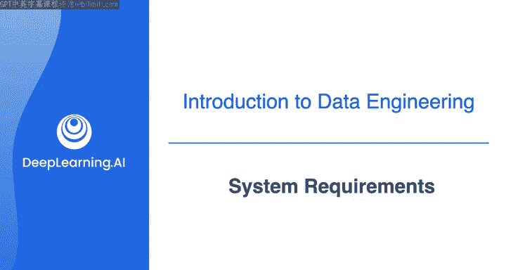
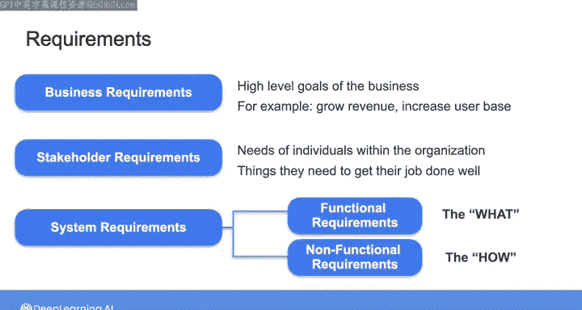
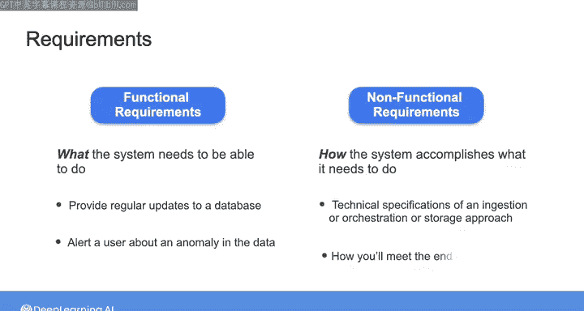
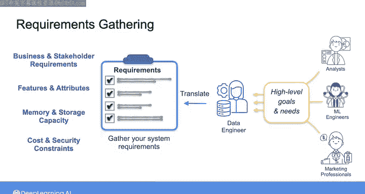

#  007：理解系统需求

在本节课中，我们将学习如何为数据工程项目定义系统需求。这是任何数据工程工作的第一步，确保我们构建的系统能够真正为利益相关者创造价值。

## 概述：什么是系统需求？

确保为利益相关者交付价值的方法是：首先理解他们的需求，然后将这些需求转化为你所构建系统的要求。

因此，在我们开始编写任何代码或在云端启动资源之前，需要花时间讨论为你的系统收集需求意味着什么。

首先，“需求”这个词在商业和工程背景下可以有许多不同的含义。例如，你可以有定义业务高层目标的**业务需求**。业务需求可能广泛地包括增加收入或扩大用户群等事项。

另一方面，**利益相关者需求**是组织内个人的需求，即他们为了做好工作所需要的东西。

当涉及到数据工程或一般的软件开发时，工程师需要定义**系统需求**，以描述系统需要能够做什么，以满足业务和利益相关者的需求。

系统需求通常分为两类：**功能性需求**和**非功能性需求**。你可以将它们分别粗略地理解为系统的“做什么”和“如何做”的要求。

## 功能性需求与非功能性需求

上一节我们介绍了需求的基本分类，本节中我们来看看这两类需求的具体含义。

功能性需求，即“做什么”，指的是系统需要能够完成的事情。在数据工程的背景下，这些可能包括：为服务于分析仪表板的数据库提供定期更新，或在数据出现异常时向用户发出警报。

相比之下，非功能性需求可以被视为你的系统将“如何”完成它需要做的事情。这可能包括技术规范，例如你计划在数据管道中使用的编排或存储，以满足最终用户的需求。

因此，要构建任何数据系统，你需要从该系统的需求集开始。这些需求可以涵盖从高层次的业务和利益相关者需求，到要提供的数据产品的特性和属性，再到你的计算和数据库资源所需的内存和存储容量。

你还需要考虑成本约束以及安全和法规要求。因此，任何数据工程项目的第一步，也是最重要的一步，就是收集系统需求。

## 如何收集需求？

理解了需求的类型后，我们来看看这些需求从何而来，以及如何收集它们。

通常，这些需求将来自你的下游利益相关者，即那些希望通过你的工作实现目标的人。问题在于，你的利益相关者通常不会以具体的系统需求形式与你沟通。相反，他们考虑的是业务目标，而你的工作就是弄清楚如何将他们与业务目标相关的需求转化为你的系统需求。

你构建的每个系统，需求收集过程看起来都会有些不同，但这个过程总是从与你的利益相关者对话开始。进行这些对话的方式将根据利益相关者在数据和数据系统方面的技术水平以及他们在组织中的角色而有所不同。

## 与不同利益相关者沟通

在下一段视频中，我将向你介绍我的朋友So Shiti，她在许多大公司担任过数据高管的角色。她将为新的数据工程师提供一些建议，关于如何与具有不同技术背景的不同利益相关者沟通。

然后，你将听到Jordan Morrow的分享，他被称为数据素养教父，建立了世界上最早的数据素养项目之一。他将就与不同利益相关者交谈时如何进行需求收集提供一些建议。

这两段视频都是可选的，你不会被评估这些对话的内容。所以，如果你愿意，可以自由地跳到后面的视频，在那里我们将看看在本周开始时为你设定的场景中，需求收集可能是什么样子：你是一家电子商务公司的新数据工程师，数据科学家需要你的帮助。

## 总结

本节课中我们一起学习了系统需求在数据工程中的核心地位。我们明确了**业务需求**、**利益相关者需求**和**系统需求**的区别，并重点剖析了系统需求中的**功能性需求**（系统“做什么”）与**非功能性需求**（系统“如何做”）。我们了解到，需求收集是与利益相关者对话的起点，并且沟通方式需因人而异。这是确保项目成功交付价值的关键第一步。