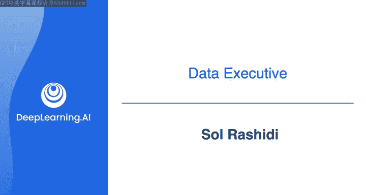

#  008：与数据高管的对话 🎙️

在本节课中，我们将学习如何与组织内的领导层进行有效沟通。通过与首席数据官索尔·拉希迪的对话，我们将了解数据工程师在商业环境中的重要性，以及如何根据沟通对象的背景调整沟通策略。

***

## 背景介绍

首席数据官（CDO）是商业世界中一个相对较新的职位。随着数据成为关键商业资产，许多公司正在围绕数据管理和价值挖掘建立专门的组织。索尔·拉希迪在2016年担任皇家加勒比的首席数据与人工智能官，是最早担任C级数据高管职位的人之一。在过去的十年里，她曾在索尼音乐、默克制药和埃斯特·劳尔等大型跨国公司领导数据和分析团队，并获得多项荣誉。

***

## 进入数据与AI领域的经历

索尔进入数据与AI领域完全出于偶然。她大学主修化学，但毕业后并不想从事化学相关工作。她决定追随自己的爱好，在大学期间参加体育运动，并在毕业后继续打橄榄球。随着年龄增长，身体恢复速度变慢，她不得不退役。她当时想找一份没人愿意做、能立刻获得的工作，结果恰好是数据工程师的职位。

她发现自己非常适合这个领域，但六个月后，团队禁止她再接触任何代码，因为她提交到生产环境的代码质量不佳。尽管如此，她仍然留在这个领域，因为她找到了自己的“部落”和社区。她发现，优秀的数据工程师虽然技术精湛，但有时无法将他们的工作转化为商业术语。索尔对商业语言、指标和财务报表一直很感兴趣，因此她成为了业务与技术之间的“翻译官”。

她的职业生涯由此展开，她担任过各种职位，最大的转折点是成为SAP白金级NDM顾问，后来晋升为企业数据管理负责人，并最终在IBM沃森团队负责数据相关工作。

***

## 成为C级高管的路径

索尔从未等待许可或被赋予机会，她总是主动识别目标并明确表达自己的追求。她曾担任安永的合伙人，负责管理最大客户的技术和数据。2015年，她建议客户聘请一位CDO，结果四个月后，客户邀请她加入领导团队，担任首席数据与人工智能官。

***

## 与数据工程师共事的经验

索尔认为数据工程师非常出色，是公司一切运作的支柱。这是一个常常不被感谢但至关重要的职位。所有业务运营，无论是营销活动、消费者细分还是产品发布，最终都依赖于信息和数据流。数据工程师掌握着这座“城堡”的钥匙，他们的工作是分析和构建管道，以确保在需要时能获取所需数据。

1.  **数据工程师非常出色**。
2.  **他们是一个未被充分重视的群体**，需要更多关注。
3.  **没有业务运营可以在没有他们的情况下运行**，他们确实是每家公司的支柱。

我们需要更好地保护、鼓励他们，并让他们知道他们的工作非常重要。

***

## 给 aspiring 数据工程师的建议

如果你渴望成为一名数据工程师：

*   **你需要有“脊梁骨”，而不是“许愿骨”**。这个职位需要一定的韧性。
*   **你掌握着城堡的钥匙**。你所了解的信息及其在生态系统中的流动方式非常强大，是艺术与科学的结合。
*   **不要害怕要求成为前台职能部门**。数据工程师有时可能被视为后台职能部门，但如果你有进入管理或领导层的抱负，请主动争取。
*   **提升沟通技巧**。如果你不满足于只在办公室或隔间里写代码，请走到前台中心。
*   **理解商业语言和背景**。对于数据工程师来说，上下文就是一切。没有上下文，业务部门可能会立即质疑数据的有效性。

请记住，你的职能对每个业务职能都至关重要，无论他们是否认可你。确保你理解他们的语言和重点，沟通是关键。

***

## 与领导层沟通的策略

在课程中，我们正在讨论需求收集的过程。其中一个关键部分是了解业务的整体目标，而最好的方式可能就是与领导层交谈。

当索尔担任首席数据官时，她经常与数据工程师、架构师、分析师和科学家互动。她最喜欢做的事情之一就是白板会议，共同解决问题。她强调，与业务高管或任何类型的领导者交谈时，**必须了解你的听众**。

*   如果对方是**职能型领导**（不懂技术语言），切勿谈论语义层、管道构建等技术细节，否则会立刻失去他们。
*   如果对方是**技术职能型领导**，可以适当使用一些行话，但不要过度。
*   如果对方是**技术型高管**，则可以充分展示你的专业技能。

关键在于，在接触业务高管之前，了解他们使用的语言，并与之对齐。

***

## 如何判断沟通对象的类型

那么，作为数据工程师，如何判断应该与利益相关者进行多深的技术交流呢？

*   **初创或小型公司**：运营非常精简。要么你周围都是技术人员（CEO可能曾是技术个体贡献者），这时可以使用正常的技术语言；要么CEO是出色的营销人员，周围是销售和市场人员，这时你必须使用职能型语言。
*   **中型和大型企业**：查看对方的**头衔**和**汇报线**。除非他们在CIO或CDO办公室，否则通常可以假设他们是职能型的。如果对方领导一个品牌、标签、职能或服务，他们很可能是职能型的。

在对话中，可以先试探他们对技术领域的了解，再决定深入的程度。一个建议是：**查看头衔和汇报线，通常先假设对方是职能型的，以职能型语言开始对话，除非他们将话题引向技术方向。**

***

## 总结

本节课中，我们一起学习了与组织内领导层沟通的重要性与策略。索尔·拉希迪的分享告诉我们，数据工程师是公司的支柱，有效的沟通需要根据听众的背景调整语言。关键在于了解你的听众是职能型、技术型还是介于两者之间，并使用他们能理解的语言进行交流。这一建议不仅适用于与领导层的对话，也适用于与其他利益相关者的沟通。接下来，我们将听取乔丹·莫罗的建议，学习如何与不同的利益相关者进行需求收集对话。