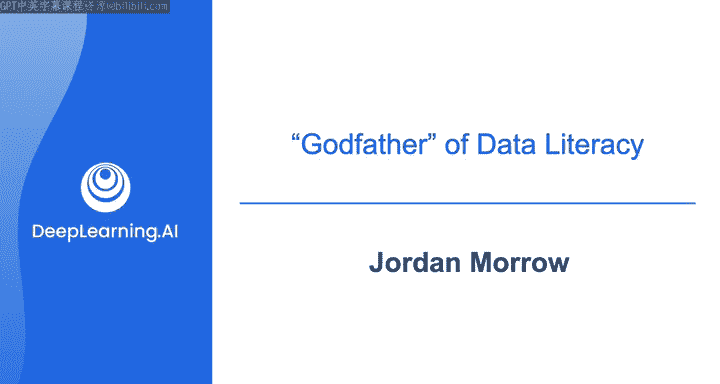

#  009：与乔丹·莫罗的对话 🎙️

在本节课中，我们将与数据素养领域的专家乔丹·莫罗进行对话，探讨数据素养的定义、重要性，以及数据工程师如何更好地理解业务需求与受众。

---

## 什么是数据素养？📊

乔丹·莫罗被广泛认为是数据素养领域的奠基人之一。他首先阐述了数据素养的核心概念。

数据素养是**使用数据的舒适度和信心**。其定义为：**阅读、处理、分析和交流数据的能力**。其核心目标是帮助所有人，而不仅仅是数据分析专业人士，都能在使用数据时感到自如。这样，当数据被民主化或在工作中使用时，人们能更从容地应对。

## 数据素养为何重要？🤔

上一节我们定义了数据素养，本节中我们来看看为什么它如此关键。

组织长期以来一直试图从数据中获取价值。但如果你在构建数据产品或人工智能产品，你需要人们去**采纳**它们。如果用户对此感到不舒适或缺乏相关技能，就会阻碍数据工作和数据战略的真正成功。

组织投资数据工具和技术时，不能只是把它们摆在人们面前。这就像不能把一个没有经过任何训练的人直接放在一面高难度的攀岩墙前。数据也是如此，不能只是把仪表盘放在人们面前，就要求他们去发现洞察。我们需要让用户有能力驾驭优秀数据工作的成果，以确保产品被有效采纳和使用。此外，避免出现“不想碰数据”的文化问题也至关重要。

## 如何收集需求与理解业务目标？🎯

数据工程的一大核心部分是沟通业务、确定需求。以下是乔丹对此的建议。

在为目标和需求收集过程中，一个可能被忽视的关键点是**理解你的受众**。首先要做的是真正理解公司的业务目标，这来自于沟通、阅读和人际网络。但需求收集的下一步是关注你为之构建产品的**人**：他们需要什么？不仅仅是业务需要什么。无论是首席营销官、首席风险官还是销售团队，了解什么能驱动他们，这样在产品完成并推广时，你不仅能满足业务目标，还能将你的故事与他们的需求联系起来，从而获得他们更深层次的认同。

因此，需求收集也应包含对受众的理解。

## 理解不同的受众角色 👥

上一节强调了理解受众，本节我们进一步探讨受众角色的多样性。

与不同高管沟通时，他们的关注点截然不同。例如：
*   **首席销售官**关注销售目标。
*   **首席营销官**关注如何改进营销。
*   **首席财务官**关注现金流。

根据你构建的产品，你可能需要同时满足所有这些角色，这使得任务更具挑战性，因为你需要与每个人的需求都联系起来。这是一个很好的练习，能有效提升你的人际交往能力。

## 给 aspiring 数据工程师的建议 💡

对于有志于成为数据工程师的人，乔丹提供了以下核心建议。

我建议他们真正擅长的是**理解业务如何运作**。这可以称为“业务素养”。其目的不是把数据工程师变成业务人员，而是让他们在保持专业本色的同时，深刻理解业务运营。这样，在进行数据工程构建时，就能朝着支持业务运营的方向努力；在沟通时，也能使用业务语言。

所以，给 aspiring 数据工程师的建议是：不必强迫自己成为下一个销售或业务专家，但要努力成为一名优秀的数据工程师，并精通业务层面的知识。

---

## 总结 📝

本节课中，我们一起学习了与乔丹·莫罗的对话。我们探讨了数据素养的定义及其对数据产品成功采纳的重要性，强调了在需求收集中理解业务目标和不同受众角色的关键作用。最后，我们了解到，对于数据工程师而言，在深耕技术的同时，培养对业务运作的深刻理解是通往成功的重要路径。