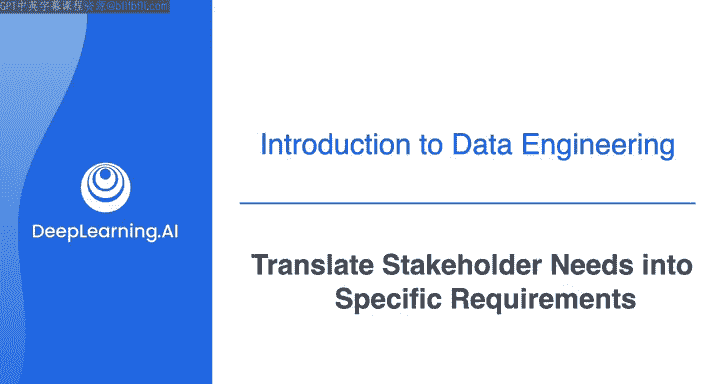
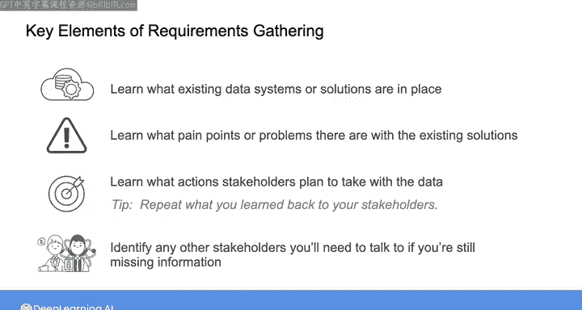
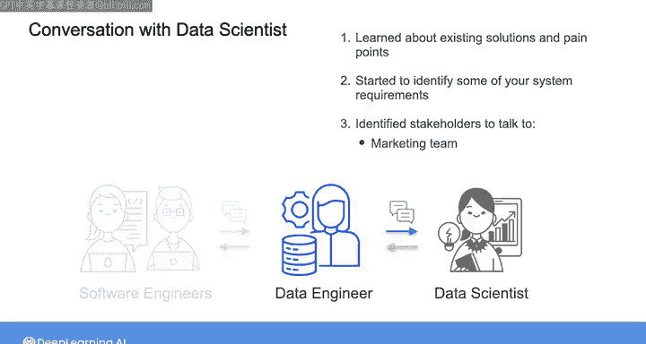

#  011：将利益相关者需求转化为具体要求 📋

在本节课中，我们将学习如何与利益相关者（例如数据科学家）进行有效沟通，并将其需求转化为清晰、具体的数据系统要求。我们将通过分析一个示例对话，拆解出需求收集的关键步骤和核心要素。

---

## 概述：需求收集的核心要素

上一节我们介绍了与数据科学家进行初步需求收集对话的示例。本节中，我们将详细分析对话中的每一部分，并提炼出一个系统化的方法，用于从类似对话中提取数据系统需求，并识别需要沟通的其他利益相关者。

任何需求收集工作的关键要素如下：
*   **了解现状与痛点**：学习当前用于交付数据的现有系统或解决方案，以及这些系统存在的问题。
*   **明确行动与目标**：了解利益相关者计划基于你提供的数据采取什么行动。
*   **确认与复述**：将你理解的内容复述给利益相关者，以确认信息准确无误。
*   **识别其他相关方**：如果对现有系统或计划行动的信息仍有缺失，识别其他需要沟通的利益相关者。

接下来，我们看看这些关键要素是如何在与数据科学家的对话中体现的。

---

## 分析现有系统与痛点

对话开始时，数据科学家提到：“营销团队需要按地区实时分析产品销售数据，但他们目前只能从软件团队获得每日数据转储，以避免影响生产数据库。”

这显然不是一个理想的解决方案。但事实上，不将生产数据库用于分析或其他项目通常被认为是良好实践。这是因为，如果在向数据库写入新客户活动信息的同时，对其运行复杂查询，可能导致整个系统崩溃，这非常不利。

数据科学家还提到，他们有时会因为数据模式变更或其他数据异常而遇到问题。对于源系统的模式变更或其他中断，你可以考虑如何建立数据摄入的自动检查机制，以确保数据符合预期。但更理想的情况是，你能在这些变更或中断发生前就知晓。你应该直接与提供数据的源系统所有者沟通。

因此，在确认了关于现有解决方案和痛点的信息后，你也识别出了需要进行进一步沟通的利益相关者。具体来说，你需要与维护源系统和数据库的软件工程师进行对话。在这些对话中，你的目标是理解比每日数据转储更好的数据摄入解决方案可能是什么样子，以及可能遇到哪些中断或变更，并探讨如何提前获知这些变更。

---

## 明确功能与非功能需求

数据科学家关心的下一个问题是数据清洗和处理的繁琐性。从某种意义上说，利益相关者的需求从一开始就很明确：需要有人（也就是你，数据工程师）来自动化数据的摄入和转换，将其变为所需的格式。

在这种情况下，你识别出了一个**功能需求**：系统需要**摄入、转换并以数据科学家所需的格式提供数据**。与此相关的系统**非功能需求**可能包括**延迟要求**，即数据在源系统中记录后，需要多快可用。

这引出了对话中出现的另一个关键信息：数据科学家多次提到“营销团队需要实时数据”。在现实世界中，你会发现人们使用“实时”这类术语相当宽泛。我曾遇到过声称需要“实时”信息的客户，但实际上他们只需要月度报告。在其他情况下，“实时”可能意味着每日、每小时或系统实际的亚秒级延迟。

因此，我想强调需求收集中的一个关键策略：**询问你的利益相关者，他们计划基于你提供的数据采取什么行动**。需要指出的是，询问“计划采取什么行动”与询问“需要什么”并不相同。利益相关者通常会倾向于直接告诉你他们需要什么，有时他们已经将自己的需求转化为系统的功能需求。他们可能做得很好，识别出了正确的功能需求。但关键在于，你必须首先准确理解利益相关者希望用你提供的数据产品做什么。然后，你可以将他们的计划映射到他们的需求上。在许多情况下，一旦你理解了他们的需求，你会发现存在他们尚未识别的不同或额外的功能需求，而下一步就是就此达成一致。

---

## 通过“行动”澄清“需求”

在这个案例中，询问营销团队计划采取什么行动，有助于明确最终用例：基于分析仪表板做出营销活动决策，以及为平台中的推荐系统提供产品推荐。很明显，产品推荐需要以**近实时**（可能几秒或更短）的方式提供给浏览平台的客户。因此，你可以开始思考该系统的功能和非功能需求。

另一方面，对于仪表板，营销团队计划采取的具体行动尚不明确。因此，需要与营销团队沟通，了解更多他们希望实现的目标，以明确“实时”对他们而言在那种情况下的具体含义。

---

## 总结与后续步骤

那段与数据科学家的简短对话包含了大量信息。至此，你已经了解了现有解决方案和痛点，开始识别一些系统需求，并确定了需要沟通的其他利益相关者，包括营销团队和软件工程团队。

**总结一下**，任何需求收集对话的关键要素是：识别现有系统和痛点、询问利益相关者计划用数据采取什么行动、确认你的理解，并识别需要沟通的其他利益相关者。

在本课程的第四周也是最后一周，当我们与其他利益相关者进行后续对话时，你将看到需求收集每个方面的更多示例。一旦你掌握了所有需求，就是时候选择能够满足这些需求的工具和技术了。在下一个视频中，我将详细介绍如何在一个框架内将这些部分整合起来，这个框架可以用于你处理的任何数据工程项目。