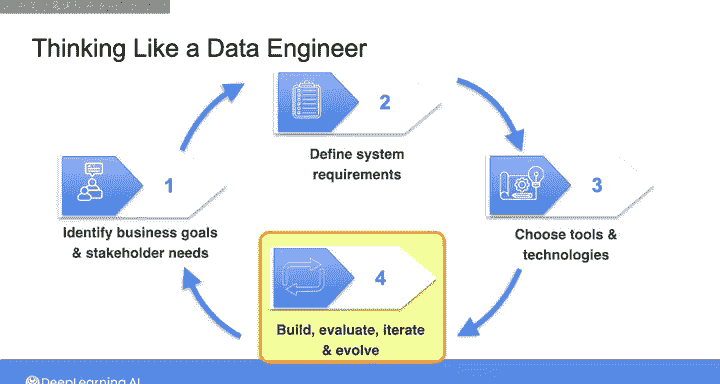

#  012：像数据工程师一样思考 🧠

在本节课中，我们将学习一个系统化的思考框架，帮助您像数据工程师一样规划、设计和实施数据项目。这个框架涵盖了从需求收集到系统部署与迭代的全过程。

---

在之前的视频中，我们走查了一个需求收集对话的示例，并总结了从该对话中得出的关于数据系统的**功能性需求**与**非功能性需求**，以及其他需要沟通的利益相关者。需求收集过程并非数据工程独有，它可能出现在各种产品开发或产品管理场景中。根据具体应用，需求收集的方法可能略有不同。

但通常，需求收集后的下一步是决定如何实际构建产品或系统以满足这些需求。在数据工程中，您的工作将涵盖从需求收集到数据系统实施的全过程。

本节视频将分享一个我称之为“像数据工程师一样思考”的框架，您可以在任何项目中应用它。

## 第一阶段：确定业务目标与利益相关者需求 🎯

在此阶段，您的主要目标是确定驱动项目的**业务目标**和**利益相关者需求**。

以下是此阶段需要完成的步骤：

*   **明确公司高层业务目标**：首先需要清晰理解公司层面的业务目标。
*   **识别利益相关者**：找出所有与项目相关的利益相关者，并理解他们的需求如何与高层业务目标相关联。
*   **与利益相关者沟通**：与每位利益相关者进行对话，了解当前已有的系统（您将要构建或替换的系统），以及现有系统之外的利益相关者需求。
*   **询问预期行动**：在此阶段，询问利益相关者计划如何使用您提供的数据产品采取行动至关重要。这有助于您精准定位所要构建系统的实际功能性需求。

## 第二阶段：定义系统需求 📋

在第二阶段，您的目标是将利益相关者的需求转化为系统的**功能性需求**和**非功能性需求**。

简而言之，这意味着：
*   **功能性需求**：描述系统**必须能够做什么**以满足利益相关者的需求。
*   **非功能性需求**：描述系统**将如何实现**其功能的技术规格。

一旦得出一组功能性和非功能性需求，您需要记录结论，并向利益相关者确认，按照这些需求设计的系统能够满足他们的期望。

## 第三阶段：选择工具与技术 🛠️

在第三阶段，您将为构建系统选择工具和技术。

此阶段始于识别能够满足系统需求的工具和技术。通常，会有多种工具和技术可以满足任何单项需求，您需要评估它们之间的权衡取舍。

因此，您需要进行**成本效益分析**，以从这些工具中选择最佳组件。在此分析中，您可能需要考虑许可费用、云资源支出估算以及使用这些组件构建和维护系统所需的其他资源。

## 第四阶段：构建、测试与迭代 🚀

最后，在选择了您认为最佳的工具和技术组合后，您将搭建系统的**原型**，以测试其是否符合预期，并判断它是否能为利益相关者带来价值。

在投入时间和精力构建完整的数据系统之前，搭建原型并进行测试的这最后一步非常重要。您需要测试所设计的系统是否真的能够满足利益相关者的需求。

在此阶段，您需要与利益相关者再次确认，让他们评估所设计的系统是否能为其带来价值。我强烈建议您花费足够的时间迭代原型，以确保系统在投入生产后能够成功。

作为此最终阶段的最后一步，您将**构建并部署**您的数据系统。

系统运行后，您需要**持续监控和评估**系统性能，并不断迭代以持续改进。您构建的任何数据系统都需要随着时间的推移而演进。

这可能是由于利益相关者需求的变化，或者在某些情况下，出现了能够提升系统性能、降低成本或提供其他优势的新工具或技术。

因此，虽然我将此框架呈现为依次发生的四个阶段，但实际上，这将是一个持续且循环的过程。随着业务目标和利益相关者需求的演变，您的数据系统也需要随之演进。

您可以这样理解：作为一名数据工程师，您需要始终与利益相关者沟通他们的需求和期望，根据数据系统的需求评估这些需求，并根据需要更新您的系统以满足利益相关者的需求。

---

我意识到这个框架可能感觉有些抽象，因为我们尚未实际完成大部分工作。但我希望在课程的第一周就介绍这些概念，以便您在后续课程中牢记它们，并重新审视每一个阶段。

在本周，我们大部分时间都在讨论前两个阶段：**识别业务目标与利益相关者需求**以及**定义需求**。

在本课程的第四周，我们将接续之前视频中与数据科学家的对话，并与其他所有利益相关者完成沟通。我们将定义需求，然后将其转化为系统的技术规格和工具选择。接着，在实验练习中，您将完成整个过程，并实施一个满足需求的数据架构。

现在，让我们快速了解一下云上数据工程的一些实际考量。下节课见。