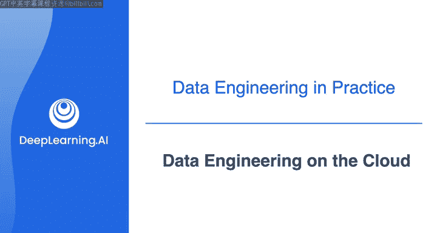
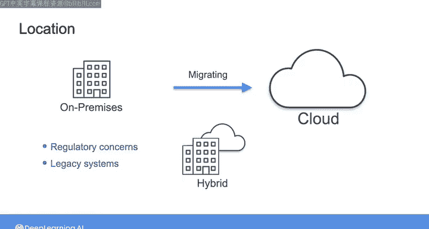
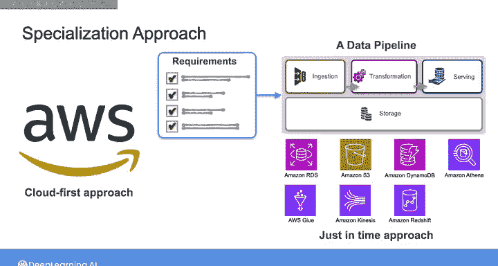

#  013：云上的数据工程 ☁️

在本节课中，我们将学习数据工程在云计算环境下的实践。我们将探讨从本地部署到云端的演变，并介绍本课程将如何采用“云优先”的方法，帮助你为成为一名数据工程师做好准备。

## 从本地部署到云端

上一节我们介绍了数据工程的生命周期和基本概念。本节中我们来看看数据工程实践环境的演变。

这门专项课程的核心是数据工程。到目前为止，在第一周的学习材料中，我们主要停留在较高的概念层面。我们审视了整体的数据工程生命周期和底层支撑，回顾了数据工程的一些历史，以及如何与利益相关者合作并为组织交付价值。

正如我在本周开始时所说，我意识到这可能不完全是你报名参加这些课程时所期望的内容。但正如我之前所说，这种高层次的思维框架和数据工程师的思考方式，对于后续所有内容都至关重要。我们将在整个课程中反复回顾这一点。

作为一名数据工程师，你所使用的实际工具和技术组合，在不同的公司之间可能会有很大差异。

正如我在关于数据工程历史的视频中所讨论的，随着公共云的出现，以及开源和专有工具的激增，各种规模和行业的公司现在都能使用同一套高性能的工具和技术。

如今，许多公司选择完全在云上构建其数据系统。但在不久之前，公司唯一的选择是在内部构建和维护自己的数据基础设施，这通常被称为本地部署系统。

今天，仍然有一些公司将其部分或全部数据基础设施维持在本地。在某些情况下，这可能是由于监管限制，或者公司有一些遗留系统，他们更倾向于在本地维护。

因此，作为一名当今的数据工程师，你可能会在一家拥有部分本地系统的公司工作，甚至可能负责将本地系统迁移到云端。

然而，越来越可能的情况是，你作为数据工程师的工作将完全在云端进行。

## 主要的云服务提供商

尽管AWS是第一个流行的公共云，并且至今仍是使用最广泛的云平台，但根据你的工作地点，你可能会遇到其他云服务提供商，例如谷歌云平台、微软的Azure等。

在本专项课程中，我们不会深入探讨如果你需要处理本地系统或从本地迁移到云端时可能遇到的细微差别或注意事项。相反，我们将采取“云优先”的方法，为你准备最可能遇到的数据工程师场景。

我们在开发这些课程时与AWS进行了合作。因此，在实验练习中，你将使用与全球数千家公司在其自身数据基础设施中使用的相同工具和技术，在AWS云上构建数据管道和架构。

到第一门课程结束时，你将能够根据我们讨论过的系统技术要求，建立一条使用适当云端工具和技术的数据管道，以满足这些需求。

## 本课程的学习方法

AWS云包含一套庞大的资源与工具。本专项课程的目标不是教你所有关于AWS数据工程的知识。相反，我们将采取“即时”学习方法，在你进行每个实验时，直接学习如何使用特定的工具。

通过这种方式，要成功完成这些课程，并不需要具备云计算方面的先验知识。

话虽如此，对云计算基础知识和术语有更广泛的了解，将有助于你在学习这些课程的过程中建立背景知识。

为了介绍AWS的工具和资源，我将邀请摩根·威利斯加入。他是一位首席云技术专家，专门教授人们如何在AWS云上取得成功。

请加入下一节视频，与摩根见面。

---

本节课中我们一起学习了数据工程向云端迁移的趋势，了解了主要的云服务提供商，并明确了本课程将采用与AWS合作的“云优先”及“即时”学习方法，为你在云端构建数据工程解决方案打下基础。