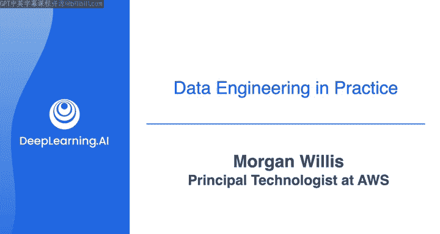

#  014：认识讲师与课程概述 🌟

在本节课中，我们将认识本课程的讲师摩根·威利斯，并概述数据工程基础课程的结构与目标。我们将了解讲师背景、课程涵盖的核心内容，以及如何为后续的实践环节做好准备。

## 讲师介绍 👩‍🏫

很高兴向大家介绍摩根·威利斯，她是AWS的首席云技术专家。

你可能在Coursera平台的其他课程中见过摩根，例如《AWS云从业者》和《云技术精要》课程。摩根，非常欢迎你加入我们。很高兴来到这里，乔。

在我们开始之前，你是否想更详细地介绍一下自己，包括你的背景以及你是如何开始教授全世界如何在AWS上构建出色应用的？当然可以。我最初获得了计算机科学学位，并担任了一段时间的软件开发人员。我确实非常热爱编程。

但我也意识到我同样热爱教学。因此，我转型成为一名软件开发训练营的讲师，之后加入了AWS担任培训师。现在，我为Coursera等平台教授我们的在线课程。我非常热爱这份工作，这无疑是我的梦想工作，能帮助人们在云计算领域实现他们的潜力。这真是太棒了。

## 课程目标与结构 🎯

欢迎来到数据工程世界，这里需要打下坚实的基础。这个基础的一部分可以称为概念和理论部分。

例如，就像我们本周讨论过的一些内容，比如需求收集、将数据工程项目从头到尾可视化为一系列阶段，以及如何开始像数据工程师一样思考。构建坚实数据工程基础的另一个重要部分是，实际动手构建数据工程解决方案的实践。

而这正是你们将在这些课程的实验环节中所要做的。当你刚开始在AWS云上构建时，可能会感到不知所措。你会接触到诸如区域和可用区等概念。

虚拟私有云、子网等等。没错，你还有不同的计算和数据库选项，以及存储选项。

网络和安全配置，而这仅仅是个开始。事实上，关于AWS云上的数据工程有太多需要了解的知识，因此我们提供了一项认证考试，让你可以成为AWS认证的数据工程师助理，并向雇主证明你熟悉AWS上的工具和资源。这项认证验证了围绕核心数据相关AWS服务的技能和知识，涉及的任务包括：数据摄取和转换能力、在应用编程概念的同时编排数据管道的知识、设计数据模型。

管理数据生命周期以及确保数据质量。通过这些课程，你将学习到该认证考试涵盖的许多关键概念和技术。如果你有兴趣，我鼓励你在完成本课程后继续学习并考取该认证。

## 课程起点与学习资源 📚

因此，我希望本周从基础开始，让你熟悉在这些课程中将会遇到的一些术语和概念。这些课程没有云知识先决条件，正如乔所说，对于完成实验所需的技术知识，我们会提供“刚好足够”和“及时”的内容，以确保你在这些练习中取得成功。

话虽如此，AWS云的内容远不止我们在这些课程中有时间详细涵盖的。如果你希望获得更深入的了解。

我推荐乔在本视频开头提到的两门课程：Coursera上的《AWS云从业者》和《云技术精要》课程。除此之外，我们每周还会提供额外的资源，供你喜欢时深入探索。那么，我们可以开始了吗？听起来很棒，交给你了，摩根。好的，太好了。我们将在下一个视频中见面，开始学习AWS云计算的基础知识。

## 总结 ✨

本节课中，我们一起认识了讲师摩根·威利斯，了解了她的专业背景和教学热情。我们概述了本数据工程基础课程的双重目标：构建概念理论框架与获得动手实践技能。课程将从AWS云基础开始，逐步深入，并为学有余力的学习者提供了进一步深造和考取专业认证的路径。下一节，我们将正式进入AWS云计算基础的学习。