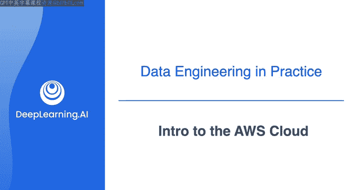
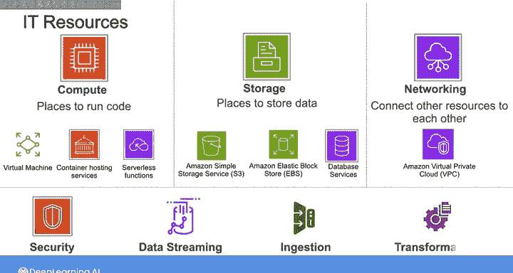
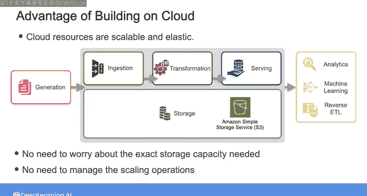
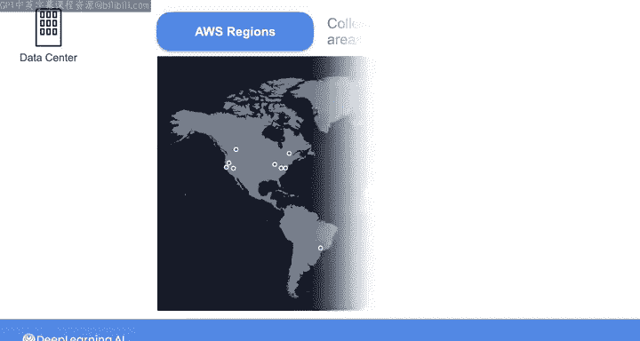
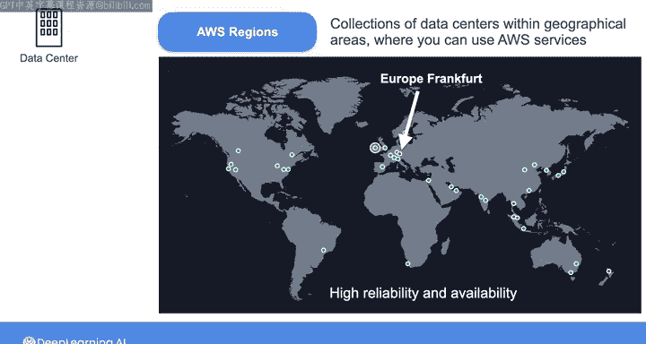

#  015：AWS云简介 ☁️

在本节课中，我们将要学习亚马逊云服务（AWS）的基本概念。我们将了解什么是云计算、AWS的核心资源类型、以及其全球基础设施的架构。这些知识是构建现代、可扩展数据系统的基础。

---

在AWS，我们将云描述为通过互联网按需交付IT资源，并采用按使用量付费的定价模式。

换句话说，AWS旨在您需要时，即时提供构建数据系统或其他应用所需的资源。当不再需要这些资源时，您可以将其关闭。在每个月底，您只需为实际使用的部分付费。

正如Joe之前提到的，这与构建自己的本地数据中心模式截然不同。在本地模式中，您通常需要为未来数年所购买的IT资源做出长期承诺。

当提到IT资源时，我指的是计算、存储和网络等资源。

在AWS上，计算资源是运行代码的地方，例如虚拟机、容器托管服务或无服务器函数。存储资源是存放数据的地方，包括亚马逊简单存储服务（S3）或亚马逊弹性块存储等服务，以及可以运行关系型数据库、NoSQL数据库、图数据库等的数据库服务。网络资源则允许您将其他资源相互连接，并与外部互联网相连。亚马逊虚拟私有云就是一个网络资源的例子，它让您在云中拥有自己的私有网络。

除了计算、存储和网络，AWS在安全、数据流、摄取、转换等领域还有许多其他类别的资源和服务。

在云上构建数据系统的优势在于，云资源具有可扩展性和弹性。

我的意思是，例如，如果您正在构建一个包含S3对象存储的数据管道，您无需提前精确计算需要多少存储容量。您也无需在数据增长或减少时管理扩展操作。相反，服务会自动向上和向下扩展，它是弹性的。其他AWS服务也存在同样类型的可扩展性和弹性。

这意味着您无需提前猜测容量。您可以随时为系统的高峰需求或变化的流量做好准备，并且更容易避免为不需要的资源付费。

可以将使用AWS想象成消费电力。用电时，您只需为实际使用的部分付费。月底支付账单时，电力是如何产生或输送到您家中的细节对您而言是抽象的。

AWS资源和服务托管在AWS于全球各地建设的物理数据中心中。您通过互联网使用这些服务，这使您能够构建解决方案，而无需建设和管理自己的数据中心。

因此，当您使用AWS时，您不会以单个数据中心的角度来思考。相反，您会将资源部署到所谓的AWS区域中。区域是地理区域内数据中心的集合，您可以在其中使用AWS服务。

以这种地理分布式方式托管您的解决方案，可以确保系统的可靠性和可用性，并在单个数据中心因自然灾害或其他问题而离线时提供弹性。

AWS区域以其地理区域命名，例如“美国东部（弗吉尼亚北部）”、“亚太（孟买）”或“欧洲（法兰克福）”。每个AWS区域由多个可用区组成。

可用区是区域内数据中心的较小分组。它们被设计得彼此足够远，以至于如果发生电力中断、洪水或其他可用区级别的故障，它们可以故障转移到区域内的其他可用区，由其他可用区吸收流量，从而使您的系统不受问题影响。

其运作方式是：多个数据中心构成一个可用区，多个可用区构成一个AWS区域。

当您在AWS上创建资源时，您需要选择区域，根据所使用的服务，可能还需要选择可用区。在幕后，这些数据中心和可用区通过低延迟链路相互连接，这些链路运行在连接所有设施的AWS全球光纤网络之上。

在您作为数据工程师的工作中，您将经常像搭积木一样，将多个AWS资源和服务组合在一起以形成解决方案。AWS提供超过200项服务，其中一些是通用型的，另一些则用途更具体。

AWS全球基础设施还有更多内容，但这是一个良好的开端。本视频中涵盖的概念将在您深入学习AWS时反复出现。

---

本节课中，我们一起学习了AWS云计算的核心概念。我们了解了按需付费的模式、计算/存储/网络三类核心资源、以及区域和可用区构成的高可用全球基础设施架构。这些是理解和使用AWS服务构建弹性数据系统的基石。