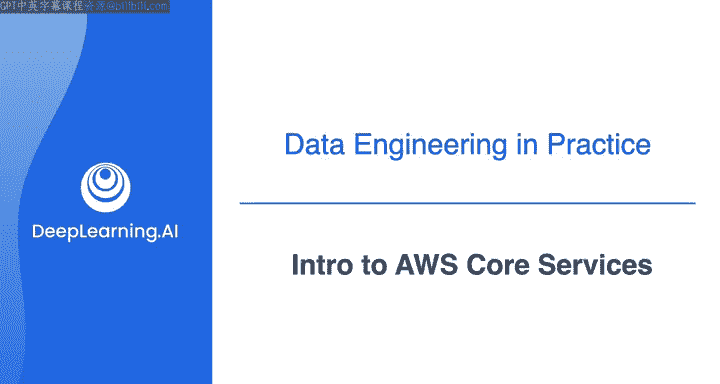
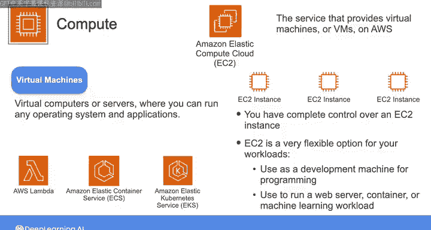
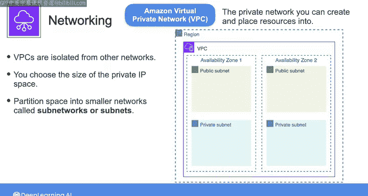
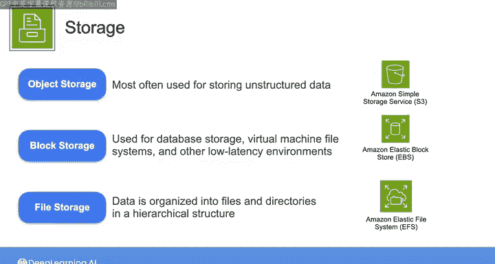
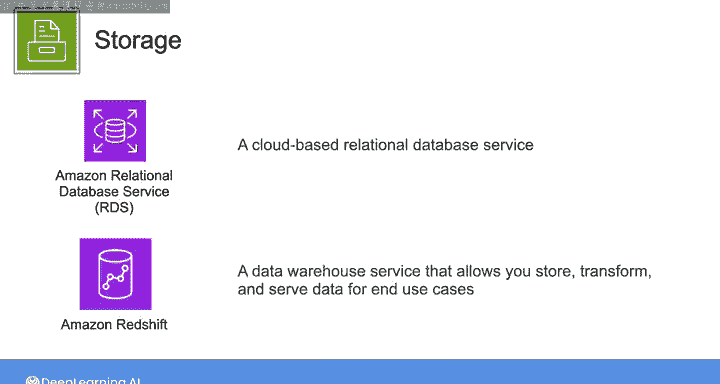
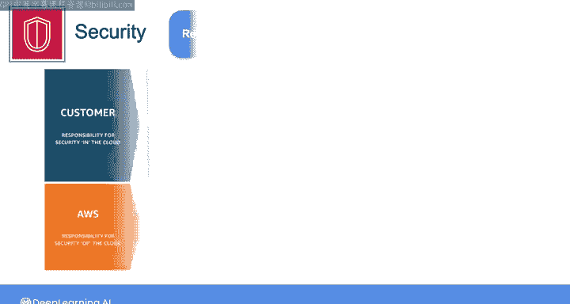
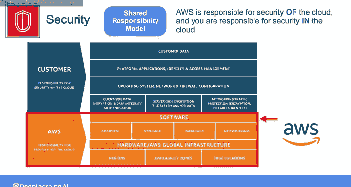
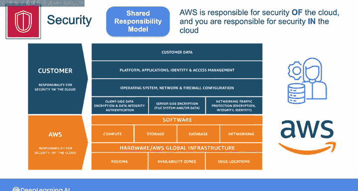

#  016：AWS核心服务简介 🚀

在本节课中，我们将要学习亚马逊云科技（AWS）的核心服务。我们将这些服务分为计算、网络、存储、数据库和安全五大类别进行介绍，帮助你为后续课程中的实际操作建立基础概念。

## 概述

上一节我们了解了AWS云的基本概念和高级工作原理。本节中，我们来看看构成AWS云基础的一些核心服务。理解这些服务是构建和操作数据工程解决方案的关键。

## 计算服务 💻

在AWS上，计算服务有多种选择。在这些课程中，你将频繁接触到一个核心服务：**Amazon Elastic Compute Cloud (EC2)**。

简单来说，EC2是在AWS上提供虚拟机（VM）的服务。你可以将VM视为一台虚拟计算机或服务器，可以在其上运行任何你希望的操作系统（如Linux、Mac或Windows）以及任何应用程序，就像在任何实体计算机上一样，只不过它运行在AWS云上。

当你使用EC2启动一台虚拟机时，我们称之为一个**Amazon EC2实例**。启动EC2实例后，你对该实例拥有完全控制权，包括操作系统、应用程序以及实例上发生的任何其他操作。因此，EC2是一个非常灵活的选择，为你提供了高度的控制力。

以下是EC2实例的一些常见用途：
*   作为编程的开发机器。
*   运行Web服务器。
*   运行容器或机器学习工作负载。
*   部署单个实例或一组实例，并水平扩展以满足需求。

除了EC2，AWS还提供许多其他计算选项，例如使用**AWS Lambda**的无服务器函数（你可以托管代码以响应触发器或事件运行），以及像**Amazon Elastic Container Service (ECS)** 这样的容器托管服务。

## 网络服务 🌐

现在，让我们转向网络服务。每当你创建一个EC2实例或许多其他类型的AWS资源时，都需要将其放入某种网络中。

在AWS中，你可以创建并放置资源的私有网络被称为**Amazon Virtual Private Cloud (VPC)**。VPC是你在云中创建和控制的私有网络，与AWS云中的其他网络隔离。

你选择所需的私有IP地址空间大小，并将其划分为更小的网络，称为**子网**。一个VPC横跨一个区域内的所有可用区，但不能跨区域。因此，你需要在每个想要运营的区域创建一个VPC。大多数AWS资源也是如此，它们都受区域限制。你的数据和资源不会离开该区域，除非你专门构建的解决方案要求如此，这对于合规性和安全性非常重要。

因此，每当你创建某些AWS资源（如EC2实例或基于实例的数据库）时，都需要选择要将其放置在哪个VPC和哪个可用区中。

## 存储服务 💾

接下来，我们谈谈存储。在AWS上，需要了解多种不同类型的存储，如对象存储、块存储和文件存储，AWS为每种类型都提供了相应的服务。

**对象存储**最常用于存储非结构化数据，如文档、日志、照片或视频。在这些课程中，你将在即将到来的实验中花大量时间熟悉**Amazon S3**对象存储服务。

与对象存储相对的是**块存储**，它通常用于数据库存储、虚拟机文件系统以及其他对低延迟和高性能要求苛刻的环境。在AWS中，你可以将称为**Amazon Elastic Block Store (EBS)** 卷的块存储设备附加到EC2实例上，这些卷会挂载到操作系统，然后你可以使用在EC2上运行的程序来存储和访问数据。

最后是**文件存储**，这是普通非技术用户最熟悉的存储类型。在文件存储中，数据被组织成文件和目录的层次结构，就像你笔记本电脑上的文件系统或工作中的共享文件系统一样。AWS提供了一项名为**Amazon Elastic File System (EFS)** 的托管服务，它提供了一个可扩展的文件存储解决方案，可以同时挂载到多个不同的系统以进行文件访问。

## 数据库服务 🗄️

在某种意义上，可以说数据库是另一种存储服务，但数据库属于一个独立的核心类别。

尽管数据库在幕后使用块存储来存储数据，但它们还提供了管理结构化数据的特殊功能，例如支持复杂查询、数据索引以及其他通常不由通用存储服务提供的特性。

作为一名数据工程师，你将经常处理以关系数据库格式组织的表格数据。在这些课程中，你将非常熟悉**Amazon Relational Database Service (RDS)**，顾名思义，这是一个基于云的关系数据库服务。

你还将使用一项名为**Amazon Redshift**的服务，这是一个数据仓库服务，允许你存储、转换数据并提供给最终用例使用。AWS上还有其他许多数据库服务，但RDS和Redshift是你在这些课程中最常看到的两个，稍后我会向你介绍其他服务。

## 安全服务 🔒

谈到云安全，AWS遵循我们所说的**责任共担模型**。

责任共担模型规定，**AWS负责“云本身的安全”**，而**你负责“云内资源的安全”**。为了更好地理解这意味着什么，我想用一个高层公寓楼的比喻来说明。

建筑所有者和物业管理公司负责确保物理建筑本身安全且符合规范，并确保每个公寓都有可用的门锁，可能还有其他安全措施。现在，如果你是楼里的租户，你负责实际使用这些安全功能，比如确保你离开时或晚上在家时锁好门。从这个意义上说，需要物业管理方和租户双方各尽其责，才能确保任何特定公寓的安全。

要了解责任共担模型在AWS上的运作方式，你可以将高层公寓楼的想法应用到Amazon EC2上。对于EC2，AWS运营和管理底层组件，从运行EC2实例的物理硬件和设施，一直到被称为**管理程序层**（在这里，计算资源被分配给你和其他AWS客户）。所有这些组件的安全是AWS 100%的责任。

而当你使用EC2启动一台虚拟机时，你负责管理该虚拟机的**客户操作系统**、任何软件更新或补丁、设置网络配置（如防火墙）、管理对你数据的访问，以及在需要时使用适当的加密技术。所有这些方面的安全是你100%的责任。

因此，需要你和AWS双方共同努力，才能维护一个安全的EC2实例。对于云上的任何其他资源也是如此。其他AWS服务的运作方式略有不同，在AWS责任结束和你责任开始的地方划定了不同的界限。随着你在课程中深入学习并接触不同的AWS服务，你会更了解这个概念。所以，如果这个安全责任共担的概念对你来说还不熟悉，请不要担心。

## 总结

本节课中，我们一起学习了将在这些课程中使用的几个核心AWS服务的简要介绍。我们涵盖了计算（EC2）、网络（VPC）、存储（S3， EBS， EFS）、数据库（RDS， Redshift）和安全（责任共担模型）五大类别。

通过这些课程的所有实验，你将能够访问AWS云资源，而无需创建自己的账户。话虽如此，在下一个视频中，我将简要介绍AWS管理控制台。如果你愿意，可以创建一个免费的AWS账户并跟着操作以熟悉环境。在下一个阅读材料中，你会找到设置自己AWS账户的一些说明，如果你有兴趣在这些课程的学习之外自行探索AWS，我邀请你这样做。但再次强调，这完全是可选的，你完全可以在不创建自己AWS账户的情况下成功完成这些课程。

请加入下一个视频，一起看看AWS管理控制台。