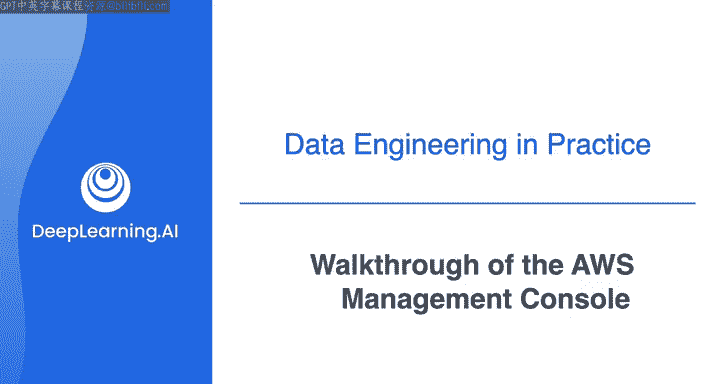
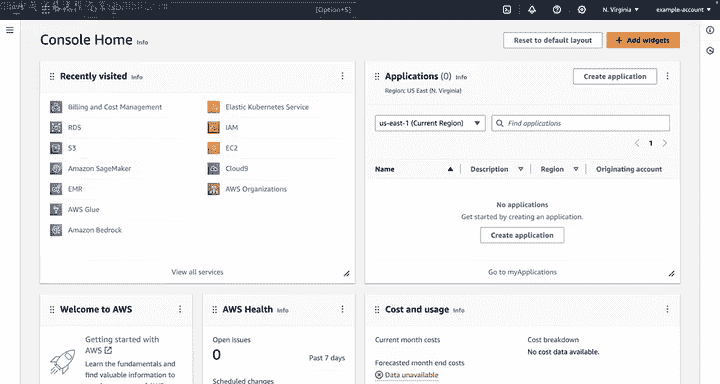
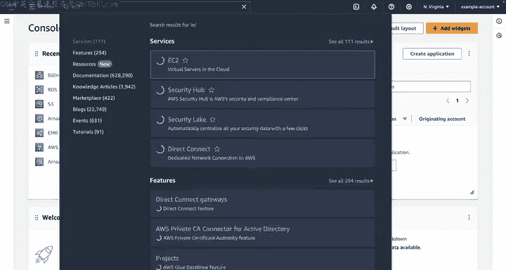
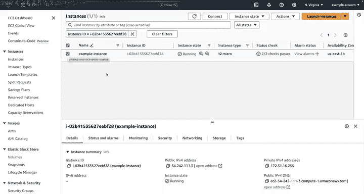
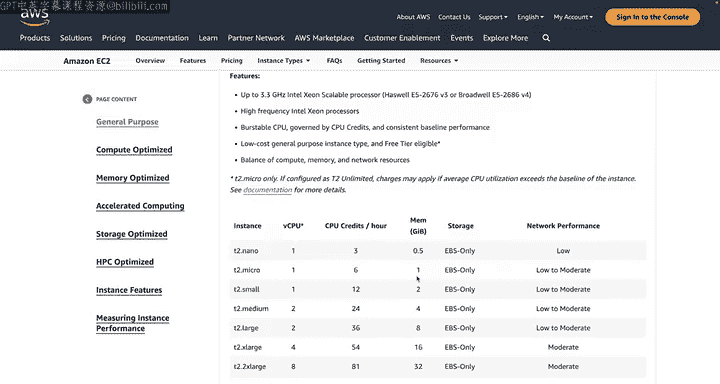
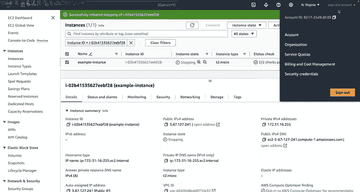

#  017：AWS管理控制台演练 🖥️

在本节课中，我们将要学习AWS管理控制台的基本操作。即使你之前没有使用过AWS或任何云服务，也无需担心。课程中的实验会为你准备好AWS环境，你无需拥有自己的AWS账户。本节课将为你展示控制台的界面和基本导航，帮助你为后续的实验做好准备。

---

## 课程概述

在学习数据工程的过程中，你将频繁地与云平台交互。AWS（亚马逊云科技）是其中一个广泛使用的平台。本节课程旨在让你熟悉AWS管理控制台，这是你启动每个实验后首先会进入的界面。我们将了解如何查找服务、启动一个基本的计算资源（EC2实例），并学习如何管理它以避免产生不必要的费用。

---

## AWS控制台初览

你之前可能没有使用过AWS或其他云服务，这没有问题。为了完成本课程的实验练习，你不需要具备任何云服务的使用经验。

在每个实验中，都会为你设置好一个AWS环境。因此，你不需要拥有自己的AWS账户来完成实验。

你将在下周看到你的第一个实验，但现在我想花点时间向你展示AWS管理控制台的样子。每次你启动一个新实验时，这里将是你首先到达的地方。

如果你有兴趣自己探索控制台，可以按照上一个阅读材料中的说明创建你自己的AWS账户，并跟随本视频一起操作。或者，你也可以放松一下，我将为你预览在实验中将会用到的AWS管理控制台。

---

## 启动控制台与导航

当你开始每个实验时，会收到打开AWS管理控制台的说明。完成此操作后，你会看到一个类似这样的登录页面。由于AWS会持续更新其平台和服务，这个控制台的用户界面可能会发生变化，你的控制台看起来可能与视频中的略有不同。但我即将展示的所有基本导航说明，在控制台主页上应该保持相对一致。

在控制台主页上，有一个“最近访问”部分，显示你最近访问过的服务。当你开始一个实验时，这个部分可能不包含任何服务。但任何时候，如果你想访问特定服务以创建资源，可以点击这个搜索栏并开始输入你需要的服务名称。

例如，假设你想访问现有的EC2资源或启动新的EC2实例。只需在搜索栏中输入“EC2”，然后点击出现的服务。你将被带到类似此处所示的服务仪表板。

大多数服务在左侧都有一个导航菜单，你可以通过点击其中一个菜单项导航到特定窗口。

---

## 启动一个EC2实例

现在，假设你想从这个EC2仪表板启动一个新的EC2实例。你需要选择“启动实例”。这将带你到一个页面，你可以在那里为实例选择所有想要提供的配置细节。许多配置选项都有默认值，因此你可以快速开始。

以下是启动实例的基本步骤：

首先，你需要为实例提供一个名称。我将这个实例命名为“示例实例”。

然后，你可以选择要使用的亚马逊机器镜像（AMI），这将决定实例上预装的操作系统和应用程序以及其他配置。这里，我将保持选择Amazon Linux作为AMI。

接着，你可以选择实例类型，这决定了EC2实例提供的硬件能力的大小和组合。因为这只是一个关于如何使用管理控制台的快速演示，我将直接接受默认值，这里是一个T2 micro实例。T2是实例类型，micro是大小。

然后，你需要选择在没有密钥对的情况下继续，以便从本地连接到实例。从这里，你可以向下滚动，接受其余的默认值，并启动实例。目前，你不需要过于担心这些具体的配置细节。我只是想向你展示如何在实验练习中熟悉导航AWS管理控制台。在实验练习中，你将获得配置EC2实例的详细说明。

这个实例需要几分钟时间启动，所以我们将在它完成后回来。

---

## 理解控制台背后的API

当你使用AWS管理控制台这样启动一个实例时，你实际上是在调用AWS API来执行此操作。你也可以使用其他工具（如AWS命令行界面、CLI或AWS软件开发工具包SDK）执行相同的任务。AWS管理控制台只是与AWS API交互的一种方式。

---

## 查看与理解EC2实例

好的，现在EC2实例已经可用。在这里，我可以看到有一个正在运行的实例。我现在可以使用控制台与此实例进行交互。

但首先，我刚刚创建的这台虚拟机到底是什么？让我们查看一下EC2的文档，以更好地了解这个小云计算机的特性。

如前所述，这个实例是一个T2 micro，这是默认的EC2实例类型。在文档页面的顶部“通用用途”下，我可以选择T2来查看所有不同类型T2实例的规格。在“功能”下，我可以看到这个实例配备了一个3.3 GHz的处理器。然后在表格的“内存”下，我可以看到T2 micro有1 GB的内存或RAM。所以这确实是一台相当小的计算机。事实上，你的手机在处理和内存容量方面可能比这个T2 micro实例更强大。

如果你在AWS上需要一台功能更强大的虚拟机来运行你的工作负载，你可以选择其他T2实例之一，或选择不同的通用实例类型来满足你的需求。你还可以选择针对计算、内存或存储进行优化的实例类型，以及加速和高性能计算实例。

这里的要点是，对于EC2，有数百种实例类型可供选择。根据你的项目，你可以配置一台从手机处理能力的一小部分到云端超级计算机的各种规格的机器。

---

## 管理资源与成本控制

现在回到我们这里正在运行的T2 micro实例。当你使用自己的AWS账户工作时，有一件事你需要确保做到，那就是在不使用任何资源时将其删除或停止，以避免为此付费。对于EC2，你只在EC2实例运行时以及为附加到实例的弹性块存储（EBS）资源付费。

因此，为了避免在这里产生费用，我将通过选择实例，然后选择“停止实例”来停止该实例。这里会弹出一个警告，告诉我我仍将为关联的EBS资源或弹性IP地址付费（在本例中我们没有这些资源）。所以我将选择“停止”，这将停止该实例。

---

## 查找账户信息与区域

接下来我想向你展示的是如何找到你的账户号码和你当前正在工作的区域，这些信息在部分实验中会需要。在右上角，你可以点击账户名称旁边的下拉菜单来复制账户ID。我创建这个账户仅用于演示目的，你的账户ID将是独一无二的。

然后，你可以点击区域下拉菜单来查看或更改你正在操作的区域。提醒一下，你在这里看到的AWS区域是一个地理区域，包含托管你资源的数据中心。

---

## 课程总结

本节课中，我们一起学习了AWS管理控制台的基本导航和操作。我们了解了如何通过搜索栏访问服务，逐步完成了启动一个EC2实例的流程，并探讨了实例类型的概念。重要的是，我们学会了如何停止实例以控制成本，以及如何查找账户ID和当前区域信息。

再次强调，在现阶段，你不需要担心具体的配置细节。本节课的目的只是让你对将在实验中遇到的平台有一个初步的了解。在本课程的每个实验中，你都将获得关于如何与控制台交互以及如何为你将构建的数据管道设置各种资源的逐步说明。

接下来，我将把你交还给Joe来结束本周的课程。