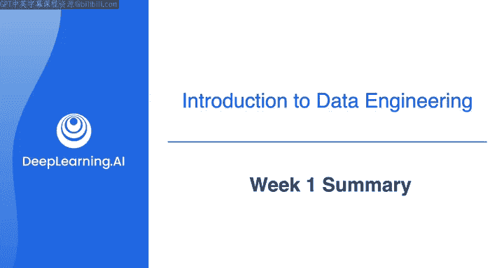
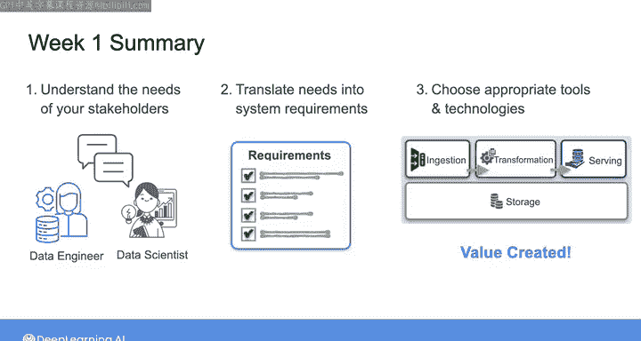
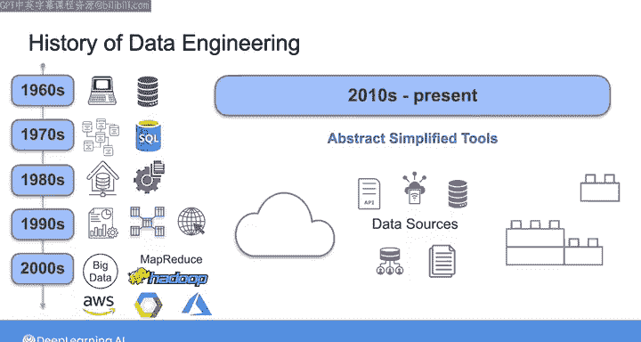
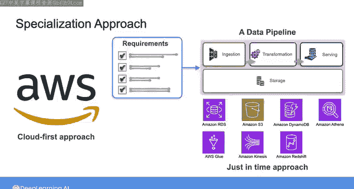

#  018：第1周总结 🎯

在本节课中，我们将回顾第1周的核心内容，总结数据工程师的思维方式、关键概念以及后续的学习方向。

---

恭喜你完成第1周的学习。希望你已经开始适应以数据工程师的思维方式思考问题。也希望你通过Morgan的视频，对AWS云的相关术语和概念有了初步了解。

本周我们从一个场景开始：你被一家充满活力的电子商务公司聘为数据工程师。实际上，作为数据工程师，你可能会面临多种不同的工作场景。

以下是几种可能的情况：
*   你可能是一家公司聘用的第一位数据工程师，负责从零开始构建数据系统。
*   你可能加入一个成熟的数据团队。
*   你甚至可能加入一家已有数据系统，但原构建者已离职的公司，你需要理解现有基础设施并进行修改、扩展或替换，以满足业务需求。

无论你身处何种情况，本周讨论的内容都具有参考价值。构建成功数据系统的第一步，无论是从零开始、更新现有系统、独立工作还是团队协作，都是理解利益相关者的需求，以及他们如何从你提供的数据中获取价值。

当你能够将这些需求转化为系统要求，并设置合适的工具和技术来满足这些需求时，你就走上了为组织创造价值的道路。

我们为你提供了一个数据工程师的思维框架，你可以将工作视为分阶段进行。

以下是该框架的四个阶段：
1.  **识别业务目标与利益相关者需求**
2.  **定义系统需求**
3.  **选择合适的工具与技术**
4.  **构建并评估数据系统**

本周我们还回顾了数据和数据工程的历史，以了解我们如何发展到当前领域的状态。

我分享了在本课程中我们将采用的“云优先”方法的一些背景。此外，你和Morgan一起学习了在AWS云上开始构建所需的一些基本概念和资源。

---

在下一周的材料中，我们将深入探讨数据工程生命周期的各个阶段和底层逻辑。随后，你将有机会在一个动手实验活动中应用SP框架，在AWS上构建你的第一个数据管道。我们下周见。

---

**本节课总结**：本节课我们一起回顾了第1周的核心要点，包括数据工程师的多种工作场景、从需求出发的思维框架（识别需求、定义要求、选择工具、构建评估），以及数据工程的历史与云优先方法。这为后续深入学习数据工程生命周期和动手实践奠定了基础。