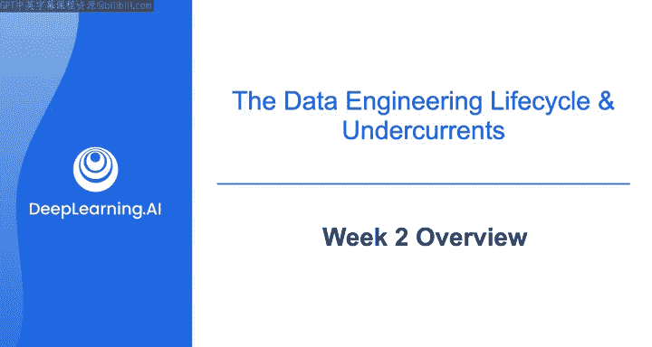
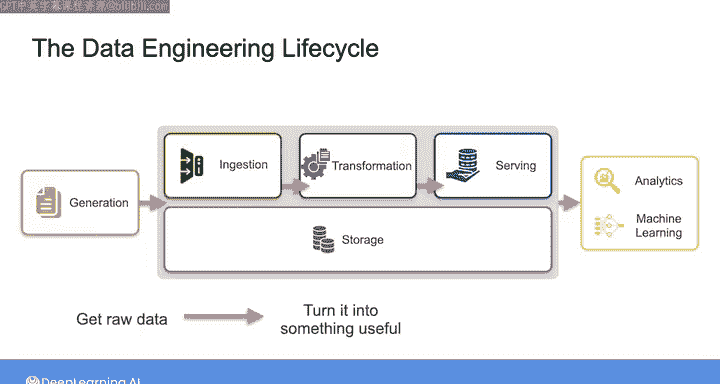
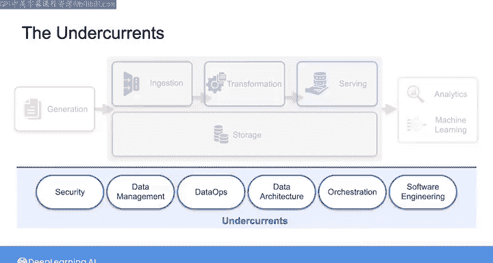

#  019：数据工程导论课程（第2周概览）🚀

在本节课中，我们将深入学习数据工程生命周期及其支撑要素。这些概念已在第1周引入，本周我们将详细探讨每个阶段及其实际应用。

上一周我们介绍了数据工程生命周期的整体框架。本周我们将深入其核心阶段：从数据生成开始，经过摄取、转换、存储，最终服务于下游应用。

## 数据工程生命周期深入 🔄

数据工程生命周期始于左侧的**数据生成**，这通常发生在数据工程师介入之前。随后，我们将探讨**数据摄取**、**转换**、**存储**以及如何为多种用例（如分析和机器学习）提供数据服务。

简而言之，我们将学习如何从源头获取原始数据，将其转化为有用形式，并使其可用于下游任务。

## 支撑要素详解 🛠️

在本周的第二课中，我们将关注数据工程生命周期的支撑要素。

以下是支撑要素的具体内容：

*   **安全**
*   **数据管理**
*   **数据运维**
*   **数据架构**
*   **编排**
*   **软件工程**

需要明确的是，本周与上周的材料一样，重点在于建立数据工程的**高层思维框架**，而非立即构建具体的数据基础设施。

我认为，在开始动手构建之前，确立正确的思维框架至关重要。这将使你在数据工程师工作的各个方面都更加成功。

## 理论与实践结合 ☁️

尽管本周侧重理论，但并非全是抽象概念。在周末，我们将看到这一思维框架如何在**AWS云平台**上付诸实践。

在实验活动中，你将亲手操作第一个端到端的云数据管道。

---

本节课中，我们一起学习了数据工程生命周期的详细阶段及其关键支撑要素，并了解到如何将理论框架应用于实际的云平台环境中。