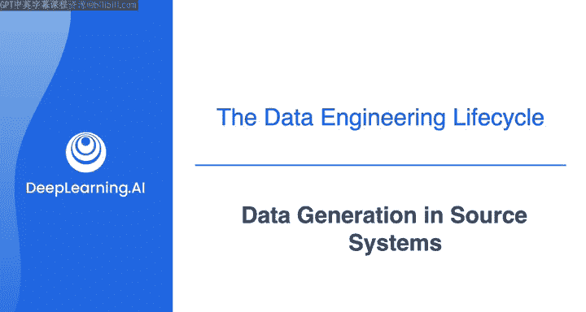
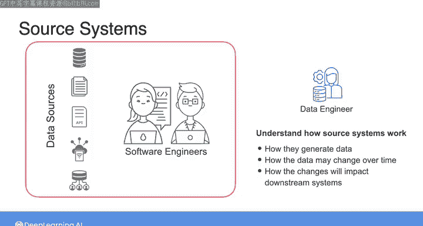

#  020：源系统中的数据生成 📊

在本节课中，我们将要学习数据工程生命周期的第一阶段：源系统中的数据生成。作为数据工程师，你将需要从各种来源获取数据。理解这些源系统如何工作至关重要，因为你构建的数据管道将依赖于这些来源生成的数据。

---

## 源系统概览 🔍

上一节我们介绍了数据生成是数据工程生命周期的起点。本节中我们来看看数据工程师在工作中会遇到的几种常见源系统。

最常见的源系统是数据库。数据库可以是关系型数据库，其数据以相互关联的表格形式呈现，也可以是其他类型的NoSQL系统，例如键值数据库、文档存储等。这些数据库可能是某个Web或移动应用后端的一部分，也可能用于存储来自其他系统的数据。如果你还不熟悉不同类型的数据库，不用担心，我们将在后续课程中详细讲解。

除了数据库，你可能还需要处理文件形式的数据，例如文本文件、MP3音频文件，甚至视频或其他类型的文件。虽然单个文件本身可能不被称为一个“源系统”，但在数据工程实践中，你经常需要下载或被授予文件访问权限才能开始工作。

另一个常见的源系统是API。API是应用程序编程接口的缩写。简而言之，API允许你通过网络请求数据，并以特定格式（如XML或JSON）获取返回的数据。

数据共享平台也是一种源系统。组织可能建立此类平台，用于内部或与第三方共享数据。

正如之前提到的，物联网设备是另一种日益普遍的源系统类型。对于这类源系统，你可能需要处理许多独立设备（即物联网设备群）实时传输的数据流。这些流数据通常被发送到数据库，源系统所有者可能通过API或数据共享平台提供数据访问。在其他情况下，你可能需要摄取并合并所有这些独立的数据流，以供下游工作流使用。

---

## 现实世界的挑战与应对策略 ⚠️

在理想情况下，你所依赖的源系统会以一致且及时的方式交付所需数据，使你能够构建依赖于该源系统可预测性的下游系统。然而在现实世界中，源系统往往是不可预测的。

这些系统有时会宕机，或者管理系统的团队会更改数据的格式或模式。有时模式保持不变，但数据本身发生了变化。

当我刚开始担任数据工程师时，我记得曾使用一个由内部软件工程师团队维护的数据库。有一天，该团队决定重新排列其应用程序数据库中的列，并且没有告知我这些更改。后来我发现，我的数据管道所依赖的列被更改、重命名，甚至有些被删除了。这完全中断了一些下游数据工作流，我不得不向一些相当不满的利益相关者解释，这体验很不好。

因此，在从源系统访问数据时，必须了解这些系统的设置方式，以及可以预期数据和系统会发生何种变化。这意味着，作为数据工程师，如果你能直接与源系统所有者合作，了解这些系统的工作原理、它们如何生成数据、这些数据可能如何随时间变化，以及这些变化最终将如何影响你构建的下游系统，你将最有可能成功。

根据我的经验，与源系统利益相关者建立良好的工作关系，是成功的数据工程中一个被低估但至关重要的部分。

---

## 总结与预告 📝

本节课中我们一起学习了数据工程生命周期的第一阶段——源系统中的数据生成。我们探讨了常见的源系统类型，包括数据库、文件、API、数据共享平台和物联网设备，并讨论了在现实工作中应对源系统不可预测性的重要性。

根据你的源系统和目标，数据工程生命周期的下一个主要阶段——数据摄取，在不同的项目中可能看起来截然不同。在下一个视频中，我们将一起深入了解从源系统进行数据摄取的过程。