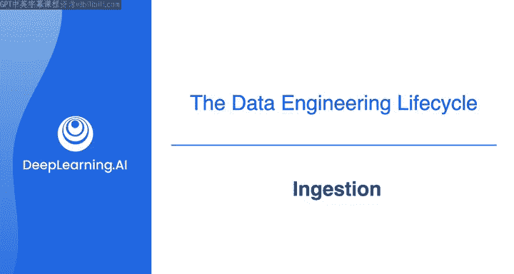
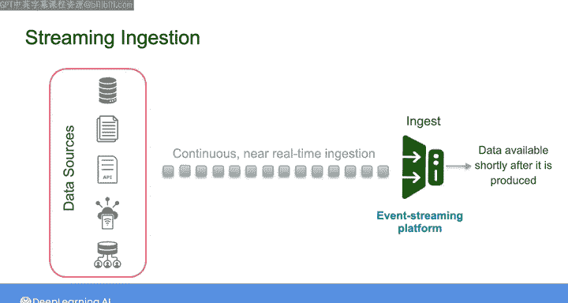
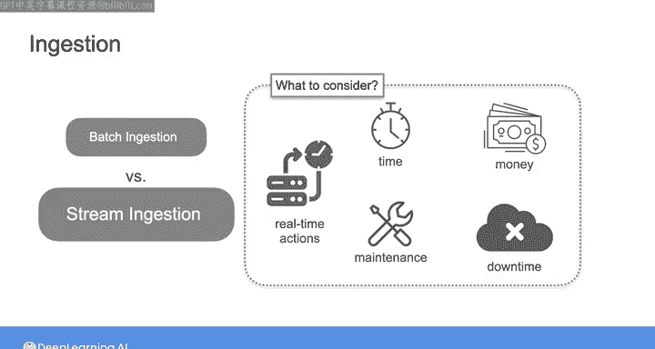
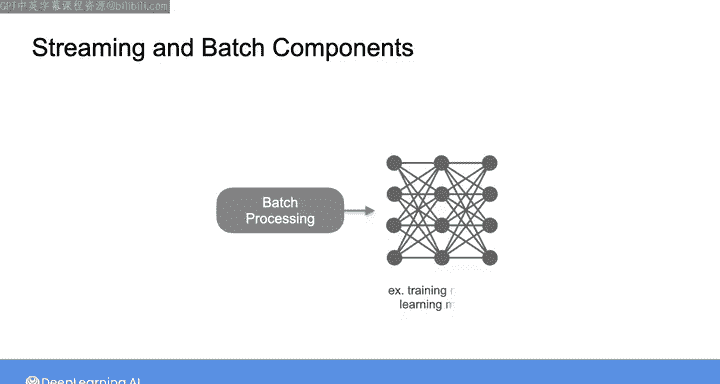
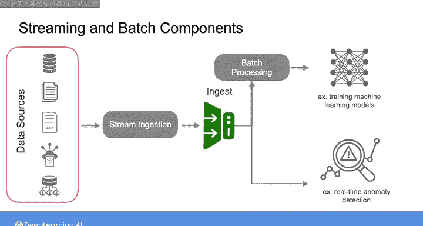

#  021：第21课 - 数据摄取模式详解 📥

在本节课中，我们将学习数据工程生命周期中的关键环节：数据摄取。我们将重点探讨两种主要的数据摄取模式——批处理与流式处理，并分析它们的特点、适用场景以及选择时需要考虑的权衡因素。

作为数据工程师，你将构建从源系统摄取数据开始的架构。这意味着将原始数据从源系统移动到你的数据管道中，以便进行后续处理。

根据经验，如果按照前一视频的建议，直接与源系统所有者合作以理解系统工作原理、数据生成方式、数据随时间可能发生的变化，以及这些变化最终将如何影响你构建的下游系统，那么源系统和数据摄取通常是数据工程生命周期中最大的瓶颈。做好这些准备，你将能很好地避免摄取阶段的常见陷阱。

## 设计数据摄取流程的关键决策

在设计数据摄取流程时，你需要做出的一个关键决策是数据摄取的频率。这意味着你需要决定多久将数据从左侧所示的这些源系统移动到你的数据管道中进行进一步处理。

以下是两种主要的频率模式：

*   **批处理摄取**：你可能选择每隔一段时间批量摄取数据，例如每小时一次或每天一次。
*   **流式摄取**：另一种日益常见的方法是，以近乎实时的连续事件流形式摄取数据。

因此，在本视频中，我将重点介绍这两种主要的数据摄取模式：批处理与流式处理。

## 理解批处理与流式处理

你可以将数据生产视为一个连续的事件系列。这些事件可能是网站点击、传感器测量或世界上发生的其他事情。这类事件在持续不断地发生。从这个意义上说，几乎可以认为所有数据在其源头都是“流式”产生的。

**批处理摄取**只是一种方便的方式，用于按大块处理这些事件流。它要么基于预定的时间间隔，要么在数据达到预设的大小阈值时触发。

例如，你可以将一整天的数据作为一个批次来处理。在很长一段时间里，批处理是摄取数据的默认方式。尽管如今有更多的摄取选项，批处理仍然是一种实用且流行的数据摄取方式，特别是在数据用于分析和机器学习的情况下。

另一方面，对于**流式摄取**，你正在以连续、近乎实时的方式摄取数据并提供给下游系统。

当我说“近乎实时”地摄取数据时，我的意思是在数据产生后很短的时间内（可能不到一秒钟）就使其对下游系统可用。在这种情况下，你需要使用特定的工具，例如事件流平台或消息队列，来持续摄取事件流。随着这些工具变得越来越普及，流式摄取也变得更加容易实现和流行。

## 选择摄取模式：权衡与考量

然而，流式摄取并非对所有用例都是最佳选择。在决定是否选择流式摄取而非可能被认为更简单的批处理方式时，需要考虑重大的权衡。

在着手构建流处理解决方案之前，你应该问自己一些问题：对实时数据采取哪些操作能比批处理数据带来改进？流式摄取在时间、金钱、维护和潜在停机方面是否比批处理成本更高？选择流式摄取而非批处理（或反之）将如何影响数据管道的其余部分？

批处理是许多常见用例（如模型训练和每周报告）的绝佳方法。我的建议是，只有在花时间确定了一个能够证明其相对于批处理的权衡是合理的业务用例后，才采用流式摄取系统。

同样重要的是要注意，流式摄取通常与批处理共存。例如，机器学习模型通常是在批处理基础上进行训练的。而同样的训练数据最初可能是通过流式方式摄取的，这可能是出于架构的某个独立目标，比如实时异常检测。

数据工程师很少有机会构建一个完全没有批处理组件的纯流式数据管道。相反，你将选择批处理和流式处理之间的边界在哪里。

## 摄取阶段的其他重要细节

除了在批处理与流式处理方法之间做出选择外，摄取阶段还有其他重要的细节需要考虑。例如，你可能会使用**变更数据捕获**来基于源系统中的数据变化触发特定的摄取过程。此外，你还需要决定是采用**推送**还是**拉取**方式，即源系统是将数据推送给你，还是你主动从源系统拉取数据。

我们将在整个专项课程中深入探讨所有这些细节及更多内容。但现在，请和我一起进入下一个视频，了解数据存储，这实际上是数据工程生命周期每个阶段都涉及的部分。

---

**本节课总结**

在本节课中，我们一起学习了数据摄取的核心概念。我们明确了数据工程师需要从理解源系统开始设计摄取架构。重点对比了**批处理**和**流式处理**两种主要摄取模式：批处理按预定间隔或大小批量处理数据，适用于模型训练、定期报告等场景；流式处理则以连续事件流形式近乎实时地处理数据。我们强调了在选择模式时需要进行的权衡，例如成本、复杂性与业务价值的平衡，并指出在实际系统中两者常共存。最后，我们提到了摄取阶段还需考虑变更数据捕获及推送/拉取策略等其他重要细节，为后续深入学习数据存储等内容奠定了基础。