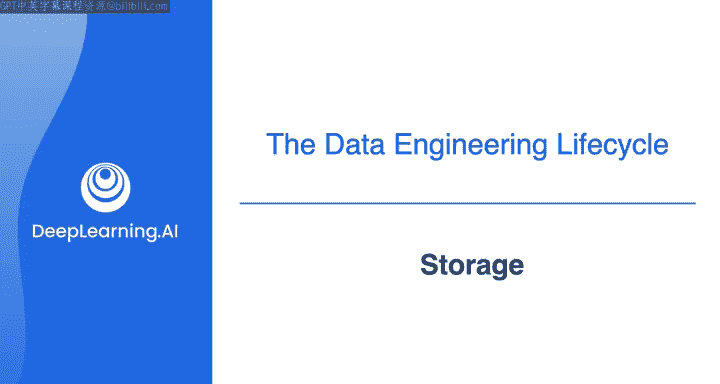
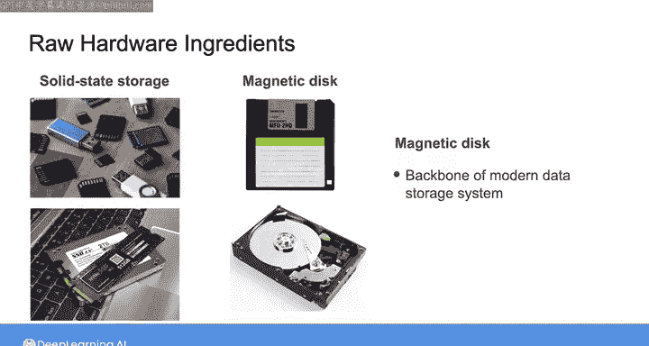
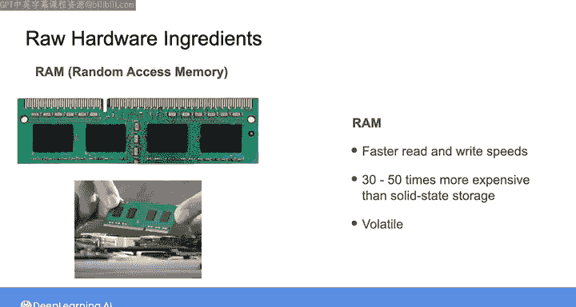
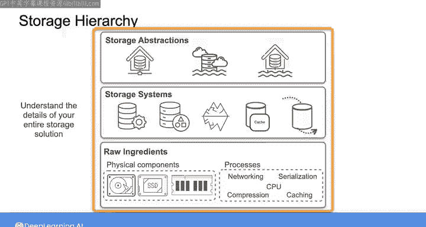

#  022：数据存储 🗄️

## 概述

在本节课中，我们将要学习数据存储的基础知识。我们将探讨数据存储系统在日常生活中的体现，分析其背后的物理硬件和逻辑架构，并理解数据工程师如何在不同抽象层次上选择和使用存储解决方案。

---

## 日常生活中的数据存储

请思考一下，你每天通过笔记本电脑与数据存储系统互动的各种方式。

例如，你可能会创建或删除文件，或在不同的文件夹之间移动文件。在这个过程中，你正在改变数据在硬盘或固态硬盘上的存储方式。当你打开应用程序时，你正在将它们加载到随机存取存储器中。RAM是另一种存储类型，它允许更快的访问速度。你也可能从互联网下载新文件或应用程序，或者将部分文件自动备份到云存储或智能手机上。

此外，你可能会发送或接收消息，或与应用程序互动，这实际上是在你设备上的不同存储组件之间以及云端移动数据。

因此，几乎你在数字设备或在线进行的任何操作，都在与数据存储系统互动。你可能会遇到这些存储系统的限制，比如手机存储照片的空间不足，或者尝试发送过大的文件。

## 存储系统的功能与性能

你所遇到的功能、性能和限制，很大程度上与这些系统的设置方式有关。

同样，在你作为数据工程师的工作中，你所构建系统的功能、性能和限制，也与你最初选择用来支持这些系统的存储解决方案密切相关。

## 存储的物理硬件

首先，让我们看看一些原始的存储硬件。

在你的日常生活中，你可能已经熟悉了各种形式的固态存储，比如闪存卡、固态硬盘、笔记本电脑或智能手机中的存储。相比之下，你可能最近没有从软盘中读取过数据。如果你认为世界已经不再使用磁盘作为数据存储解决方案，这可以理解。

然而，事实是，磁盘仍然是现代存储系统的支柱。这主要是因为磁盘存储的低成本。在录制本课程时，磁盘存储的成本大约是固态存储的1/2到1/3。

RAM，通常被称为内存，是你可能熟悉的另一种物理存储形式。RAM提供比固态硬盘或磁盘快得多的读写速度，这使其成为许多应用和架构的关键组件。

然而，RAM存储的成本可能是固态存储的30到50倍。它也是易失性的，这意味着如果你的系统断电，在大多数情况下，根据你使用的RAM类型，内存中的数据会立即丢失。

## 数据在架构中的流动

在大多数现代架构中，数据在数据管道的各个处理阶段中，会经过磁盘存储、固态硬盘和内存。

然而，存储的物理组件只是其中一个方面。数据存储在你的整个架构中是如何实现的，同样重要。

现代云数据存储系统通常分布在多个集群和数据中心。这意味着网络、CPU、序列化、压缩和缓存等都是现代数据系统中存储数据的关键原始要素。

如果你不熟悉我刚才提到的所有内容，请不要担心。我们将在专项课程的第三门课中更深入地探讨存储的每个要素。

## 数据工程师的存储工作

作为数据工程师，你通常不需要负责管理数据如何在数据中心网络和物理存储设备之间移动和存储的细节。

相反，你将使用存储系统，如数据库管理系统，或对象存储平台，如Amazon S3。根据你的架构需求，你可能还需要使用像Apache Iceberg或Hudi这样的系统，以及基于内存的存储系统或流式存储。

所有这些数据存储系统都建立在服务器和集群中存在的物理和其他原始存储要素之上，允许这些系统使用不同的访问协议来摄取和检索数据。

最后，在你作为数据工程师的工作中，你很可能不仅会使用单个存储系统，还会使用组合在一起的存储系统，这些系统被安排成存储抽象层，如数据仓库、数据湖，或这些概念更近期的结合体——数据湖仓。

## 存储层次结构

使用这些存储抽象工具，你无需担心底层组件如何安排的细节，而是选择各种配置参数，以满足你在延迟、可扩展性和成本方面的系统要求。

那么，如果将存储视为一种层次结构，你会如何安排存储的不同方面呢？

*   在底层，你有数据存储的**原始要素**，包括各种物理组件，如磁盘、RAM和固态存储，以及各种非物理的原始要素，如网络和序列化。
*   在此基础上，你有由这些原始要素构建的**存储系统**，包括数据库系统、对象存储等等。
*   最后，在层次结构的顶部，你有**存储抽象层**，它们是存储系统的组合，使你能够满足高级别的数据存储需求，而无需担心过多的底层细节。

## 理解存储的重要性

作为一名数据工程师，你完全有可能将大部分时间花在这个层次结构的顶部或附近。这意味着你不需要思考数据在不同存储组件和系统之间移动的具体细节。

然而，如果你花时间了解整个存储解决方案的内部工作原理、能力和限制，直至原始要素，你的工作将最有效。

事实是，当今许多实践中的数据工程师并不深入了解他们构建的存储系统的细节。这会在性能和成本等方面导致不幸的后果。

碰巧的是，我曾为一个团队提供咨询，他们未能考虑到这些细节。他们需要将大量数据移入数据仓库，却无意中选择了对每一行数据直接进行行插入的方法。这意味着他们一次只摄取和写入一行数据到数据仓库中。

结果证明，这不仅非常慢，而且非常昂贵，因为直接行插入通常按使用次数收费。最终，他们发现了错误，并转向了批量摄取方法，但在此之前，他们已经浪费了大量时间，并在短短一周内用掉了年度数据仓库预算的一半。

因此，总而言之，作为一名数据工程师，精通存储对你有利。这就是为什么我们将在这些课程中探索各种存储解决方案的细节和影响。

---

## 总结

本节课中我们一起学习了数据存储的基础概念。我们了解到数据存储系统无处不在，其性能与成本取决于底层的物理硬件和逻辑架构。数据工程师通常在较高的抽象层次上工作，但深入理解从原始硬件到存储抽象层的整个存储层次结构，对于构建高效、经济的系统至关重要。忽视底层细节可能导致严重的性能问题和成本超支。

---

接下来，我们将探讨数据工程生命周期的下一个阶段：数据转换。