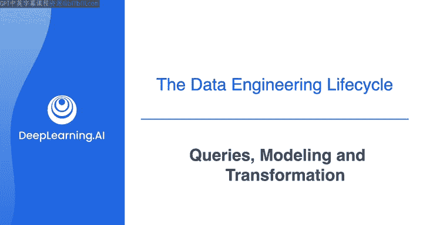
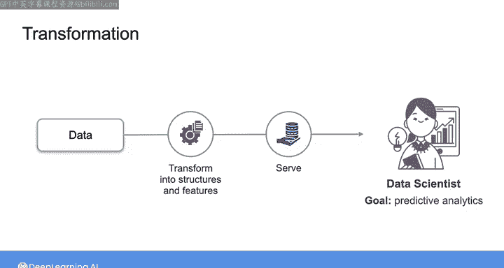
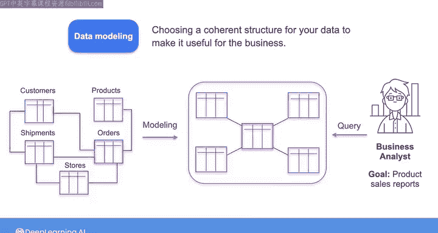
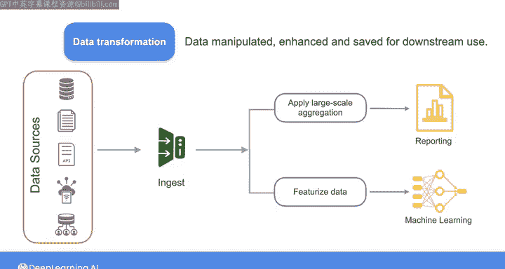

#  023：查询、建模与转换 🛠️

在本节课中，我们将要学习数据工程生命周期中的核心环节——转换阶段。这个阶段是数据工程师开始创造价值的关键步骤。我们将依次探讨查询、数据建模和数据转换这三个组成部分，理解它们如何共同作用，将原始数据转化为对下游用户有用的信息。

---

## 转换阶段的价值

数据工程生命周期中的转换阶段，是数据工程师真正开始创造价值的地方。

这是因为在转换之前的过程，即从源系统摄取和存储原始数据，并不能直接为下游利益相关者带来价值。正如之前所说，数据工程师的宏观工作流程是：从某处获取原始数据，将其转化为有用的东西，然后提供给最终用户。

**转换**，正是“将其转化为有用的东西”的阶段。那么，“有用”具体指什么呢？

---

## 什么是有用的数据？

想象一下，你的下游用户是一位业务分析师。假设他的任务是报告一系列产品的每日销售情况。他可能需要诸如客户ID、产品名称、价格、销售数量和销售时间等信息。

业务分析师通常精通SQL，他们会依赖你将原始数据进行转换，并以一种能够快速、轻松查询的格式提供给他们。

再举一个例子，想象你的下游用户是一位数据科学家或机器学习工程师。除了SQL，他们甚至可能精通多种潜在的数据转换方法。但他们的核心职能是使用数据进行预测分析。你可以通过将数据转换为可直接用于模型训练或分析的结构化特征，为他们提供巨大的价值。

---

## 转换的三个组成部分：查询、建模与转换

以上都属于数据工程生命周期的转换部分。但实际上，这个过程由三个部分组成：**查询**、**建模**和**转换**。

我将查询和建模与转换分开讨论，因为它们是任何数据管道的关键组成部分。如果做得好，它们能极大地增加价值；如果做得不好，则会带来风险。为了说明这一点，让我们从查询开始。

---

### 查询数据

当你查询数据时，你是在向数据库或其他存储系统发出读取记录的请求。例如，你可能需要查询存储在云数据仓库中的表格和半结构化数据。

你可以使用多种语言来查询数据，但在本课程中，我们将重点介绍**结构化查询语言**，简称 **SQL**。它目前仍然是一种流行且通用的查询语言。

你的查询可能涉及跨多个数据集的清洗、连接和聚合数据。你可能会使用SQL表达式来过滤数据，以便只检索特定的记录。

> 如果你还不熟悉幻灯片上展示的这些SQL命令，请不要担心。在后续课程中，你将有机会通过动手实验学习SQL的基础知识。

编写查询的方式不止一种，而编写不当的查询可能会产生负面后果。例如，它可能影响源数据库的性能，或者导致一种称为“**行爆炸**”的情况。即，一个包含表间连接（join）的查询产生的记录数远超预期，这可能会拖垮你的存储基础设施。在其他情况下，编写不当的查询可能只是运行缓慢，导致下游的报告或分析出现延迟。

在实践中，大多数数据工程师都能读写SQL，但可能不熟悉查询在底层是如何工作的，这可能会在他们构建的架构中带来不可预见的后果。我们将在专项课程的第三门课中详细探讨查询的具体工作原理。

---

### 数据建模

接下来我想讨论的是**数据建模**。数据模型代表了数据与现实世界关联的方式。数据建模涉及为你的数据精心选择一个连贯的结构，这是使数据对业务有用的关键一步。

例如，再次回顾那位需要创建产品销售报告的业务分析师的案例。你可能已经从上游的关系型源数据库摄取了所谓的“**规范化**”数据，其中包含产品信息、订单详情、客户信息等独立的表。这些数据之间通常存在复杂的关系。

为了满足这位分析师的需求，你可能需要对数据进行所谓的“**反规范化**”，以一种允许分析师快速高效地查询并获取报告所需数据的方式来建模数据。

一个好的数据模型旨在最好地反映组织的流程、定义、工作流和逻辑。例如，术语“客户”在你公司内部的不同部门可能意味着不同的事情。

为了成功地进行数据建模，你需要与利益相关者合作，理解他们的术语（比如“客户”这个词对他们意味着什么）以及数据的业务目标。你将在专项课程的第四门课中了解更多关于数据建模和规范化的知识。

---

### 数据转换

除了查询和建模，数据还必须进行**转换**，也就是说，需要被操纵、增强并保存以供下游使用。

正如我之前提到的，在整个数据工程生命周期中，你通常会对数据进行多次转换。例如：
*   数据在你接触之前就可能已经被转换了，比如当记录还在源系统中时就为其添加了时间戳。
*   你可能在数据摄取过程中，当数据“在途”时应用转换。
*   在摄取之后，可能会立即进行基本转换，以将数据映射到正确的类型，并将记录放入标准化格式。
*   在将记录发送到数据仓库之前，你可能会在流式管道中用额外的字段和计算来丰富一条记录。
*   更进一步，在下游，你可能会转换数据模式，并应用反规范化、用于报告的大规模聚合，或为机器学习模型训练准备特征化数据。

---

## 总结

在本节课中，我们一起学习了数据工程转换阶段的三个核心组成部分：**查询**、**建模**和**转换**。

*   **查询**是向存储系统请求数据，需要编写高效的语句以避免性能问题。
*   **建模**是为数据设计结构，以准确反映业务逻辑并方便下游使用。
*   **转换**是对数据进行各种操纵和增强，使其在整个生命周期中变得有用。

在整个课程中，你将参与大量涉及查询、建模和转换数据的动手练习。现在，让我们进入下一个视频，在那里我们将看看数据工程生命周期的最后阶段：为下游用例提供数据。