#  024：数据服务 📊

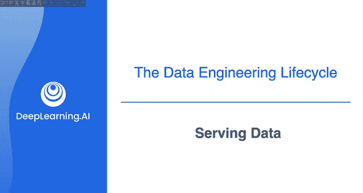

在本节课中，我们将要学习数据工程生命周期的最后一个阶段——数据服务。这个阶段不仅仅是让数据变得可用，更是让利益相关者能够从数据中提取业务价值的关键环节。

---

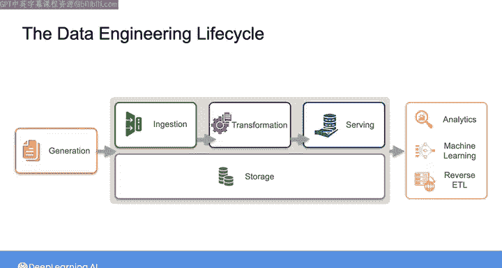

上一节我们介绍了数据存储和查询，本节中我们来看看数据服务的具体内涵。数据服务阶段的核心在于，将经过摄取、转换和整理的数据，交付给最终用户或系统，以支持实际的应用场景。数据价值的具体体现，取决于不同的最终用途，例如分析、机器学习、反向ETL等。在本课程中，我们将先概览这些不同的应用场景，了解数据服务在不同情境下的差异。在后续的第4门课程中，我们会深入探讨为每种用例提供数据服务的具体机制。

## 分析用例 📈

分析是从数据中识别关键洞察和模式的过程。作为数据工程师，你几乎肯定会为以下三种最常见分析形式中的一种或多种提供数据支持。

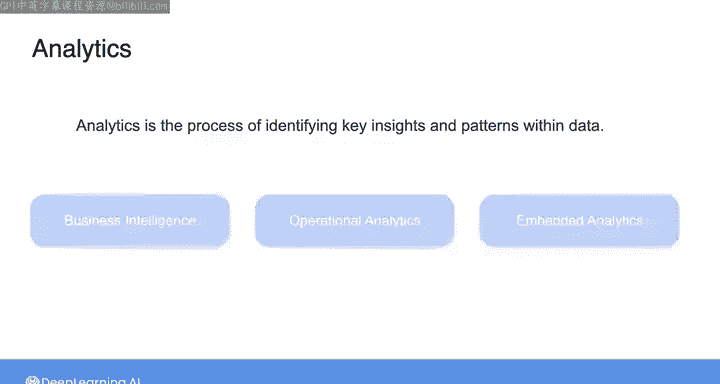

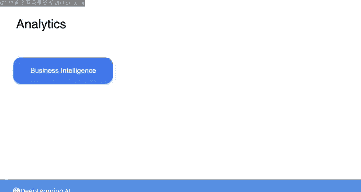

以下是三种主要的分析形式：

*   **商业智能**：分析师探索历史和当前的业务数据以发现洞察。作为数据工程师，你提供的数据最终会以报告或仪表板的形式呈现，帮助用户做出战略性和可操作的决策。
*   **运营分析**：关注监控实时数据以采取即时行动。例如，一个电子商务平台团队可能需要监控网站实时性能指标的仪表板。
*   **嵌入式分析**：这是一种较新的趋势，指面向外部客户的分析应用。例如，银行应用程序中显示用户消费历史趋势的仪表板，或智能恒温器配套应用程序中显示家庭当前及历史温度的数据。

在嵌入式分析中，作为数据工程师，你的工作是为面向用户的应用程序提供实时和历史数据。

## 机器学习用例 🤖

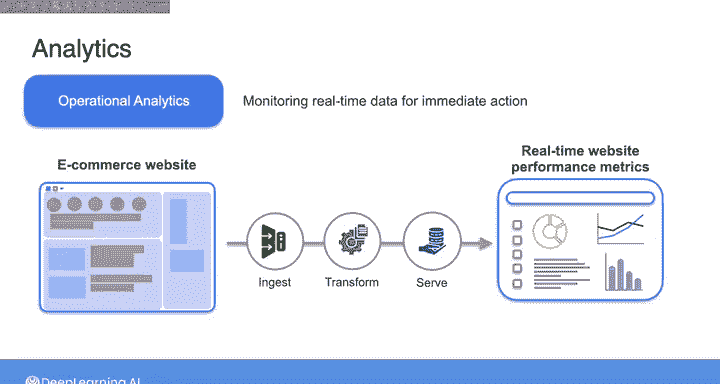

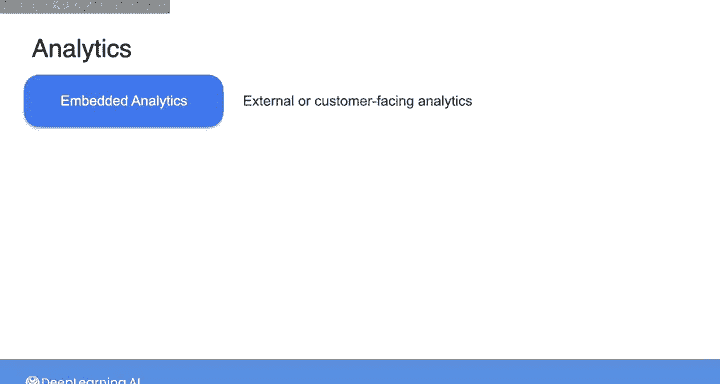

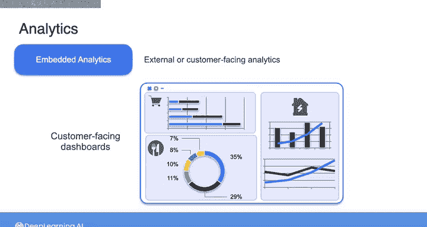

随着机器学习近几十年的兴起，数据工程师的角色很可能涉及为机器学习用例提供数据。在这些课程中，我们将机器学习与其他服务用例分开讨论，因为它可能涉及额外的复杂性。

例如，在机器学习用例中，你可能需要负责提供用于**模型训练**的**特征存储**数据。你可能还需要为**实时推理**提供数据，或者支持用于跟踪数据历史和血缘的**元数据与编目系统**。我们将在后续课程中更详细地探讨这些场景。

## 反向ETL用例 🔄

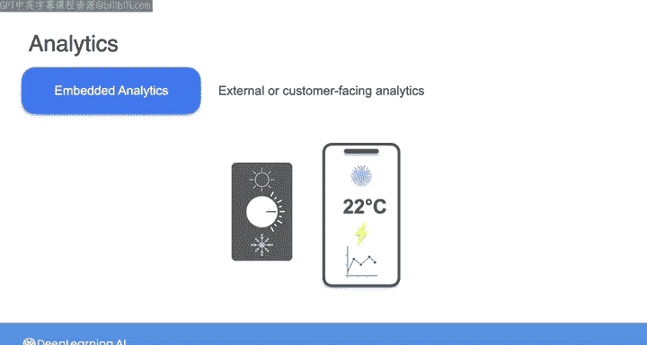

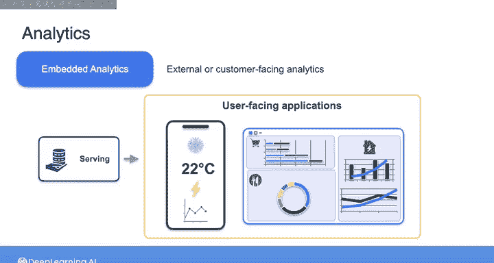

除了分析和机器学习，另一个常见的数据服务用例，目前至少被称为**反向ETL**。

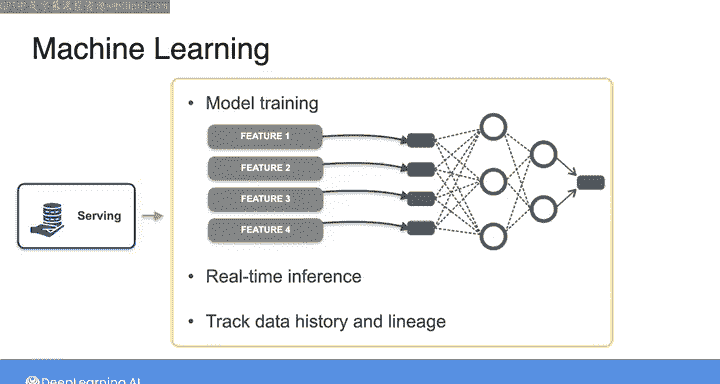

通过反向ETL，你会将经过转换的数据，以及分析和机器学习模型的输出，反馈回源系统。例如，假设你从客户关系管理系统中摄取了客户数据，经过转换后存入数据仓库。分析师可以取用这些数据来训练一个“潜在客户评分模型”。模型的结果可以返回到数据仓库，然后作为增强信息推送回CRM系统，丰富其中已存储的客户数据。

需要说明的是，“反向ETL”这个名称更多是因为缺乏更好的描述词汇，而非精准描述了这个过程本身。无论如何，这种实践正变得越来越普遍，作为数据工程师，你很可能会参与到反向ETL（或未来它可能被称呼的任何名称）的工作中。

---

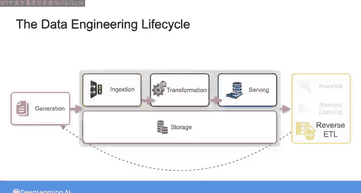

本节课中我们一起学习了数据工程生命周期的数据服务阶段。我们了解到，数据服务不仅仅是提供数据访问，更是根据不同的最终用途（如分析、机器学习、反向ETL）来交付数据，从而创造业务价值。我们快速浏览了数据工程生命周期的所有阶段，包括源系统、摄取、转换、存储和服务。

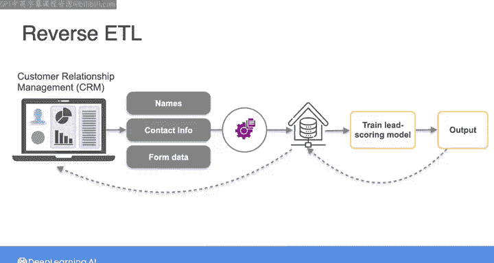

在下一课中，我们将把焦点转移到贯穿所有这些阶段的生命周期“暗流”上。下一课见。