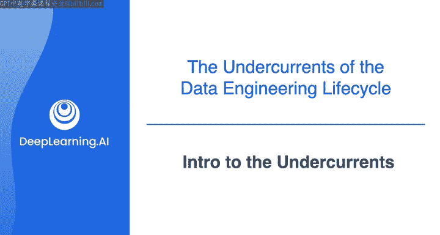
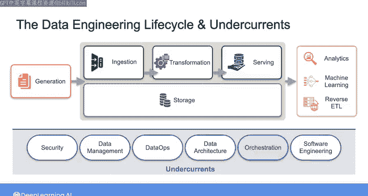

#  025：底层技术介绍 🔧

在本节课中，我们将学习数据工程生命周期中的一系列核心支撑实践，这些实践被称为“底层技术”。它们贯穿于数据工程的各个环节，是确保数据项目成功的关键。

---

我们一直在探讨数据工程生命周期，以及如何从源系统摄取数据、进行转换、存储并最终服务于终端用户。作为一个领域，数据工程正在迅速成熟。就在十年前，数据工程师的角色主要聚焦于技术层面。工具的持续抽象化和简化，已经扩展了这一角色的范围。

如今，数据工程所涵盖的内容远不止工具和技术。换句话说，这个领域正在向价值链上游移动，这对作为数据工程师的你来说是个好消息。

现代数据工程融合了传统企业实践，如**数据管理**和**成本优化**，以及较新的实践，如**DataOps**。对于你的数据工程师工作而言，有一系列这样的实践将适用于整个生命周期的各个环节。在《数据工程基础》一书中，我们将这些实践描述为数据工程生命周期的“底层技术”。

这些底层技术包括：
*   **安全**
*   **数据管理**
*   **DataOps**
*   **数据架构**
*   **编排**
*   **软件工程**

在接下来的几个视频中，我们将逐一深入探讨这些底层技术。之后，你将开始探索数据工程生命周期和这些底层技术如何在真实的AWS云环境中具体实现。

---

让我们开始吧。