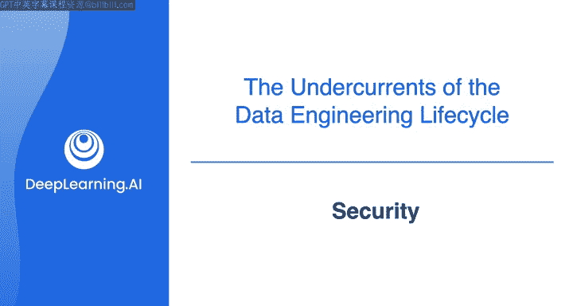
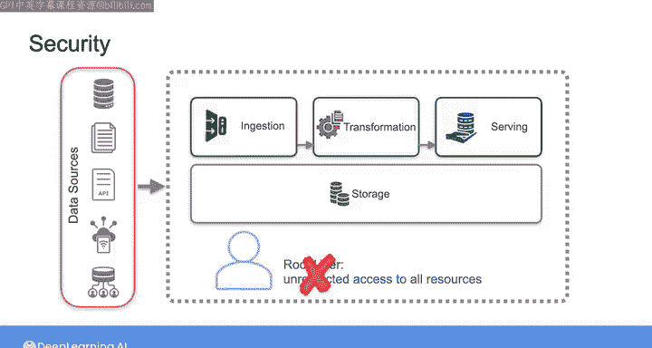
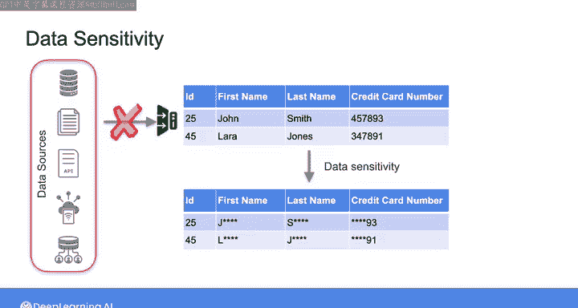
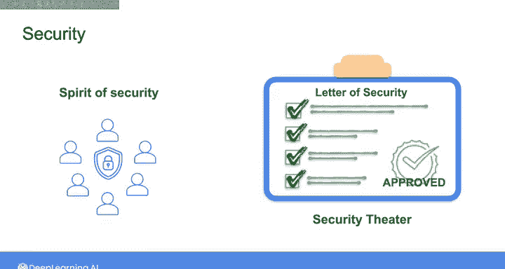

#  026：数据安全 🔐

在本节课中，我们将要学习数据安全的核心原则与最佳实践。作为数据工程师，您将负责处理敏感数据，因此理解如何保护这些数据至关重要。我们将探讨从个人数据保护到组织级安全文化的各个方面。

---

在深入探讨安全如何应用于数据工程师的角色之前，请先思考一下安全问题如何影响您日常的个人数据。

例如，您可能不会随意将银行账户信息告知他人。您也不会将您所有在线账户的密码公开发布在他人可见的地方。

同样地，作为数据工程师，您被委托管理敏感数据，无论是客户的个人隐私信息还是专有的商业信息。数据所有者信任您会保护他们的信息安全。因此，认识到您的角色至关重要：您需要整合正确的原则、协议和文化实践，以确保您所构建系统的安全性。

在本视频中，我将介绍一些在管理数据管道并为最终用户提供数据时，关于数据安全的基础原则和最佳实践。

---

## 最小权限原则

当您需要向其他用户或应用程序授予数据和系统资源的访问权限时，需要牢记一个关键的安全原则：**最小权限原则**。

这意味着您只授予用户或应用程序执行其工作所必需的、且仅在所需时间段内有效的数据和资源访问权限。

您不仅需要对组织内的其他人应用最小权限原则，对您自己也应如此。例如，就像您不会给团队中的每个人管理员权限一样，在您自己的工作中，非必要时不要在根Shell下操作，除非绝对必要，否则不要使用管理员或超级用户权限。

---

## 数据敏感性与访问控制

在思考如何最好地保护工作中的数据时，您不仅需要考虑数据访问，还需要考虑数据敏感性。

遵循最小权限原则意味着仅在绝对必要时才向用户显示敏感信息。除此之外，保护敏感数据的最佳方法是首先不要将其摄取到您的系统中。如果您没有明确的目的来摄取和存储敏感数据，那就不要这样做。这样，您就完全消除了意外泄露该数据的风险。

---

## 云环境下的安全考量

在当今以云为中心的世界里，安全又增加了一个维度，要求您理解诸如身份和访问管理（IAM）规则、加密方法和网络协议等概念。

在本专项课程中，随着我们更深入地探讨如何确保数据管道的安全性，您将看到更多关于这些主题的内容。

---

## 安全始于人

安全不仅仅是原则和协议，它也关乎人。安全始于您个人，也终于您个人，并贯穿于您组织中的其他个体。

在安全方面，您应该采取一种防御性的思维模式。当被要求提供凭据或敏感机密数据时，务必保持谨慎。设想潜在的攻击和泄露场景，并以此为指导来设计您的数据管道和存储系统。

在现实世界的数据泄露事件中，个人往往是许多最大安全漏洞的源头。例如，有人忽视基本预防措施，如不安全地与他人共享密码；有人成为网络钓鱼攻击的受害者（攻击者试图通过冒充权威人物或您信任的人来窃取敏感信息）；或者有人在公司系统和数据中不负责任地操作。

---

## 避免常见安全失误

在数据工程安全方面，我经常惊讶地看到数据工程师将AWS S3存储桶、服务器或数据库意外暴露在公共互联网上，而这并非本意。有一些简单的修复方法可以防止这种情况发生，但我经常看到这种情况发生，因为数据工程师要么根本不知道安全最佳实践，要么在应用这些实践时不小心忘记了。

---

## 超越“安全剧场”：建立安全文化

在组织层面，我经常看到的情况是，许多组织建立了一种安全表象，可能是一套检查清单，以表明他们符合法规或合规标准，但组织文化中缺乏更深层次的安全精神。这种只遵循安全条文而没有安全文化和精神的做法，我称之为“安全剧场”。

真正的安全源于一种文化，在这种文化中，每个团队成员都认识到自己在保护数据方面的角色，从上到下每个人都把安全作为优先事项和习惯来拥抱。

---

## 总结与展望

因此，在您作为数据工程师的旅程中，请记住，虽然原则、协议以及工具和技术是您保护数据时的盟友，但真正的安全文化源于整个组织对责任和漏洞的共同理解。

随着我们在专项课程中的深入，您将获得与数据架构所有方面相关的安全考量的实践经验。

在接下来的视频中，我们将探讨数据工程生命周期中的下一个底层支撑：数据管理。