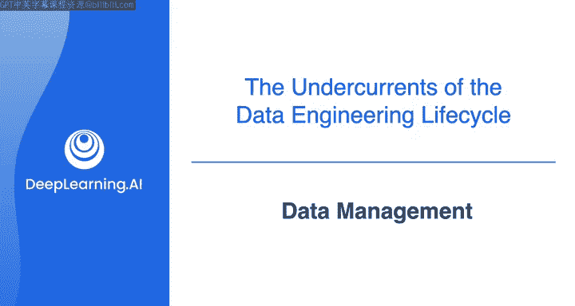
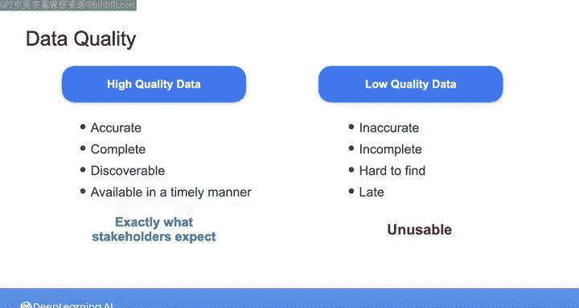

#  027：数据管理 📊

在本节课中，我们将要学习数据管理的核心概念，特别是数据治理与数据质量。理解这些概念对于成为一名高效的数据工程师至关重要，因为它们决定了数据如何为组织创造价值。

---

## 数据管理概述

在之前的课程中，我们探讨了数据工程师的角色。本节中我们来看看数据工程师工作的核心背景：数据管理。无论你从事何种数据工程工作，都必须思考你的工作如何为组织的利益相关者增加价值。数据可以成为极具价值的商业资产，但前提是得到妥善管理。

数据管理非常重要，因此存在一个国际组织——国际数据管理协会（DAMA），专门为公司和个人提供资源以正确进行数据管理。DAMA 提供了一份简洁的出版物：《数据管理知识体系指南》（简称 DMBOK）。正如你所见，数据管理涉及的知识非常广泛。

但请不要感到压力。作为一名数据工程师，你不需要记住这本书中的所有内容。实际上，虽然这是一本很好的参考书，但在数据工程工作中，你将专注于数据管理任务的一个子集，并与软件工程、IT 等其他团队共同承担数据管理的全部责任。

在本视频中，我将快速重点介绍作为数据工程师需要关注的数据管理关键方面。

---

## 数据管理的定义与范畴

首先，DMBOK 将数据管理定义为：在整个生命周期内，对交付、控制、保护并增强数据和信息资产价值的计划、方案和实践进行开发、执行和监督。

这个定义内容很多，甚至可能听起来有些模糊。让我们稍作分解。作为一个领域，数据管理包含许多方面和学科，每个方面都有其自身的职责，这可能使数据管理环境显得复杂。

DMBOK 将数据管理的不同方面分解为 11 个所谓的“数据知识领域”。这些领域包括数据治理、数据建模、数据集成与互操作性、元数据、安全性等。它们被安排在下图所示的框架中。

在本系列课程中，你会看到更多关于这些主题的内容。但如图所示，**数据治理**触及数据管理的所有其他领域，并且许多其他知识领域通过数据治理实践相互关联。

因此，在本视频中，我将重点讨论数据治理，因为它与你作为数据工程师角色中许多重要领域密切相关。

---

## 深入理解数据治理

根据另一本名为《数据治理权威指南》的书籍，数据治理首先是一项数据管理职能，旨在确保从组织收集的数据的质量、完整性、安全性和可用性。

从这个定义中，你可以开始看到数据治理涵盖的范围很广，从数据安全和隐私到数据质量和可用性。我们在上一个视频中稍微谈到了安全和隐私。在本视频中，我想重点讨论**数据质量**，它与你在定义中看到的其他关键术语（如完整性、可用性和可靠性）密切相关。

---

## 数据质量的核心

数据质量是一个深入且细致入微的话题，但其核心概念相对简单明了。

以下是高质量数据的关键特征：
*   **准确性**：数据正确无误。
*   **完整性**：数据包含所有必要的信息，没有缺失值。
*   **可发现性**：数据易于被需要的人找到和理解。
*   **及时性**：数据在需要时可用。

除此之外，高质量的数据能精确地代表利益相关者期望它代表的内容，这体现在定义良好的**模式（Schema）** 和**数据定义**上。符合这些质量标准的数据是决策中的强大工具，能为组织增加巨大价值。

相比之下，低质量的数据可能不准确、不完整或以其他方式无法使用。低质量数据可能导致利益相关者浪费时间、做出错误决策，甚至可能导致整个数据团队被解雇。

你将在下一门课程中学习如何在数据管道中监控和确保数据质量。但现在，我们将继续前进，探讨下一个贯穿始终的主题。

---

## 总结与预告

本节课中我们一起学习了数据管理的基础，特别是数据治理和数据质量的核心概念。我们了解到，数据管理的目标是最大化数据的价值，而数据治理是确保这一目标实现的框架，其中数据质量是关键支柱。

高质量的数据是准确、完整、可发现且及时的，它是可靠决策的基础。下一节视频中，我们将加入新的内容，探索**数据架构**如何应用于数据工程生命周期。

我们下节课见！