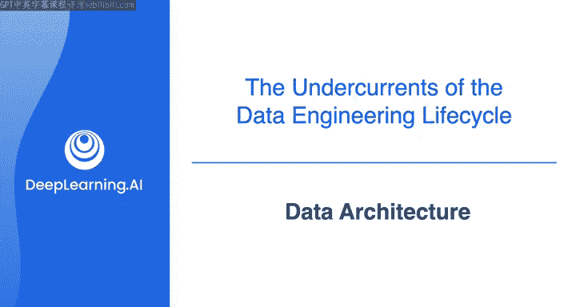
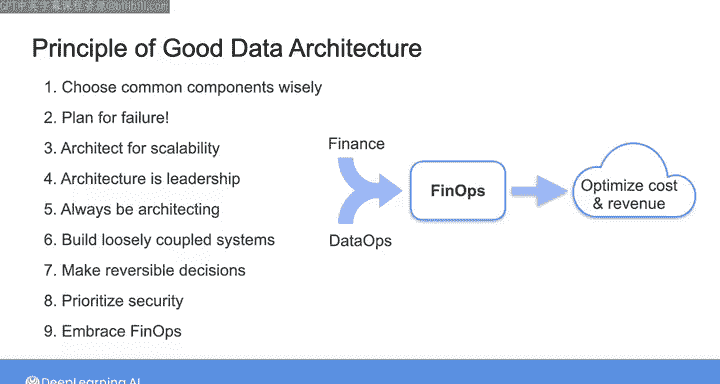

#  028：数据架构 🏗️

在本节课中，我们将学习数据架构的核心概念与设计原则。数据架构是数据系统的蓝图，它指导我们如何根据需求设计和构建稳健、可扩展且安全的数据系统。

---

## 什么是数据架构？

你可以将数据架构视为数据系统的路线图或蓝图。

在本课程的第一周，我们讨论了需求收集，以及如何将利益相关者的需求转化为具体的技术要求。为了将这些需求映射到成功的系统设计中，你需要像架构师一样思考。

需要明确的是，根据你的工作环境，作为数据工程师，你可能并不直接负责架构和设计决策。你的组织可能设有数据架构师这一角色，专门负责确立设计，然后交由你来实现。

然而，根据我的经验，能够像架构师一样思考，将使你在数据工程师的角色中更加成功。在某些情况下，例如在一家小型初创公司工作，你可能同时兼任架构师和工程师。无论如何，我希望在我刚开始从事数据工程时，就有人教我如何像架构师一样思考。

因此，在本视频中，我将简要介绍一些关键的架构思维原则。在整个课程中，我们将反复回顾这些原则，让你在设计构建稳健数据系统时充满信心。

---

## 数据架构的定义

在我们的著作《数据工程基础》中，Matt Haussley 和我将数据架构定义为：

> **数据架构**是通过仔细评估权衡后，做出灵活且可逆的决策，从而设计出支持企业不断发展的数据需求的系统。

让我们花点时间来解读这个定义。

首先，数据架构需要支持组织不断发展的数据需求。这意味着一个好的设计不仅要满足当前的数据需求，也要为未来的需求做好准备。在实践中，这表示数据架构是一项持续的工作，而非一劳永逸的事情。

其次，定义指出，好的设计是通过**灵活且可逆的决策**实现的。这强调了企业的数据需求可能会以你未曾预料的方式演变，因此你需要更新架构。如果你的初始设计选择本身就是灵活且可逆的，那么随着时间的推移，你将更容易调整架构以满足组织的新需求。

最后，定义的最后部分指出，这一切都通过**仔细评估权衡**来实现。这些权衡可能涉及性能、成本、可扩展性或其他参数。

值得一提的是，在过去几乎所有数据架构都构建在本地系统上时，做出灵活且可逆的决策要困难得多，有时甚至是不可能的。例如，如果你决定购买并安装价值数百万美元的服务器硬件，无论你是否愿意，都可能在未来数年内被该系统所束缚。

如今，大多数数据架构都构建在云端，从某种意义上说，只要你最初做出了灵活且可逆的决策，你就可以随时改变关于架构技术选择的想法。

---

## 优秀数据架构的核心原则

为了进一步阐述这些理念，让我们看看一组优秀数据架构的原则。这些原则将在整个课程中反复提及。

在开始之前，我想说明你现在无需记忆任何内容。我只是想让你预览一下课程内容，并开始像架构师一样思考。

以下是优秀数据架构的九项核心原则：

**1. 明智选择通用组件**
通用组件是架构中将被组织内多个个人和团队使用的部分。一个好的通用组件选择，应既能满足单个项目的功能需求，又能促进团队间的协作。

**2. 为失败做好规划**
这条原则的含义很明确。一个好的架构不仅要设计在一切正常运行时的情况，也要设计在系统出现故障时的情况。

**3. 为可扩展性而设计**
可扩展的系统能够根据需要扩大规模以满足需求，也能在需求减少时缩小规模以降低成本。将可扩展性融入架构，你就能灵活应对需求变化，同时优化成本。

**4. 架构即领导力**
虽然“架构即领导力”这一原则可能不直接适用于你作为数据工程师的角色，但如果你努力像架构师一样思考，并向数据架构师寻求指导，随着技能提升和资历增长，你将能更好地领导和指导其他团队成员。最终，你自己也可能担任数据架构师的角色。

**5. 持续进行架构设计**
如前所述，架构设计不是一次性事件。相反，你需要根据组织不断发展的需求，持续评估你的系统，并不断进行架构调整。

**6. 构建松耦合系统**
松耦合系统由独立的组件构成，这些组件可以轻松替换为其他组件，而无需重新设计整个系统。

**7. 做出可逆的决策**
通过选择构建这种易于互换的组件，你就是在做出一系列可逆的决策。这意味着，如果你改变了主意，或者组织的需求发生了变化，你可以轻松地撤销之前的决策，并替换架构中的组件以满足新的设计规范。

**8. 优先考虑安全性**
我们已经了解了一些安全原则，如最小权限原则。在后续关于架构的讨论中，我们还将深入探讨其他原则，如零信任原则。所有这些原则的核心要点是：安全性是你作为数据工程师角色的核心。

**9. 拥抱 FinOps**
在云时代，数据的成本结构发生了巨大变化。FinOps 是一场运动，旨在将财务的业务优先级与 DevOps（或在此情况下的 DataOps）结合起来。在云端，大多数数据系统都是按需付费且易于扩展的。通过拥抱 FinOps，你可以设计出同时优化成本和潜在收入生成的系统。

---

## 总结与展望

以上就是对优秀数据架构关键原则的快速概览。

在本节课中，我们一起学习了数据架构的定义及其作为系统蓝图的重要性，并详细探讨了九项核心设计原则，包括选择通用组件、规划失败、设计可扩展性、持续演进、构建松耦合系统、做出可逆决策、优先安全以及拥抱成本优化。

下周的课程中，我们将更深入地探讨这些原则以及优秀数据架构的更多细节。现在，让我们继续学习数据工程生命周期的下一个重要环节。

请与我一起进入下一个视频，了解 **DataOps**。