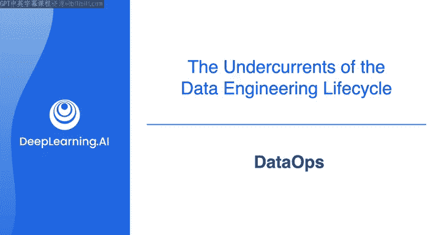
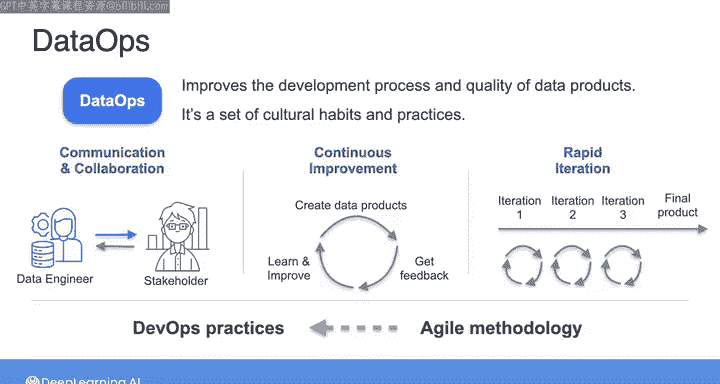
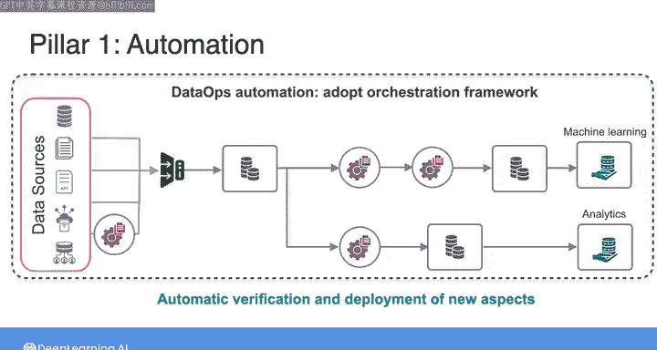
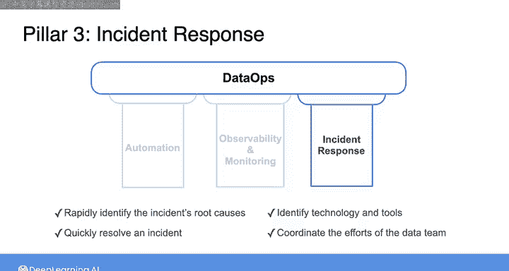

#  029：DataOps 🚀

在本节课中，我们将要学习DataOps的概念、核心支柱及其在数据工程实践中的重要性。DataOps借鉴了软件开发领域的DevOps理念，旨在提升数据产品的开发流程与质量。

## 概述

大约在2007年，软件开发领域出现了一个名为DevOps的框架，旨在打破编写和测试代码的软件开发团队与部署和维护代码的软件部署团队之间的壁垒。DevOps借鉴了其他一些知名的方法论，包括精益和敏捷，以实现消除瓶颈、减少浪费、快速识别问题以及快速迭代等目标。DevOps运动使得软件产品的发布周期缩短，质量得到提升。随着数据领域的成熟，我们采用了一种类似的方法，称为DataOps，以改进数据产品的开发。

## DataOps的文化与实践

上一节我们介绍了DataOps的起源，本节中我们来看看其核心的文化习惯与实践。DataOps首先是一套可以采纳的文化习惯和实践。这些习惯和实践包括优先考虑与其他业务利益相关者的沟通与协作、持续从成功和失败中学习，以及采取快速迭代的方法来改进系统和流程。这些也是DevOps的文化习惯和实践，它们直接借鉴了敏捷方法论，这是一个专注于以增量和迭代步骤交付工作的项目管理框架。

## DataOps的技术支柱

在文化实践之外，DataOps还包含技术要素。以下是DataOps的三个关键支柱：

*   **自动化**：这是第一个支柱。
*   **可观测性与监控**：这是第二个支柱。
*   **事件响应**：这是最后一个支柱。

这些与DevOps的核心组件相似，但目标不同。在DevOps中，最终目标是在软件产品中提供特定的功能和特性。而在DataOps中，目标是提供高质量的数据产品。你可以将数据产品视为提供给最终用户的任何数据或数据系统。

接下来，让我们更详细地了解DataOps的这三个支柱。

## 自动化支柱详解

在自动化方面，一个加速软件构建生命周期的DevOps实践被称为持续集成和持续交付，简称CI/CD。通过CI/CD，开发人员能够自动化构建、测试和部署代码所需的许多手动流程。这种自动化不仅带来了更快的审查和部署周期，也减少了错误，最终使软件团队在构建高质量软件产品时更高效。DataOps采用了类似的自动化框架应用于数据处理，正如DevOps应用于软件开发一样。在DataOps中，自动化变更管理的总体目标保持不变。例如，当涉及管理代码、配置或环境的变更时。此外，DataOps还专注于数据处理管道和数据本身的变更管理。

为了理解自动化如何应用于数据处理，让我们设想你刚刚在一家小型组织开始工作，你的任务是构建一个数据管道。这个管道从从多个源系统摄取数据开始。你可能从数据库、一些文件、一个API或数据共享平台摄取数据。然后，你可能在摄取过程中执行一些实时转换，接着将摄取的数据存储在存储系统中，可能是一个数据库。假设你有两个最终用例需要服务，一个用于分析，一个用于机器学习。接下来，假设你执行一些进一步的转换，可能在将数据推送到另一个存储系统并使其对最终用户可用之前，对数据进行建模和聚合。

因此，在转换和服务阶段，你基本上有两个管道。如果你是这家组织的第一个数据工程师，并且处于开发数据系统的早期阶段，你可能会选择手动执行数据管道中的各种任务。例如，手动启动每个摄取过程，然后一旦这些完成，再手动执行转换、存储和服务阶段的每个后续步骤。从长远来看，这可能是一个快速启动并原型化数据管道某些方面的合理方法。然而，这种多阶段手动执行容易出错且效率低下，因为它需要你手动运行每个任务。

通过最低限度的自动化，你可能会选择采用所谓的纯调度方法。这意味着你将管道中的每个任务设置为在一天中的特定时间开始。例如，你可能在每晚午夜启动所有这些摄取任务。然后，你会估计所有数据被摄取并加载到存储系统所需的时间。接着，你可以安排下游的转换任务在那之后开始，依此类推，贯穿管道中的所有任务。这被称为调度，因为你创建了一个时间表来自动启动数据管道中的每个任务。

为了将DataOps自动化提升到下一个层次，你可以采用像Airflow这样的编排框架。编排框架在运行每个任务之前检查数据管道中任务之间的依赖关系。因此，你可以决定希望管道第一个任务开始的时间和频率。然后，一旦前一个任务成功完成，编排框架将自动启动后续任务。当任何任务出现错误时，编排框架还可以通知你，这样依赖于先前任务的下游任务就不会在不应该的时候启动。许多编排框架不仅自动化数据管道中任务的执行，还通过支持自动验证和部署数据管道的新方面来增强这些管道的开发，类似于软件部署的CI/CD过程。

## 可观测性与监控支柱

当涉及到下一个支柱，即可观测性与监控时，你需要记住的主要一点是，你建立的任何数据管道最终都注定会失败。引用亚马逊网络服务首席技术官Werner Vogels的话：“一切都会失败，而且总是如此。”这意味着，如果你不密切观察和监控你的数据系统，当它们失败时，你会措手不及。在最坏的情况下，你可能只有在你的下游利益相关者自己发现问题时，例如在他们的报告或分析仪表板中，才会意识到这些系统故障。在我与客户的工作中，我见过无数由于数据处理系统中未被发现的故障而导致错误数据在报告中停留数月甚至数年的案例。这类故障可能浪费时间和金钱，导致决策依据不足，并最终可能让你失去工作，如果利益相关者对你的工作失去信任的话。因此，可观测性和监控是你构建的数据系统的关键方面。

## 事件响应支柱

DataOps的第三个支柱是事件响应，这是关于利用你建立的可观测性和监控能力，快速识别事件的根本原因，并尽可能快速可靠地解决它。正如我之前所说，事情会出问题，它们出问题只是时间问题。对于事件响应，不仅关乎你用来识别和响应问题的技术和工具，还关乎开放和无责难的沟通，以及协调数据团队成员乃至整个组织中其他人员应对事件的努力。作为一名数据工程师，你应该主动发现问题，或者由你组织中的其他利益相关者向你报告问题。

## 总结与展望

本节课中我们一起学习了DataOps，这是一套相对较新的理念，仍在发展之中，并非所有组织都采纳了DataOps的最佳实践。在你的数据工程师工作中，你可能会发现自己身处一个DataOps相当成熟的组织，或者一个尚未拥抱DataOps的地方。DataOps是一套旨在提升数据产品质量和开发效率的文化实践与技术框架，其三大支柱——自动化、可观测性与监控、事件响应——共同构成了稳健数据工程的基础。

接下来，我们将更深入地研究编排，这是DataOps的一个关键组成部分，也是现代数据架构和管道中如此关键的一个部分，以至于我们将其视为数据工程生命周期中一个独立的底层支撑。