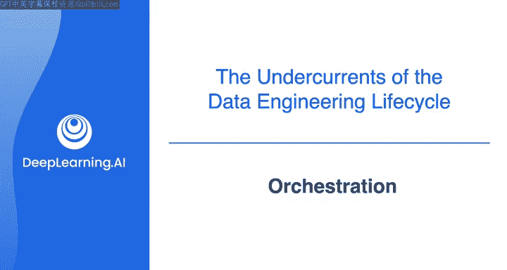
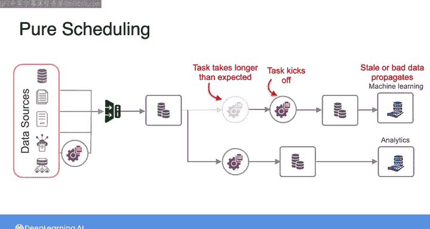
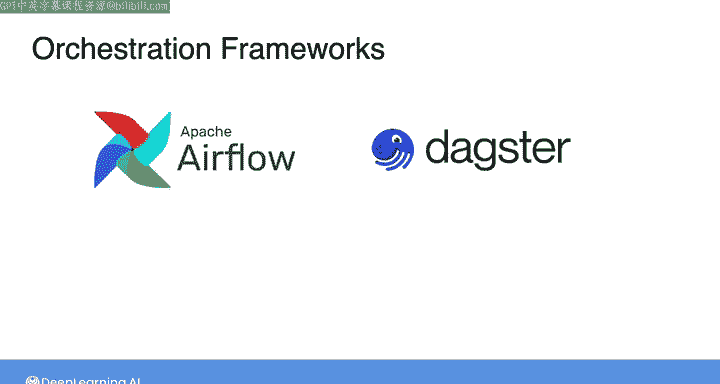
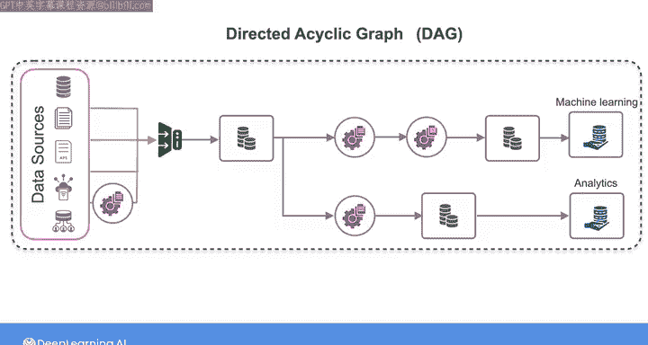
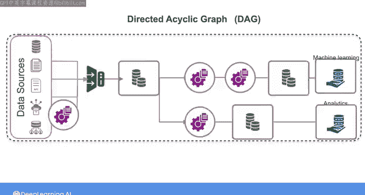
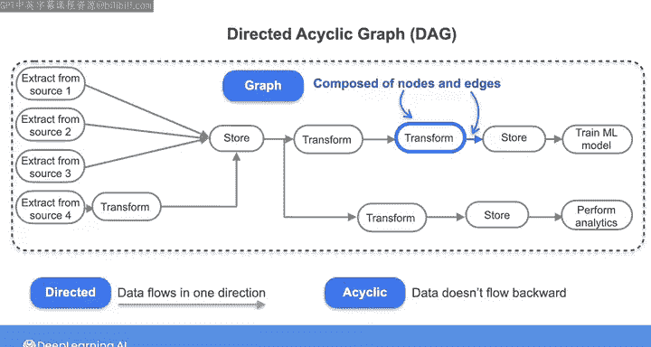

#  030：编排 🎼

在本节课中，我们将要学习数据工程中的一个核心概念——编排。编排是协调和管理数据管道中众多任务的关键，确保数据能够顺畅、准确地流动和处理。

---

## 什么是编排？

当你想到“编排”这个词时，脑海中可能会浮现出指挥家引导管弦乐队的画面。指挥家示意各种乐器或声部何时突出，并控制节奏和强度的变化，所有努力都是为了奏出美妙的音乐。

类似地，一个数据管道有许多需要协调的“活动部件”，才能获得良好的结果。作为数据工程师，你就是负责协调和管理数据管道中各项任务的“指挥家”。

我们在上一个视频中简要提到了编排，它是数据运维的一个基本组成部分。接下来，我将进一步阐述编排如何作为数据工程生命周期的底层支撑，发挥关键作用。

---

## 从手动执行到自动化编排

正如上一个视频提到的，如果你刚刚起步，例如在一家小型初创公司担任首位数据工程师，或在任何规模的组织中进行新项目的原型设计阶段，你最初可能会建立一个需要手动执行每个阶段任务的数据管道。

我们来看一个这样的管道：从多个源系统摄取数据到存储系统，同时应用一些“飞行中”的转换。然后，下游有更多的流程来转换、存储数据，并为下游用户（如机器学习和分析用例）提供数据服务。

**手动执行**数据管道中的所有步骤，即在需要时手动触发每个步骤运行，可能有助于系统各个方面的原型设计。但从长远来看，这不是一种可持续的数据处理方法。

---

## 纯调度方法及其局限

一旦你明确了数据管道中需要运行的任务，你可能会采用**纯调度方法**，让这些任务在一天中的特定时间或以特定频率自动运行。

例如，你可以将数据摄取和初始存储任务安排在每天同一时间开始。然后，你可以安排转换步骤在你预期所有摄取的数据都已存在于存储系统后一小时启动。

纯调度方法在历史上曾被广泛用于各种数据处理任务。然而，这种方法可能会遇到问题。

以下是可能出现的问题：
*   如果预定的摄取任务执行失败，可能会导致下游的转换任务也失败。
*   如果某个转换任务耗时超出预期，而下一个转换任务在前一个任务完成前就启动了，你的管道中可能会传播不完整、过时或有问题的数据。

---

## 现代编排框架

不久前，比纯调度器更复杂的编排框架实际上只供拥有资源构建自定义解决方案的大型企业使用。如今，有许多开源编排框架，使你无论团队或公司规模大小，都能在自己的数据管道中构建复杂的编排功能。

目前最流行的框架是 **Apache Airflow**。但其他一些较新的开源框架，如 **Dagster**、**Prefect** 和 **Mage**，也正在获得关注。

这些框架允许你实现数据管道的自动化，并构建复杂的依赖关系和监控能力。你仍然可以进行基于时间的调度，但你也可以构建依赖关系，例如，验证第一个转换任务**已完成**，再启动下一个转换任务。

或者，你可以不预定义任务启动的具体时间或频率，而是设置由**事件触发**的任务。例如，当源数据库中有一定量的新数据可用时，触发摄取步骤开始。

你可以在编排框架内设置监控，并触发警报，以便在例如某个转换任务执行失败或在特定时间前未完成时通知你。

---

## 有向无环图

许多编排框架要求你将数据管道设置为所谓的**有向无环图**。这其实是一个过于复杂的术语，用来描述数据如何流经你的数据管道。

让我们看看我们一直在讨论的这个管道的有向无环图（简称 DAG）会是什么样子。从某种意义上说，这已经是一个 DAG，其中每个图标代表管道中的一个不同任务，箭头显示数据如何从一个任务流向下一个任务。

现在我将修改一下这里的视觉表示，使其更明确地像一个你在其他地方会看到的 DAG 图。

我们将这些源系统称为 So1、So2、So3 和 Source4。我们从所有这些源**摄取**或**提取**数据，并且从这里的 Source4 开始有一个“飞行中”的转换步骤。

然后，将所有提取的数据**存储**起来。之后，你的管道会分叉：沿着顶部这条分支，你有两个更多的转换步骤，然后是服务于机器学习最终用例的存储；在底部这条分支，你有一个转换步骤，然后是服务于分析用例的存储。

*   **有向**：表示数据流只朝一个方向。
*   **无环**：表示没有循环，数据不会流回之前的步骤。
*   **图**：因为它由节点和边组成。

你可以将 DAG 视为数据如何流经你管道的流程图。你将在所选的编排框架内**构建和部署 DAG**。正如我提到的，你将能够为每个任务应如何触发、以及你想要设置何种监控和警报，指定**标准和依赖关系**。

在本课程后面部分，你将有机会在一些数据管道和流行框架中练习设置和运行 DAG。

---

## 总结

本节课中，我们一起学习了编排的核心概念。编排是贯穿整个数据工程生命周期以及数据运维关键方面的底层支撑。它使你能够从手动或简单的调度执行，过渡到自动化、可监控且具备复杂依赖关系管理的强大数据管道。

在下一个视频中，我们将探讨最后一个底层支撑——软件工程，看看它如何与数据工程师的角色相关联。