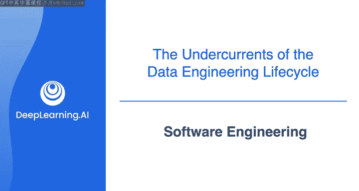
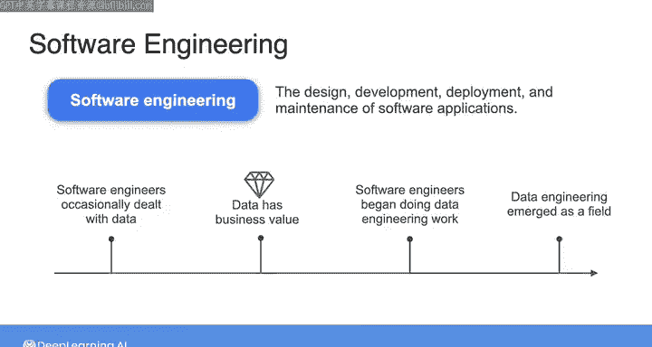
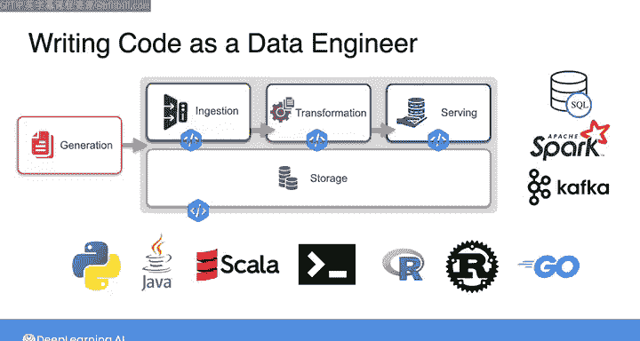
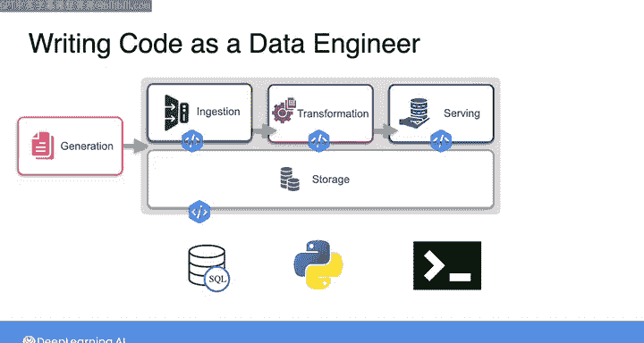
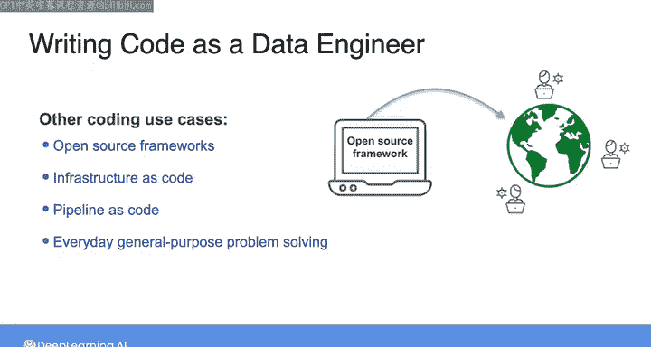

#  031：软件工程 👨‍💻

## 概述

在本节课中，我们将要学习数据工程生命周期中一个至关重要的“暗流”——软件工程。我们将探讨为什么编写代码是数据工程师的核心技能，以及如何编写高质量、可投入生产的代码。

---

在之前的课程中，我们讨论了数据工程生命周期中一些相当复杂的“暗流”，例如安全、数据架构、运营与管理，以及数据管道的编排。

在所有这些“暗流”中，或许最容易理解的是最后一个：软件工程。我的意思是，作为一名数据工程师，你需要知道如何阅读和编写代码。就这么简单。

但这不仅仅意味着临时拼凑一些能完成当前任务的代码，而是要编写生产级别的代码——这些代码应该是**干净、可读、可测试且可部署**的。

因此，软件工程是软件应用程序的**设计、开发、部署和维护**。

---

在不太遥远的过去，数据工程并非一个正式的职业。只有软件工程师偶尔会在工作中处理数据。随着企业逐渐认识到数据的价值，软件工程师开始承担数据工程的各个方面作为其工作的一部分。

近几十年来，数据的多样性和体量不断增长，软件工程中面向数据的部分变得愈发重要，并最终发展成为一个独立的领域。

多年来，那些从事数据工程的软件工程师构建了各种出色的解决方案。因此，如今作为一名数据工程师，你可以利用广泛的托管服务和应用程序，从而更高效地完成工作。

这是一件好事。它让你能将更多时间集中在为组织增加真正价值的最重要方面上。从某种意义上说，这些现有的服务和应用程序让你得以向价值链上游移动。

这也意味着，如今的数据工程师通常需要编写的代码量，远少于十到二十年前那些以软件工程为导向的前辈们。

然而，这并不意味着编码在数据工程师的工作中不重要。事实上，你能够编写出色的代码，并且所写代码质量上乘，这一点比以往任何时候都更加重要。

以下是数据工程师需要编写代码的几个关键场景：

*   **数据处理代码**：在数据工程生命周期的各个阶段，从摄取、转换到服务，你都需要编写核心的数据处理代码。
*   **框架与语言**：你需要精通诸如 **`SQL`**、**`Spark`** 或 **`Kafka`** 等框架和语言。你也可能会遇到 **`Python`**，或者像 **`Java`** 或 **`Scala`** 这样的Java虚拟机语言，以及用于命令行操作的 **`bash`**。
*   **其他语言**：你可能还需要使用其他语言，如 **`R`**、**`Ruby`** 或 **`Go`**。但如果你专注于建立扎实的基础软件工程技能，在不同语言间切换就不会有太大困难。

本专项课程在实验练习中将主要关注 **`SQL`**、**`Python`** 和 **`bash`**，因为这是你作为数据工程师与数据交互最常见的方式。

此外，作为一名数据工程师，你很可能会参与到开源框架的开发中。

这种情况通常是这样发生的：你采用一个开源框架来解决特定问题，并最终为了你的具体用例而进一步开发该框架。只要你编写了优秀的代码，就可以提交一个**拉取请求**，将你的贡献添加到开源项目中，以帮助其他人解决类似的问题。

你还会参与的其他工作包括开发所谓的“**基础设施即代码**”或“**管道即代码**”解决方案，我们将在后续课程中讨论。

除了这些特定的实例，在你作为数据工程师的角色中，你还需要在数据工程生命周期的所有阶段，为日常的通用问题解决编写代码。

因此，正如我在本视频开头所说，作为一名数据工程师，你需要知道如何阅读和编写代码。编码将是你日常工作的一部分，而你编写**干净、可读、可测试且可部署**代码的能力，将转化为你为组织创造的价值。

值得你花时间去与你组织中的软件工程师交朋友，并向他们学习如何编写出色的代码。

---

## 总结

本节课中，我们一起学习了数据工程生命周期中的“暗流”——软件工程。我们了解到，编码是数据工程师的核心技能，其目标不仅是让代码运行，更是要编写出**生产级别的高质量代码**。我们探讨了数据工程师需要掌握的关键语言和框架，以及参与开源项目和编写“即代码”解决方案的可能性。

至此，我们完成了关于数据工程生命周期“暗流”的课程。我相信你已经受够了所有这些理论内容，准备好卷起袖子，在一些实际练习中应用这些概念了。在下一节课中，请与我一起看看数据工程生命周期及其“暗流”如何在AWS云上变为现实。