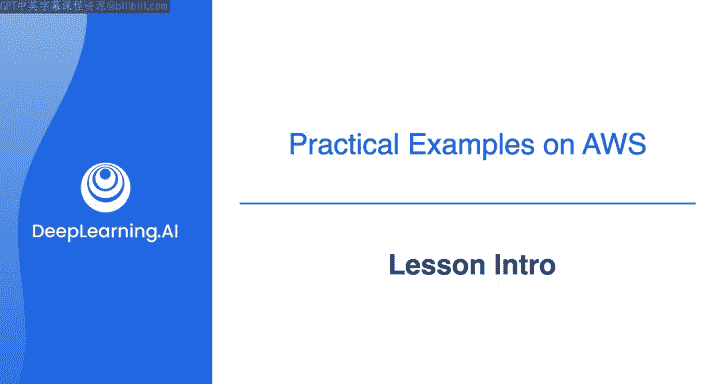

#  032：AWS云平台工具概览 🚀

在本节课中，我们将学习如何将数据工程生命周期和底层支撑概念，具体应用到AWS云平台的工具与技术中。我们将了解为何选择AWS作为学习平台，并预览后续实验中将接触到的核心工具。

---

现在您已经熟悉了数据工程生命周期及其底层支撑概念，是时候看看这些概念如何转化为AWS云平台上的具体工具和技术了。

首先需要说明，市场上存在其他云服务提供商，包括微软的Azure和谷歌云平台，以及其他一些规模较小的提供商。根据您作为数据工程师的工作环境，您可能会基于其中某个平台进行构建。

尽管如此，您在课程中学到的所有概念，无论您在哪一个云平台上构建，都是相关的。只是部分工具和实现细节可能会有所不同。目前，AWS是领先的云提供商，我们非常高兴能与他们合作开设这些课程。这样，您就能使用已被全球数千家公司采用的相同工具和技术，获得数据工程所需的技术技能。

在下一个视频中，Morgan Willis将向您介绍在本系列课程的实验环节中将会使用到的一些工具，并解释这些工具如何融入数据工程生命周期和底层支撑概念中。

之后，我将为您介绍本周实验练习的概况。

---

本节课中，我们一起学习了将数据工程理论映射到AWS云平台实践的背景与意义。我们了解到核心概念具有跨平台的通用性，同时认识到AWS作为行业领先平台的价值。接下来，我们将通过具体工具的学习和动手实验，进一步巩固这些知识。