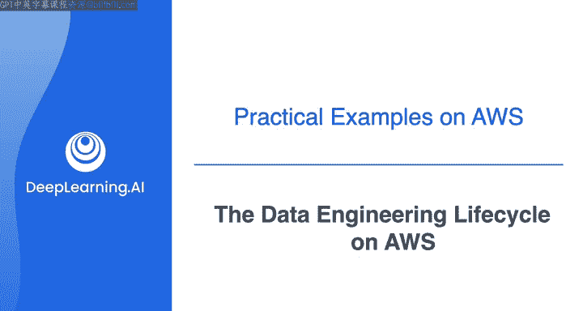
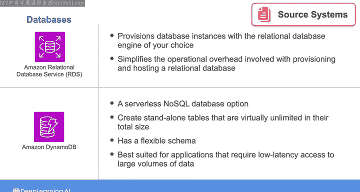
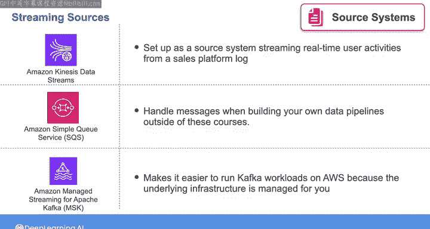
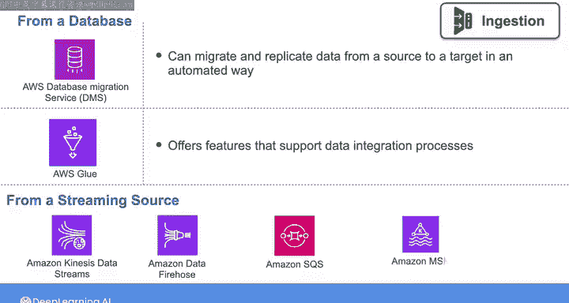
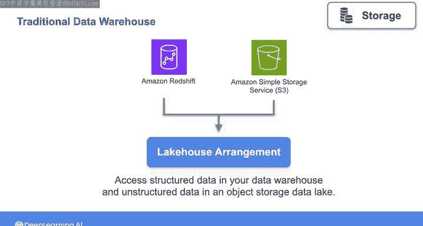
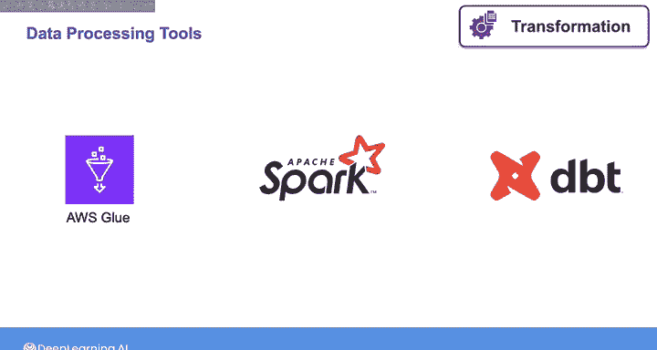
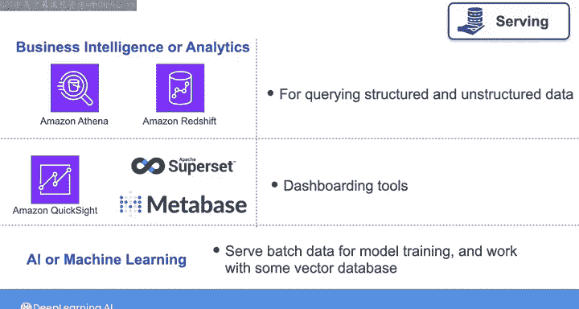

#  033：AWS上的数据工程生命周期 🚀

## 概述

在本节课中，我们将学习数据工程生命周期及其底层支撑概念在AWS云平台上的具体实现。我们将逐一探讨生命周期的各个阶段，并将其与AWS提供的特定工具和技术联系起来，帮助你理解如何利用这些工具构建实际的数据系统。

---

## 源系统

上一节我们介绍了数据工程生命周期的整体概念，本节中我们来看看在AWS上如何实现**源系统**。正如之前提到的，最常见的源系统是数据库。

以下是你在AWS上可能遇到的主要源系统类型：

*   **Amazon RDS (Relational Database Service)**：这是一项托管服务，可为你配置所选关系型数据库引擎（如MySQL或PostgreSQL）的实例。RDS简化了配置和托管关系型数据库的操作负担，并负责补丁和升级等任务。其核心是提供一个托管的数据库实例。
*   **Amazon DynamoDB**：这是一个无服务器的NoSQL数据库选项。使用DynamoDB时，你创建独立的表，这些表在总数据量上几乎没有限制。DynamoDB具有灵活的模式，非常适合需要低延迟访问海量数据的应用，例如游戏、移动应用和实时分析，其数据模型可以随时间演进，无需复杂的迁移。
*   **流式数据源**：
    *   **Amazon Kinesis Data Streams**：在本课程的最后一周，你将有机会使用它作为源系统，从一个销售平台博客流式传输实时用户活动数据。
    *   **Amazon SQS (Simple Queue Service)**：虽然在实验中没有使用，但在构建自己的数据管道时，你可能会使用SQS来处理消息。
    *   **Apache Kafka**：一个开源的流处理平台。你可以自行部署，或使用AWS的托管服务**Amazon MSK (Managed Streaming for Kafka)**，该服务为你管理底层基础设施，使在AWS上运行Kafka工作负载变得更加容易。

---

## 数据摄取

了解了数据来源后，接下来我们进入**数据摄取**阶段。这个阶段负责将数据从源系统移动到存储或处理系统。

以下是AWS上常用的数据摄取工具：

*   **AWS Database Migration Service (DMS)**：如果你需要从数据库摄取数据，可以使用DMS。它能够以自动化的方式将数据从源迁移或复制到目标。
*   **AWS Glue ETL**：在本课程的实验中，你将主要使用AWS Glue ETL服务。它提供了支持数据集成流程的功能。
*   **流式数据摄取**：在实验中，你将使用**Amazon Kinesis Data Streams**和**Amazon Kinesis Data Firehose**。在实际工作中，你也可以使用之前提到的其他流式摄取工具，如SQS或Kafka。

---

## 数据存储

数据被摄取后，需要存储在合适的地方。本节我们探讨AWS上的**数据存储**选项。

你将练习使用以下存储方案：

*   **传统数据仓库**：例如**Amazon Redshift**，适用于结构化数据的分析查询。
*   **对象存储（数据湖）**：主要是**Amazon S3 (Simple Storage Service)**。S3为数据湖提供了高扩展性、低成本的对象存储。
*   **湖仓一体 (Lakehouse)**：这是一种架构模式，可以结合使用上述服务，实现对数据仓库中的结构化数据和对象存储数据湖中的非结构化数据的无缝访问。

---

## 转换与处理

存储了原始数据后，通常需要对其进行**转换**，使其适合分析或机器学习使用。

在本课程中，你将使用以下工具进行数据转换：

*   **AWS Glue**：一个托管的ETL服务。
*   **Apache Spark**：一个强大的开源分布式计算框架。
*   **dbt (Data Build Tool)**：一个专注于数据转换层（在仓库内）的流行工具。

你可以根据需求，组合使用这些工具，或将其作为Glue的替代方案。

---

## 数据服务

数据经过转换后，最终需要被**服务**给最终用户或应用程序。这主要涉及两种用例。

以下是两种主要的数据服务场景及其对应工具：

1.  **商业智能与分析用例**：
    *   **查询工具**：使用**Amazon Athena**（无服务器交互式查询服务）或**Redshift**来查询结构化和非结构化数据。
    *   **仪表板**：你可能会使用**Amazon QuickSight**，或者开源的**Apache Superset**进行数据可视化。在本周的实验中，你将获得在Jupyter Notebook中操作仪表板的经验。

2.  **人工智能与机器学习用例**：
    *   为模型训练提供批量数据。
    *   使用一些**向量数据库**选项，为产品推荐系统提供数据，或与大型语言模型配合使用。

---

## 总结

本节课中，我们一起学习了数据工程生命周期在AWS平台上的具体映射。我们从**源系统**（如RDS、DynamoDB、Kinesis）开始，经历了**数据摄取**（DMS、Glue）、**数据存储**（Redshift、S3、湖仓一体）、**数据转换**（Glue、Spark、dbt），最后到**数据服务**（Athena、QuickSight、AI/ML工具）。重要的是要记住，生命周期的每个阶段都有众多开源和托管服务选项，这里提到的只是你将在本课程中实践的一部分，旨在帮助你将学到的概念与实际工具联系起来。