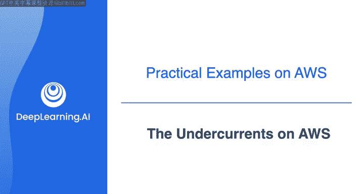
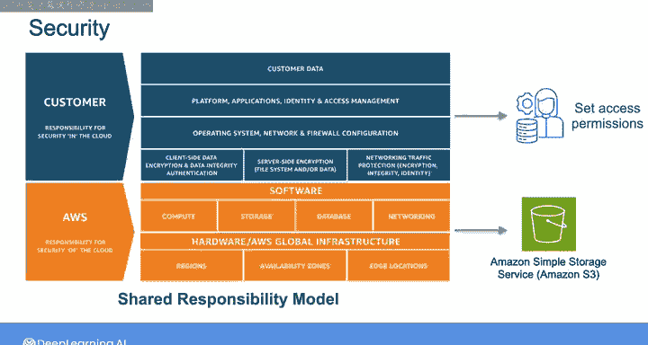
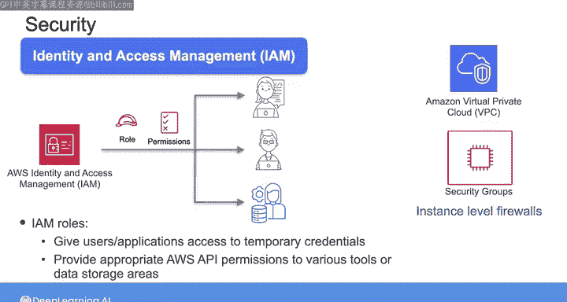
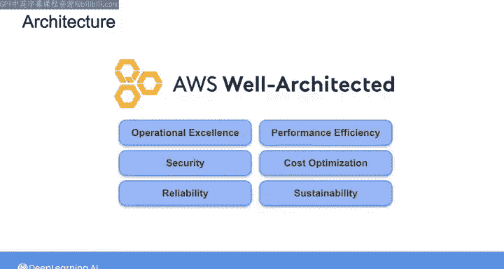
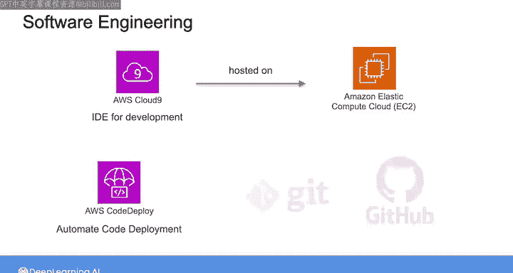

#  034：AWS上的底层技术 🛠️

在本节课中，我们将学习数据工程生命周期中的底层技术如何在AWS平台上具体体现。我们将探讨安全、数据管理、数据运维、编排、架构和软件工程等核心概念，并了解AWS提供的相关工具和服务。

---

## 安全 🔒

上一节我们介绍了数据工程生命周期的整体框架，本节中我们来看看安全这一底层技术在AWS上的具体表现。

安全在AWS工作中以多种形式出现。AWS采用**责任共担模型**：AWS负责其数据中心和所提供服务的安全，而您负责使用这些资源构建的系统的安全。

例如，如果您将数据存储在Amazon S3上，AWS的责任是确保S3服务本身的安全，而您的责任是正确设置访问权限，确保数据仅对授权的人员和应用程序可用。

以下是AWS安全的关键概念和工具：

*   **身份与访问管理**：通过IAM，您可以设置角色和权限，控制对AWS资源的访问，确保用户和服务能够安全地执行任务。在数据管道中，您将使用IAM角色，它为用户或应用程序提供自动轮换的临时凭证，并授予对各种工具或数据存储区域的适当AWS API权限。
*   **网络安全**：对于AWS上的安全至关重要。您需要熟悉以下服务和功能：
    *   **Amazon Virtual Private Cloud**：即VPC。
    *   **安全组**：这是实例级防火墙，是实施安全数据管道的另一个关键方面。

---

## 数据管理 📊

在安全之后，数据管理是另一个贯穿数据工程生命周期的关键底层技术。在AWS上，数据管理涉及数据的发现、编目和访问控制。

在这些课程中，您将使用以下AWS服务进行数据管理：

*   **AWS Glue爬网程序和Glue数据目录**：允许您发现、创建和管理存储在Amazon S3或其他存储和数据库系统中的数据的元数据。
*   **Lake Formation**：帮助您集中管理和扩展细粒度的数据访问权限。

所有这些也都与安全相关，但在此将它们列在数据管理下，因为它们专门涉及数据隐私和发现。

---

## 数据运维与编排 ⚙️

了解了数据的管理，接下来我们需要确保数据系统能够稳定、可靠地运行。这涉及到数据运维和编排。

在下一门课程中，您将使用名为**Amazon CloudWatch**的服务，它收集指标并为云资源、应用程序甚至本地资源提供监控功能。此外，还有**Amazon CloudWatch Logs**，可以帮助您存储和分析操作日志。

在课程2中，您还将使用**Amazon Simple Notification Service**，即SNS，它提供了一种在应用程序之间或通过短信/电子邮件设置通知的方法，这些通知由系统内的事件触发。

您在自己的工作中可能还会使用许多开源可观测性工具，例如Monte Carlo或BigEye。

对于编排，在这些课程中，您将使用**Airflow**。Airflow是一个编排工具，您可以将其作为开源工具实现，或使用AWS提供的托管版本。Airflow目前是行业标准，但您应该了解较新的编排工具，如Dagster、Prefect和Mage，它们旨在解决Airflow未设计处理的一些问题。

---

## 架构与软件工程 🏗️

在确保了系统的运行和流程的协调之后，我们需要从更高层面审视系统的结构和开发方式。这引出了架构和软件工程。

在架构方面，我们将在下周查看**AWS完善架构框架**。这是一套由AWS开发的原则和实践，可以帮助您构建系统时兼顾运营效率、安全性、可扩展性和可持续性。

在软件工程方面，在这些课程中，您将使用**Amazon Cloud9 IDE**进行开发。Cloud9托管在Amazon EC2上，因此该服务本质上是一个安装了IDE的虚拟机，您可以在浏览器中使用它。

在您自己的工作中，您可能还会使用诸如**Amazon CodeDeploy**之类的工具，它允许您自动化代码部署，以及各种CI/CD工具。您还将使用**Git和GitHub**处理版本控制。

---

## 总结 📝

本节课中，我们一起学习了数据工程生命周期底层技术在AWS平台上的具体体现。

我们探讨了**安全**的责任共担模型和关键服务（IAM、VPC），了解了**数据管理**的工具（Glue、Lake Formation），认识了**数据运维**的监控与通知服务（CloudWatch、SNS），介绍了**编排**的主流工具（Airflow）及其替代品，概述了**架构**的指导框架（AWS完善架构框架），并简要说明了**软件工程**的开发与部署工具（Cloud9、CodeDeploy、Git）。

接下来，Joe将带您完成第一个实时练习，您将在AWS上启动一个端到端的数据管道。