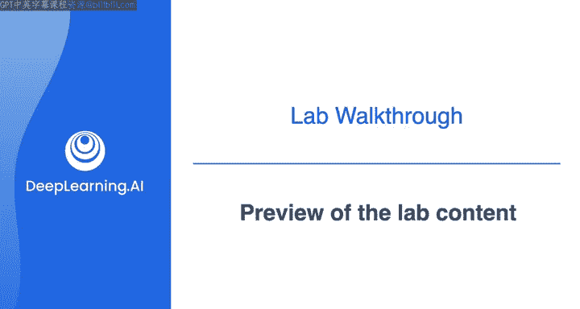
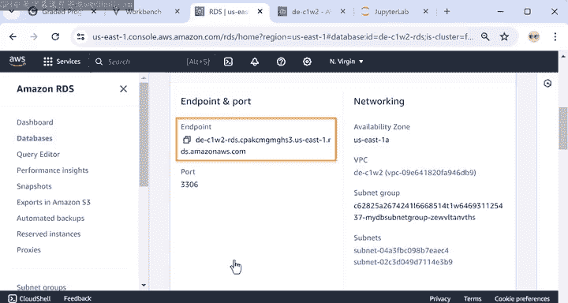
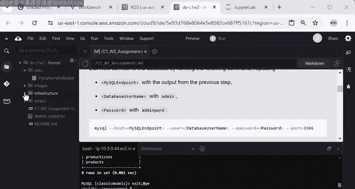
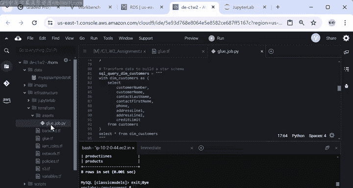
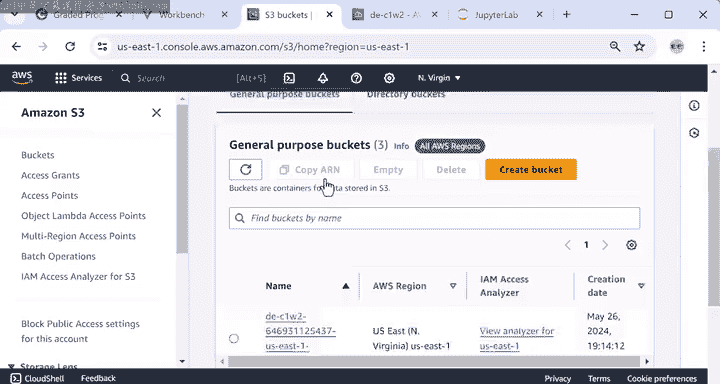
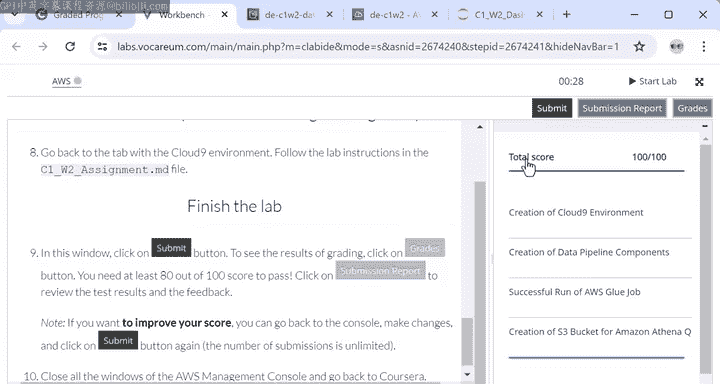

#  035：数据工程导论 第2周 实验演练预览 👀



在本节课中，我们将预览第2周实验的具体内容和操作步骤。你将了解如何探索已设置好的源数据库，如何使用Terraform创建数据管道资源（如AWS Glue和S3存储桶），如何运行数据转换作业，以及最终如何在Jupyter Notebook中查询和分析转换后的数据。

---

上一节我们介绍了实验环境的设置，本节中我们来看看实验的具体任务流程。

首先，实验的核心是探索一个已为你实例化的源数据库系统。该数据库是一个MySQL数据库，包含了名为`classicmodels`的示例数据。



以下是连接到并探索该数据库的步骤：

1.  在AWS控制台中搜索并进入RDS服务，点击左侧的“数据库”，即可查看源数据库实例的详细信息，包括访问所需的**端点（Endpoint）**。
2.  或者，在终端中运行命令 `aws rds describe-db-instances --db-instance-identifier <数据库标识符>` 来获取端点。
3.  使用MySQL客户端建立连接。命令格式为：
    ```bash
    mysql -h <数据库端点> -u admin -p
    ```
    密码是 `useradmin`，端口是 `3306`。
4.  连接成功后，使用 `use classicmodels;` 命令选择数据库。
5.  使用 `show tables;` 命令查看数据库中的所有表。

如果你好奇数据的来源和结构，可以在实验文件夹的 `data/` 目录下找到 `mysqlsampledatabase.sql` 文件，其中包含了创建并填充该数据库的所有SQL代码。

完成数据库探索后，输入 `exit` 命令退出连接。

---

上一节我们查看了源数据，本节中我们来看看如何构建数据处理管道。

实验使用Terraform代码来自动化创建AWS Glue实例和S3存储桶等资源。所有Terraform配置文件都位于 `terraform/` 目录下，文件扩展名为 `.tf`。

以下是主要的Terraform文件及其作用：

*   `glue.tf`：定义了AWS Glue数据目录、连接、爬网程序和ETL作业的配置。
*   `s3.tf`：定义了用于存储转换后数据的S3存储桶。
*   其他文件负责网络和权限设置，这些将在后续课程中详细学习。

在 `glue.tf` 文件中，关键的资源配置包括：
*   一个连接到RDS源数据库的Glue连接。
*   一个用于爬取S3数据的Glue爬网程序。
*   一个Glue作业，它指定了源系统连接、包含转换代码的脚本位置（位于 `infrastructure/terraform/assets/gluejob.py`）以及转换后数据的目标位置。



该Python脚本的核心任务是将规范化的源数据转换为更适合分析的**星型模式**，即事实表和维度表。

---

资源定义完成后，接下来需要在终端中运行Terraform来实际创建这些云资源。

以下是创建资源的步骤：

1.  导航到 `terraform` 目录。
2.  运行 `terraform init` 来初始化Terraform，安装必要的提供商插件。
3.  运行 `terraform plan` 来预览Terraform计划创建的资源列表。
4.  运行 `terraform apply` 并输入 `yes` 来确认执行，开始创建资源。



创建完成后，你可以在AWS控制台中搜索“AWS Glue”和“S3”来验证资源（如Glue作业和S3存储桶）是否已成功创建。

---

资源就绪后，便可以运行Glue作业来处理数据。

在终端中，按照实验说明复制并运行启动Glue作业的命令。作业启动后，你可以通过AWS控制台进入Glue服务的“ETL作业”部分，在“运行”选项卡中监控作业状态。通常需要等待几分钟，直到状态显示为“成功”。



作业成功后，转换后的数据便已写入指定的S3存储桶。你可以前往S3控制台查看存储桶内容，应该能看到包含各个转换后表（对应维度表和事实表）的文件夹。

---

最后，我们将使用数据分析师工具来查询这些处理好的数据。

实验环境已预先设置好Jupyter Lab。打开Jupyter Notebook，你会看到一个包含多个代码单元的Python笔记本。

以下是笔记本中的主要查询示例：

*   第一个单元导入`awswrangler`包，它允许使用Amazon Athena查询S3中的数据。
*   第二个单元包含一个SQL查询，用于从 `dm_products` 表中提取所有产品信息。
    ```sql
    SELECT * FROM dm_products;
    ```
*   后续单元包含更复杂的分析查询，例如按国家统计总销售额，或按国家、产品线、订单日期等多维度进行分组统计。

如果你对SQL还不熟悉，无需担心，后续课程将提供大量实践机会。如果你已掌握SQL，可以尝试完成单元中的可选查询问题或自行编写查询。

最后，你可以运行一个交互式仪表板来进一步探索数据。

---

完成实验所有步骤后，请务必返回实验设置说明页面点击“提交”。请注意，实验环境将在两小时后过期，请确保在时间结束前提交。



本节课中我们一起学习了第2周实验的完整流程：从探索源数据库开始，到使用Terraform创建数据管道资源，运行Glue作业进行数据转换，最后在Jupyter Notebook中对转换后的数据执行分析查询。现在，轮到你动手尝试了。请仔细遵循实验说明，如果遇到困难，可以随时回看本视频。完成实验后，我们将回到这里进行本周内容的总结。