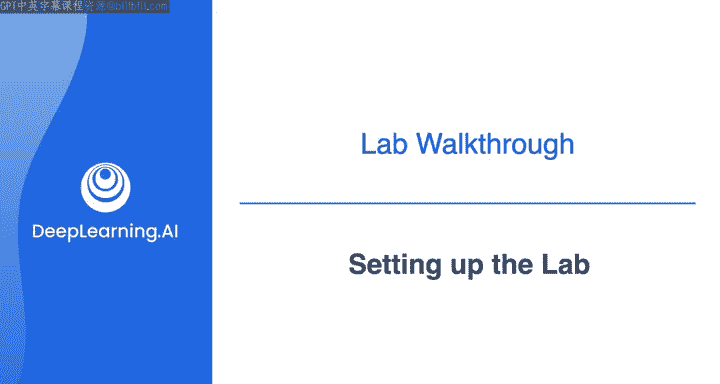
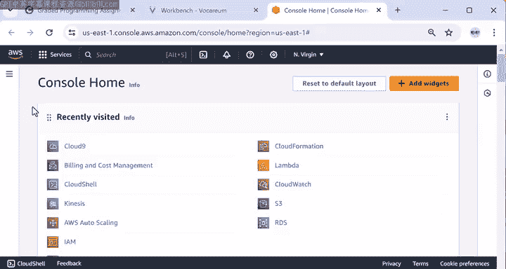
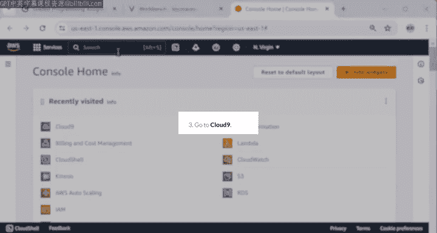
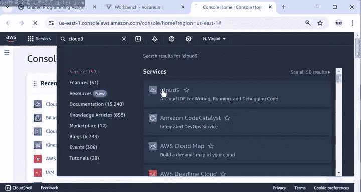
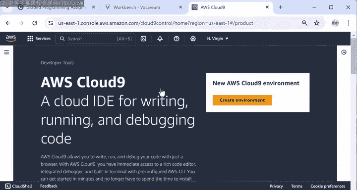
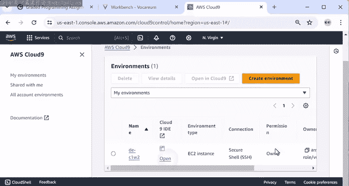
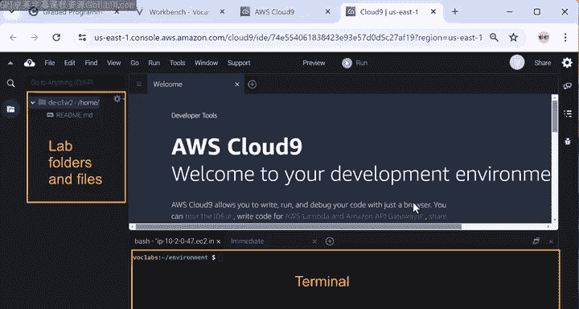
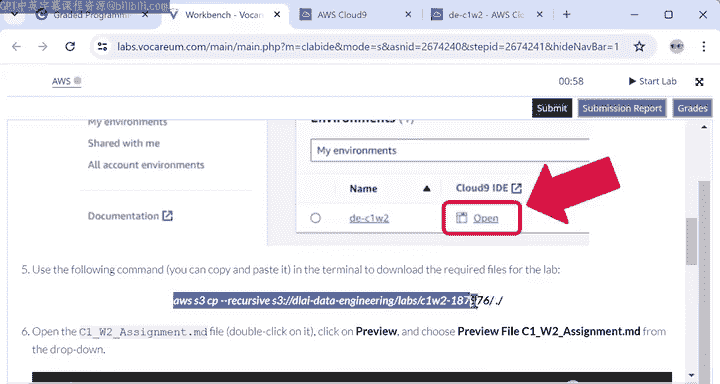
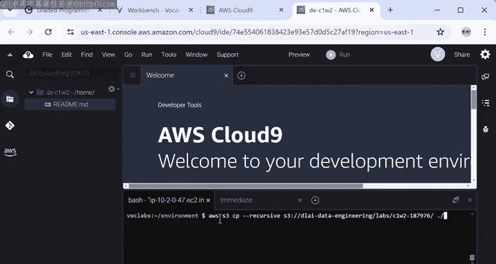
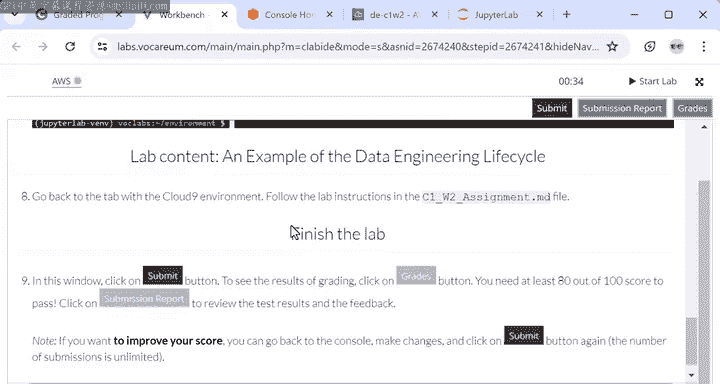

#  036：实验演练 - 设置实验环境 🛠️

在本节课中，我们将学习如何访问并设置第一个实验所需的实验说明和Jupyter Notebook环境。我们将逐步完成从启动实验到配置所有必要工具的完整流程。

---

## 概述

本节教程将指导你完成实验环境的初始设置。你将学习如何访问Coursera上的实验、启动AWS Cloud9集成开发环境、下载实验文件，以及安装运行实验所需的软件工具。

---

## 启动实验

首先，你需要在Coursera平台上找到本周的“graded app”实验。点击并启动该应用后，你将进入实验的欢迎页面。该页面包含了设置实验、启动Cloud9以及打开Jupyter Notebook的详细说明。

完成实验后，你需要返回此页面提交你的成果。

以下是启动实验的具体步骤：
1.  点击启动按钮，等待上方圆圈图标变为绿色，以打开AWS控制台。
2.  请注意，首次启动实验时，环境加载可能需要几秒钟。后续尝试可能需要大约10分钟，因为创建的AWS账户需要执行清理程序。

---

## 配置AWS Cloud9环境

上一节我们启动了实验，本节中我们来看看如何配置核心的编程环境。

当AWS控制台图标变为绿色后，点击它将在新的浏览器标签页中打开AWS控制台。接下来，你需要启动AWS Cloud9 IDE来获取实验代码和详细说明。

以下是配置Cloud9环境的步骤：
1.  在AWS控制台的搜索栏中输入 `cloud 9` 并选择该服务。
2.  进入新页面后，点击“Create Environment”按钮。
3.  按照实验说明第4步的细节进行配置：
    *   **环境名称**：`DEC C1W2`
    *   **EC2实例类型**：`T3 small`
    *   **网络设置**：选择“Secure Shell (SSH)”
    *   **VPC设置**：在下拉菜单中选择名为 `D C1W2` 的VPC和名为 `D C1W2 public subnet` 的公共子网。
4.  向下滚动并点击“Create”。AWS需要几分钟时间来设置环境。

**注意**：对于未来的实验，你可能需要选择其他EC2类型或不同的VPC设置。请务必仔细阅读设置说明，否则可能无法构建实验所需的Cloud9环境。

---

## 下载实验文件并查看说明

环境创建完成后，你可以打开IDE。在环境底部有一个终端，左侧应显示实验文件夹和文件。初始时，实验文件尚未下载。

以下是获取实验内容的步骤：
1.  返回实验设置说明页面。
2.  从第5步复制命令，并将其粘贴到Cloud9环境的终端中。
    *   该命令的格式类似于：`aws s3 cp s3://[bucket-name]/[lab-content] ./ --recursive`
3.  此命令会从为实验设置的S3存储桶下载实验内容。下载完成后，左侧将显示实验的文件夹和文件。
4.  要访问详细的实验说明，请按照设置说明的第6步操作：打开指定的Markdown文件（例如 `C1w2assignment.md`），点击“Preview”，然后从下拉菜单中选择“Preview File”。
5.  如果详细说明没有正确渲染，请点击刷新按钮。

---

## 安装必要软件

在开始实验主体部分之前，还需要执行一个设置步骤来安装Terraform并启动Jupyter Notebook。

以下是安装步骤：
1.  返回实验设置说明页面。
2.  从第7步复制命令，并将其粘贴到终端中。
    *   该命令包含一个Bash脚本，用于安装Terraform并通过JupyterLab启动Notebook。
3.  Terraform现在开始安装，JupyterLab的安装也可能需要几分钟。
4.  安装完成后，终端将输出一个JupyterLab的URL。复制此URL，并将其粘贴到一个新的浏览器标签页中，以访问JupyterLab环境。

---

## 理解实验工作区布局

至此，你已经设置了多个工作环境，理解它们各自的作用非常重要：

*   **Cloud9环境**：你将在此环境中设置和运行数据管道。
*   **AWS管理控制台**：你可以在此查看已创建的AWS资源的详细信息。
*   **JupyterLab环境**：你将在实验的最后部分使用此环境（位于另一个浏览器标签页中）。
*   **实验设置说明页面**：实验结束时，你需要返回此页面提交实验。

我知道这涉及很多标签页，一开始在它们之间来回切换可能会让人不知所措。但随着你在专项课程中的不断深入，这一切都会变得更加熟悉。

---

## 总结

本节课中，我们一起学习了如何为数据工程实验设置完整的工作环境。我们完成了从Coursera启动实验、在AWS上创建并配置Cloud9 IDE、下载实验文件、查看详细说明，到安装Terraform和JupyterLab的全过程。现在，你的实验环境已经准备就绪，可以开始构建和运行数据管道了。

在下一个视频中，我将引导你完成设置数据管道的后续步骤。