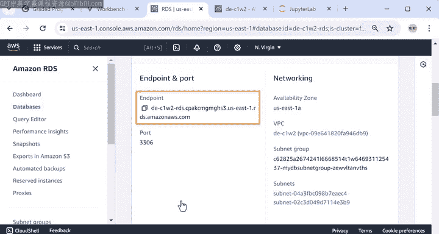
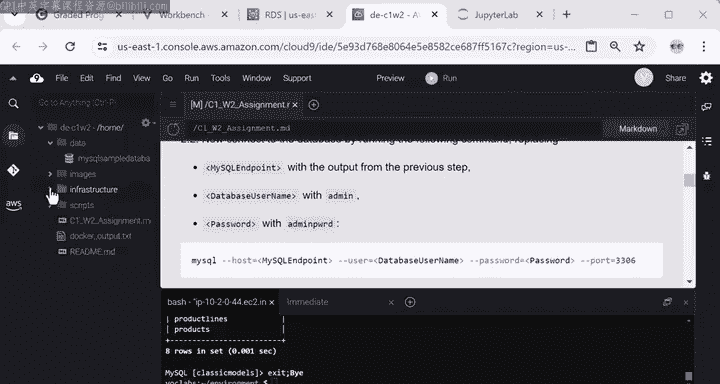
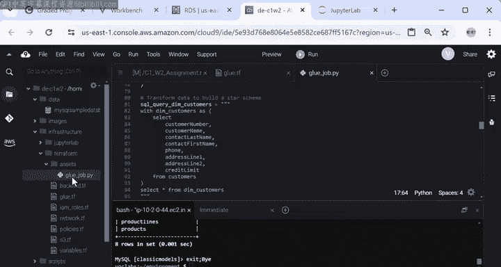
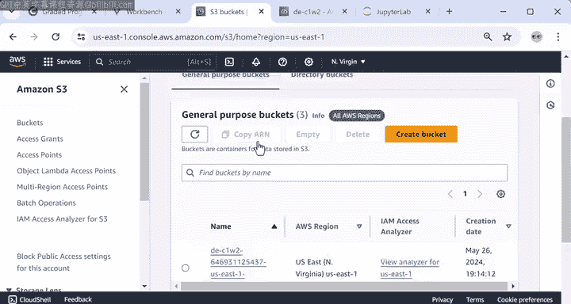

#  037：实验内容预览 🧪


在本节课中，我们将预览本周实验的具体内容和操作步骤。你将了解如何探索源数据库、使用Terraform创建数据管道资源、运行AWS Glue作业，以及最终在Jupyter环境中查询已转换的数据。

---

## 实验环境概览

上一节我们完成了实验环境的设置，最终得到了一个Cloud9环境。环境左侧的文件夹结构中包含了实验所需的所有文件。

你已经打开了名为 `C1_W2_assignment.md` 的文件，其中包含了实验练习的详细说明。这些说明顶部有介绍，你的工作将从第2节“探索源系统”开始。

## 探索源数据库系统



如前所述，源系统数据库已为你实例化。你可以在AWS控制台中查看此数据库的详细信息。

以下是查看数据库详情的步骤：
*   在AWS控制台搜索并选择“RDS”服务。
*   在左侧点击“数据库”。
*   这里列出了源数据库实例。点击标识符可查看所有详细信息，例如允许你访问数据库的**端点（URL）**、端口号以及其他网络信息（如RDS实例所在的VPC和子网）。


你还可以通过终端运行以下命令获取端点：
```bash
aws rds describe-db-instances --db-instance-identifier <你的数据库标识符>
```
你需要将 `<你的数据库标识符>` 部分替换为实际的数据库标识符。现在，你看到了与控制台中相同的端点。在查看其内容之前，你需要先建立到该数据库的连接。

由于这是一个MySQL数据库，你可以通过以下命令连接：
```bash
mysql -h <数据库端点> -u admin -p
```
系统将提示你输入密码（`useradmin`），端口是 `3306`。

连接建立后，你可以使用以下命令选择要探索的数据库：
```sql
USE classicmodels;
```
你可以通过以下命令查看数据库中的表：
```sql
SHOW TABLES;
```
如果你好奇，还可以通过进入 `data` 文件夹并打开名为 `mysqlsampledatabase.sql` 的文件，查看用于填充数据库的脚本。在这里，你可以看到数据来源的一些信息和版本历史。

向下滚动，你会找到一系列SQL代码。首先是创建数据库本身的语句，然后是一系列创建表并填充数据的命令。目前，你无需担心所有这些SQL代码，在下一门课程中你将有机会阅读、编写和解释SQL命令。

最后，要退出数据库连接并继续实验说明，请输入：
```sql
EXIT;
```

## 创建数据管道资源

接下来，让我们为数据管道创建资源，即AWS Glue实例和S3存储桶。为此，我们提供了包含创建和配置这些资源代码的Terraform文件。

如果你点击左侧的 `terraform` 文件夹，所有以 `.tf` 扩展名结尾的文件都是Terraform文件。例如：
*   `glue.tf` 文件包含AWS Glue实例的配置。
*   `s3.tf` 文件包含S3存储桶的配置。
*   其他Terraform文件包含网络和权限设置，你将在课程2中了解更多。

现在，我快速浏览一下 `glue.tf` 文件，向你展示其中声明的资源：
*   这里定义了AWS Glue数据目录，我们将建立AWS Glue与RDS源数据库之间的连接。
*   这是另一个定义Glue爬网程序的资源，它将用于爬取S3存储桶。
*   最后，这是Glue作业，我们在其中指定了与源系统的连接、包含转换代码的脚本位置以及转换后数据的目标位置。

你可以在 `assets` 文件夹下找到该脚本，它包含提取数据、转换数据并最终加载到S3的代码。我们将在课程4中进一步深入了解AWS Glue的细节。



如果你好奇，也可以通过打开 `infrastructure/terraform/assets` 文件夹中的Python脚本 `gluejob.py` 来查看将应用于数据的转换。但你不必担心脚本的具体细节，它所做的就是将所谓“规范化”形式的数据，建模为事实表和维度表的星型模式，以便于分析。这是数据分析用例中处理表格数据时非常常见的工程实践。

要为此管道实际创建资源，你需要在终端中运行Terraform文件。让我们导航到terraform目录并开始执行命令。

## 使用Terraform部署资源

以下是使用Terraform创建资源的步骤：
1.  首先运行 `terraform init`。此命令将安装创建AWS资源所需的任何文件。
2.  然后，你可以运行 `terraform plan` 命令，该命令会显示Terraform计划创建的资源列表。
3.  最后，运行 `terraform apply` 命令来创建资源。此时，你将再次看到计划，并需要确认你希望Terraform执行这些操作。输入 `yes` 并等待资源创建完成。



资源创建完成后，你可以通过AWS管理控制台查看它们。

## 验证资源与运行Glue作业


让我们进入控制台，在搜索栏中输入“AWS Glue”，点击该服务，然后在左侧点击“ETL作业”。在这里，你将看到刚刚创建的实例。

你也可以搜索S3存储桶。这里是将包含转换后数据的存储桶。



现在资源已创建，让我们运行Glue作业。我将从实验说明中复制命令，并将其粘贴到终端中以启动Glue作业。

要监控作业状态，请进入控制台并再次搜索“AWS Glue”，导航到ETL作业部分，然后点击作业名称。在“运行”选项卡中，你将看到作业状态，现在显示为“正在运行”。


你可能需要等待两到三分钟作业才能完成。可以刷新浏览器以查看最新状态。

一旦Glue作业完成且状态显示为“成功”，转换后的数据就应该在S3存储桶中了。让我们通过访问此S3存储桶的内容来验证一下。在这里，你可以找到包含转换后数据表的文件夹。

## 在Jupyter中查询数据

在实验的最后一部分，你将探索数据分析师如何在我们之前设置的Jupyter实验环境中查询数据集。我将点击Jupyter笔记本。

这是一个Python笔记本，其中包含对转换后的数据执行分析查询的单元格。在第一个单元格中，导入的 `awswrangler` 包允许你使用Amazon Athena从S3存储桶中提取数据。

以下是查询示例：
*   第一个查询语句从 `dm_products` 表中提取所有产品。
*   下一个单元格包含一个按国家/地区查找总销售额的查询。
*   随后的单元格包含一个查询，进一步按国家/地区、产品线、订单日期和产品名称对销售总额进行分组。

如果这些代码和SQL查询语句看起来不熟悉，请不要担心，你将在课程2和3中获得编写和解释查询的实践经验。如果你熟悉SQL，则可以尝试此单元格中的可选查询问题或任何其他你选择的查询。

最后，你可以运行此交互式仪表板以进一步探索数据。

## 完成实验与总结

完成本实验中的步骤后，请务必返回实验设置说明页面并点击“提交”。请注意，实验环境将在两小时后过期，因此请确保在时间用完之前提交。

现在你对本周实验要做什么有了更好的了解，轮到你来尝试了。请仔细按照实验说明操作，如果在任何环节遇到困难，可以随时重新观看这些视频。完成本实验后，我将在这里与你见面，进行本周内容的快速总结。


---


本节课中我们一起学习了本周实验的完整流程预览，包括：连接并探索源数据库、使用Terraform脚本自动化创建AWS Glue和S3资源、运行数据转换作业，以及最终在Jupyter笔记本中查询和分析结果数据。请按照步骤动手操作，以巩固对数据工程管道基础的理解。