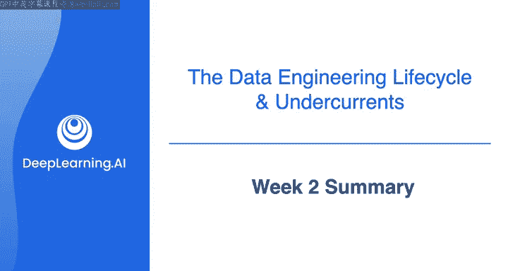
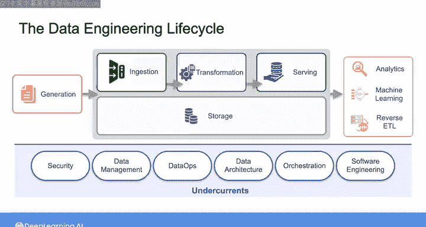

#  038：数据工程导论、源系统、数据摄取和管道、数据存储和查询｜第1-2-3课 🎯

## 第2周总结 📋

在本节课中，我们将对数据工程课程的第二周内容进行回顾与总结。我们将梳理本周所学的核心概念与框架，并展望后续的学习方向。

恭喜你完成了本课程第二周的学习。正如我在课程伊始所强调的，本周的重点更多地在于构建一个关于数据工程的高层次思维框架，而非实际搭建数据基础设施。不过，你确实有机会在AWS上探索了一个端到端的数据管道。

为了开始规划如何将这些理论付诸实践，我们本周构建的实践经验和思维框架，都将帮助你在数据工程师工作的各个方面取得更大的成功。

因此，本周你学习了数据工程生命周期及其基础支撑要素。这些内容涵盖了作为数据工程师，你如何从某处获取原始数据、将其转化为有用的内容，并最终提供给终端用户的各个方面。

以下是本周课程的主要内容回顾：

*   **第一课**：我们探讨了数据工程生命周期的每个阶段。从数据生成和存储系统开始，然后研究了针对分析、机器学习和反向ETL等多种使用场景的数据摄取、转换、服务和存储。
*   **第二课**：我们学习了数据工程生命周期的基础支撑要素。这些要素包括：安全、数据管理、数据运维、数据架构、编排和软件工程。

在接下来的课程中，你将看到关于数据工程生命周期及其基础支撑要素所有方面的更多细节，并获得更多实践机会。

接下来，我们将深入探讨构建良好数据架构的具体含义。我们将在那里再见。

---

本节课中，我们一起回顾了数据工程第二周的核心内容，包括数据工程生命周期及其基础支撑要素的宏观框架。我们明确了理论框架与实践探索相结合的重要性，并为深入理解数据架构做好了准备。