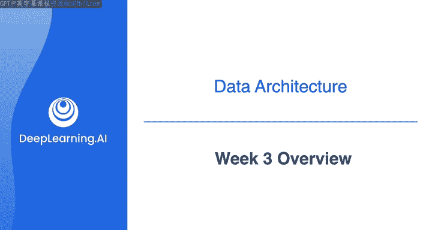
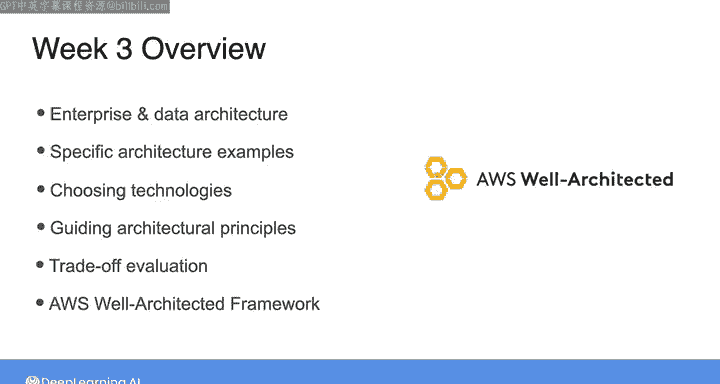

#  039：数据工程导论 第3周概览 🏗️

在本节课中，我们将深入学习如何构建优秀的数据架构。我们将探讨数据架构在企业整体架构中的位置，分析具体的架构案例，并学习如何将利益相关者的需求转化为数据系统的技术选择。课程最后，您将掌握一套在数据工程旅程各阶段都有用的工具。

---

上周，我们简要了解了数据架构，并探讨了如何在数据工程工作中，即使您的职位并非数据架构师，也能通过像架构师一样思考来获得成功。

本节中，我们将更深入地探讨构建良好数据架构的具体含义。

---

## 数据架构与企业架构 🏢

首先，我们将审视数据架构如何融入更广泛的企业架构背景中。企业架构指的是您整个组织的架构。

理解这一点有助于确保数据系统与组织的整体战略和目标保持一致。

---

## 从需求到技术选择 🔧

接下来，我们将查看一些具体的架构示例。我们将学习如何开始思考将利益相关者的需求，转化为数据系统的具体技术选择。

这个过程是数据架构设计的核心。

---

## 架构师思维指导原则 🧭

此外，我将与您分享一些指导原则。在您学习像架构师一样思考时，可以牢记这些原则。

这些原则是设计稳健系统的基础。

---

## 本周实验：评估权衡与探索框架 ⚖️

在本周的实验环节，您将有机会评估实际数据架构在成本、性能、可扩展性和安全性等方面的权衡。实验将基于AWS云上的一个实际架构。

您还将有机会探索 **AWS完善架构框架**。这是一套互补的指导原则，能帮助您设计出稳健高效的数据系统。

以下是实验将涉及的核心评估维度：
*   **成本**： 系统建设和运营的经济投入。
*   **性能**： 系统处理数据的速度和效率。
*   **可扩展性**： 系统应对数据量或用户量增长的能力。
*   **安全性**： 保护数据免受未授权访问和泄露的措施。

---

## 总结 📚

本节课中，我们一起学习了数据架构的核心概念及其在企业中的定位。我们探讨了如何将需求转化为技术方案，并介绍了关键的指导原则。通过本周的学习和实践，您将掌握一套工具，这套工具将在您数据工程旅程的各个阶段持续为您服务。

---

请与我一同进入下一个视频，开始深入学习。