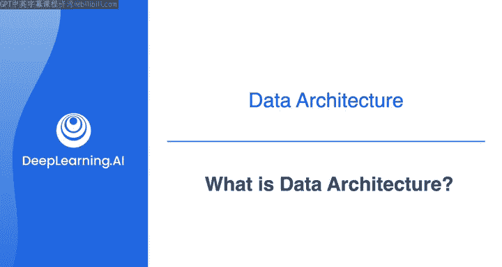
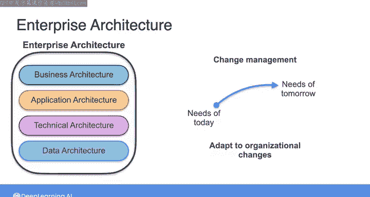
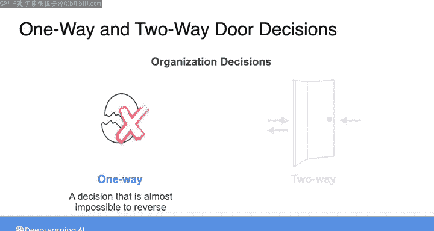
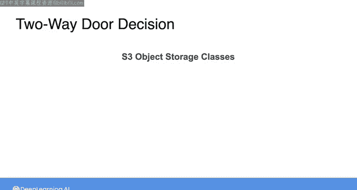
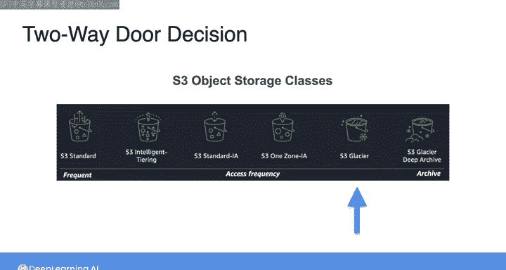
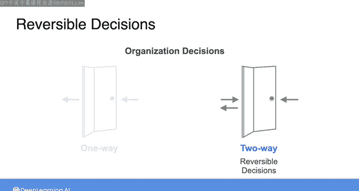
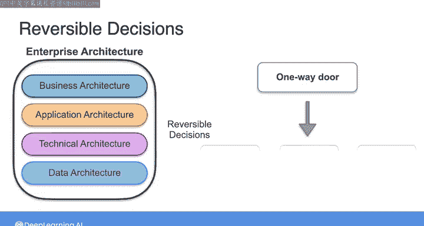

#  040：什么是数据架构 🏗️

在本节课中，我们将要学习数据架构的基本概念，了解它如何融入更广泛的企业架构范畴，并探讨架构决策的核心原则——灵活性与可逆性。

在深入探讨数据架构的细节之前，我们先退一步，看看数据架构如何融入一个更广泛的背景，即企业架构。企业架构的定义本身可能有些模糊和抽象，业界对此没有明确的共识，不同团体对其定义各不相同。

在《数据工程基础》一书中，我们采用了以下定义：**企业架构是通过仔细评估权衡后，做出灵活且可逆的决策，从而设计出支持企业变革的系统**。你可能会想，我们上周在数据架构的背景下是否已经见过类似的定义。

是的，你的想法正确。事实上，上周看到的数据架构定义是：**数据架构是通过仔细评估权衡后，做出灵活且可逆的决策，从而设计出支持企业不断演变的数据需求的系统**。

鉴于这两个定义的相似性，你可以看出数据架构与企业架构高度一致，并融入其背景中。实际上，企业架构包含多个领域，你可以将这些领域视为四个主要部分。

以下是企业架构包含的四个主要领域：

1.  **业务架构**：适用于企业的产品或服务战略及商业模式。
2.  **应用架构**：描述服务于业务需求的关键应用程序的结构与交互。
3.  **技术架构**：涉及支持业务系统和应用程序部署所需的软硬件技术组件。
4.  **数据架构**：正如你所见，它完全关乎支持企业不断演变的数据需求。

因此，你可以将数据架构视为企业架构的一个组成部分。这样，你就能开始理解，作为一名数据工程师，你的工作如何直接与组织的最高层目标和结构联系起来。

由于组织的结构可能随时间变化，这引出了另一个重要概念——变更管理，它正是企业和数据架构的核心。你可以预期组织的需求会不断演变，而你的数据架构需要适应这些变化。

亚马逊前首席执行官杰夫·贝佐斯提出了“单向门”与“双向门”的概念，适用于组织内所做的任何决策。单向门决策几乎无法逆转，门在你身后关闭并锁上，无法返回。

这个概念的一个简单例子可以这样理解：如果你打碎一个鸡蛋来烹饪，之后无法改变主意再将鸡蛋复原。因此，打碎鸡蛋是一个单向门决策。

就组织而言，例如，亚马逊本可以在某个时刻决定出售其AWS及所有云服务，或者直接关闭它。采取此类行动后，亚马逊几乎不可能重建一个具有相同市场地位的公共云。

另一方面，双向门是易于逆转的决策。你可以走过这扇门，如果喜欢所见，可以留下；如果不喜欢，可以走回来。

例如，在选择如何在S3这类对象存储系统中存储数据时，你可以根据性能、数据访问和成本需求，从一系列存储类别中进行选择。一个双向门决策的例子是：如果你选择将数据存储在S3的标准存储类别中，之后若存储需求发生变化，你可以付费过渡到任何其他存储类别。因此，这个决策是可逆的。

由于每个双向门决策的风险通常较低，组织可以更容易地做出更多此类可逆决策，快速迭代并改进其收集、使用和存储数据的方式。

灵活且可逆的决策制定是企业和数据架构的核心。在你的架构中尽可能追求双向门决策，你将能更好地应对组织面临的变革。

如果你发现自己面临看似单向门的决策，看看能否将其分解为一系列较小的决策，其中每个独立决策都是一个双向门。

因此，架构不仅仅是规划业务流程或数据流程，并模糊地展望遥远的乌托邦式未来。架构师需要积极解决业务问题并创造新机会。如果你在数据工程师的角色中像架构师一样思考，你构建的技术解决方案将不仅仅为了存在而存在，而是直接支持业务目标。

接下来，我们将探讨良好数据架构的原则。但在那之前，我想强调一个影响所有数据系统架构的非常有趣的现象——康威定律。下一个视频是可选内容，我不会就此对你进行测试，如果你想跳过，完全可以。但我觉得如果不在这些课程中至少提及康威定律，那就是我的失职，因为我敢保证，这将影响你构建的系统类型。

本节课中，我们一起学习了数据架构的定义及其在企业架构中的位置，理解了“单向门”与“双向门”决策的核心概念，并认识到灵活、可逆的决策对于构建能够适应变化的稳健数据架构至关重要。