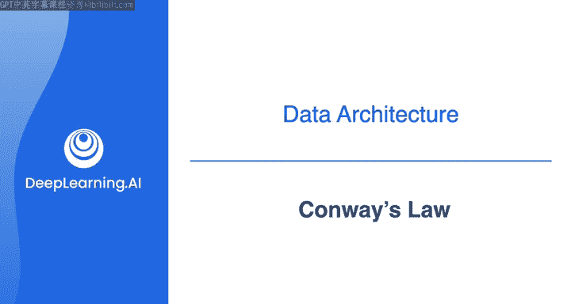
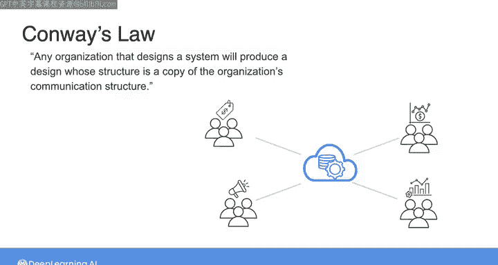

#  041：康威定律 🏛️

在本节课中，我们将学习一个对任何系统架构都至关重要的指导原则——康威定律。理解这一定律将帮助你分析组织沟通结构如何影响其数据系统的设计。

---

在之前的课程中，我们讨论了适用于不同场景的各种原则和架构模式。本节中，我们来看看一个普遍适用的、至关重要的指导原则。

这个原则被称为**康威定律**。其提出者梅尔文·康威对此的最佳描述是：**任何设计系统的组织，其产生的设计在结构上都是该组织沟通结构的副本**。

这听起来可能像是一个奇怪的断言，但它在实践中是这样运作的：

想象一家公司有四个不同的部门：销售、市场、财务和运营。

以下是这些部门可能的工作模式：
*   如果这些部门在相对孤立的“筒仓”中运作，他们的沟通模式也将是孤立和筒仓化的。
*   当涉及到构建数据架构和系统时，他们将不可避免地构建出相对孤立和筒仓化的系统。

换句话说，销售部门会开发一套数据系统，市场部门会构建另一套，财务部门是第三套，运营部门则是另一套系统。你应该明白了这个模式。

反之，如果同一组织中的这四个部门进行跨职能沟通、分享想法并在部门间协作，那么他们构建的数据系统将反映出这种跨职能协作与沟通的文化。

我意识到这可能听起来很奇怪，但尽管看似奇特，康威定律在所有类型的组织中都具有显著的一致性。

作为数据工程师，你需要记住的主要启示是：当需要理解哪种数据架构适合你的组织时，你首先需要关注并理解该组织的沟通结构。

甚至可以说，如果你试图构建一个与你公司沟通结构相冲突的数据架构，你注定会遇到麻烦。

如果你有兴趣了解更多关于康威定律的信息，我在本周结束时的资源部分提供了一个链接。

---

本节课中，我们一起学习了康威定律，它揭示了组织内部沟通结构与其所设计系统结构之间的深刻联系。理解这一定律是设计有效数据架构的第一步。

在下一个视频中，请与我一同深入探讨优秀数据架构的关键原则。