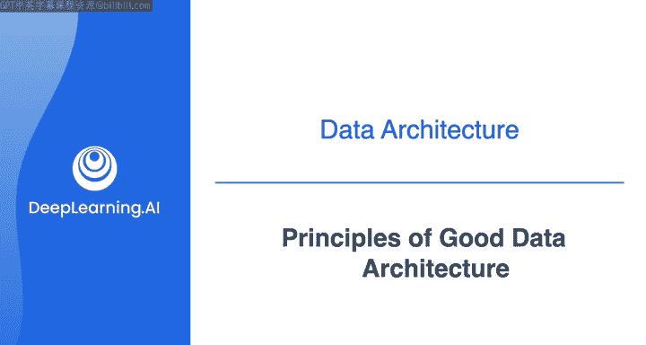
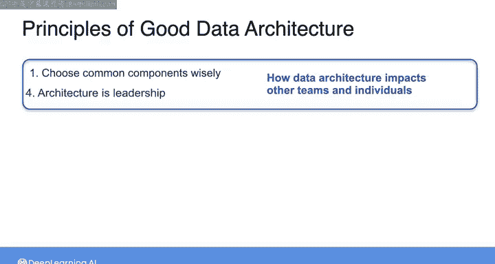
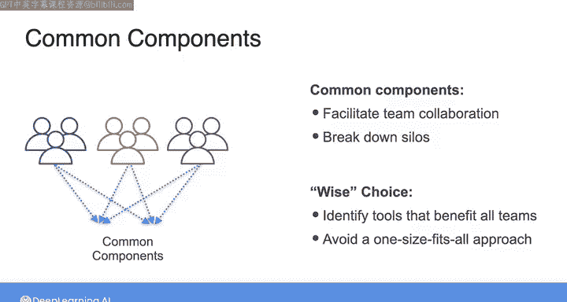
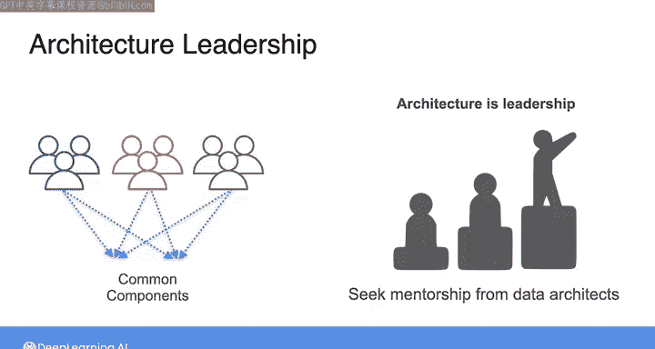

#  042：良好数据架构的原则 🏗️

在本节课中，我们将深入学习良好数据架构的九项核心原则。这些原则是构建高效、可靠数据系统的基础，我们将对其进行详细拆解，以帮助你理解如何在实践中应用它们。

上周我简要提到了在构建数据架构时需要牢记的九项原则。

为了帮助你回忆，这里再次列出它们。在本专项课程中，我们将反复回顾这些原则。本周的主题是数据架构，因此在深入探讨具体架构之前，我想花更多时间详细解释每一项原则。在某种意义上，这些原则彼此关联。

为了便于讨论，我将其分为三组。在我看来，第一组的两项原则共同点在于，它们都涉及数据架构如何影响组织内的其他团队和个人。第二组原则的核心观点是，数据架构是一个持续演进的过程，你的架构会随着时间发展而变化。第三组原则则像是一系列虽未明言但被普遍理解的优先事项，它们是任何数据架构的基础，即你需要为你构建的任何系统考虑成本、安全性、可扩展性和故障模式。

当然，你也可以用其他方式来组合或关联这些原则。

但在这里，我将按这三组进行讨论。在本视频中，我将讨论第一组原则，即关于数据架构如何影响组织内其他团队和个人的原则。在接下来的几个视频中，我们将探讨另外两组原则。

## 明智选择通用组件与架构即领导力 👥

以下是第一组原则：**明智选择通用组件**和**架构即领导力**。数据架构师的主要职责之一，以及作为数据工程师可能承担的部分工作，就是选择能在组织内广泛使用的通用组件和实践。通用组件可以是任何在组织内具有广泛适用性的东西。

这包括对象存储、版本控制系统、可观测性监控与编排系统以及数据处理引擎等。云平台是采用通用组件的理想场所。

例如，云数据系统中计算与存储的分离意味着，你可以通过一个共享的存储层为组织内的不同团队提供数据服务，允许用户根据其特定用例查询数据。当你明智地选择通用组件时，它们将成为组织架构的一部分，促进团队协作并打破数据孤岛。

这并不是说总会存在能为每个团队提供完美解决方案的通用组件。明智地选择通用组件意味着识别那些团队能从使用相同数据工具和实践中受益的用例，同时避免因盲目采用“一刀切”的方法而在数据系统中制造生产力障碍。

作为数据工程师，你可以通过与组织成员协商，识别正确的通用组件来实践架构领导力。随着你资历渐深、承担更多责任。

你可能会成为指导他人并为这些组件提供适当培训的人。正如我之前所说，作为数据工程师，我也建议你向组织内或其他地方的数据架构师寻求指导，因为最终你很可能会担任架构师的角色。

在下一节中，我们将探讨第二组原则，这些原则关乎如何在你的架构中构建灵活性。