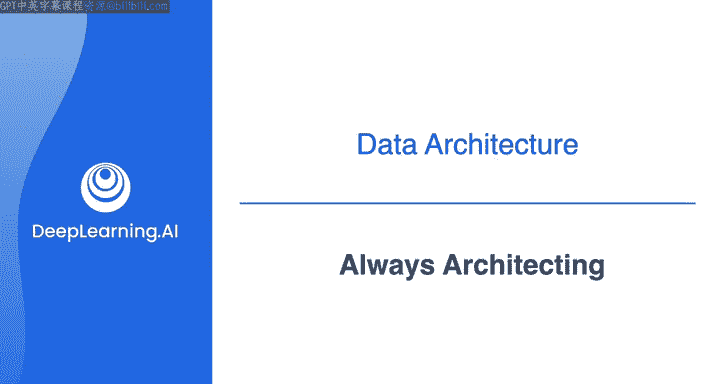
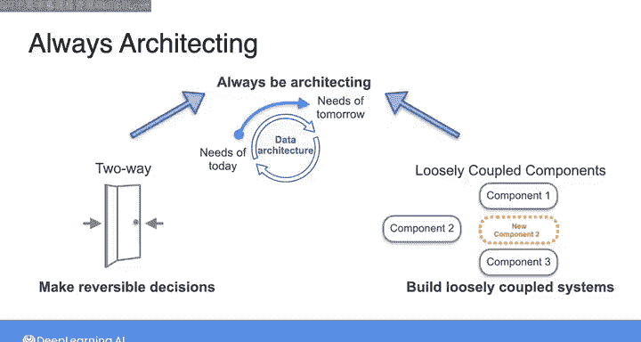

#  043：持续架构与API设计原则 🏗️

在本节课中，我们将学习数据架构中关于决策可逆性和系统设计的重要概念。我们将探讨“单向门”与“双向门”决策的区别，并深入了解亚马逊的“API强制令”如何塑造了现代松散耦合系统与云服务的基础。

---

在之前的视频中，我提到了“单向门”和“双向门”的概念。

“单向门”代表那些难以或无法逆转的决策，而“双向门”代表可逆的决策。

围绕可逆决策构建的系统允许你“持续进行架构设计”。我想提出来自亚马逊的另一个概念。

即所谓的“API强制令”，它源自杰夫·贝佐斯在2002年发给所有亚马逊员工的一封电子邮件。你可以通过本周课程末尾资源部分的链接阅读更多关于此强制令的细节。

但此强制令的要点是：所有团队必须使用服务接口（也称为应用程序编程接口或API）进行通信，并提供数据和功能。

该强制令最后，杰夫·贝佐斯表示，不遵守此规定的人将被解雇。由此可见他对亚马逊API概念的重视程度。

这意味着，无论任何特定团队在其自身系统中处理多么复杂的混乱情况，他们都必须向其他团队提供任何数据、功能和通信。

**一个稳定且可预测的服务接口**。

这使得亚马逊的各个团队能够作为一个松散耦合的系统协同工作，各个团队通过这些服务接口相互连接，并且任何团队内部的重组或工具更换都不会影响其他团队。

API强制令的另一部分是，所有这些服务接口或API都必须从一开始就设计为最终能够对外部世界的开发者公开。

这种向服务接口的重新定位，为最终成为亚马逊网络服务（AWS）奠定了基础，而AWS如今已被世界广泛用作云平台。

因此，在接下来的这组原则中，我们要**做出可逆的决策**。

**构建松散耦合的系统**，并**持续进行架构设计**。

正如你已经知道的，那些可逆的决策就是你的“双向门”。如果你不喜欢结果，可以轻松撤销的决策。

确保你的决策可逆的一个关键方法是，用松散耦合的组件构建你的数据系统。

在架构的语境中，所谓“松散耦合”，我指的是那些可以相对容易地替换，而无需重新设计整个系统的组件。

当一个系统由松散耦合的组件和可逆的决策构建而成时，你将始终拥有“持续进行架构设计”的能力。

正如我们已经谈到的，数据架构需要支持组织不断发展的数据需求。

这意味着数据架构本身也必须能够演进。

作为一名数据工程师，你的工作不仅是构建满足组织当前数据需求的系统，还要着眼于未来，以便能够不断适应业务需求的变化。

以及可用技术的变化。

在下一个视频中，请与我一起探讨最后一组原则。

重点关注在理解你所构建系统的成本、安全性、可扩展性和故障模式时的最佳实践。

---

本节课中，我们一起学习了数据架构中的关键设计原则。我们理解了“可逆决策”（双向门）的重要性，以及如何通过构建“松散耦合”的组件系统（例如通过定义良好的API）来实现这一点。这种以服务接口为中心、支持持续演进的设计思想，不仅是现代云平台（如AWS）的基石，也是每一位数据工程师构建灵活、健壮且面向未来的数据系统时应遵循的核心准则。