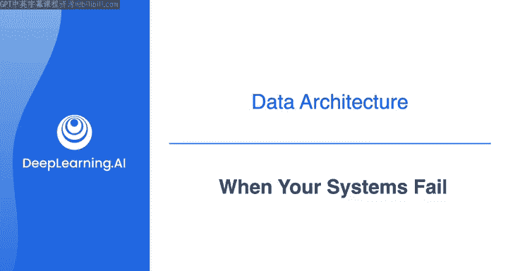
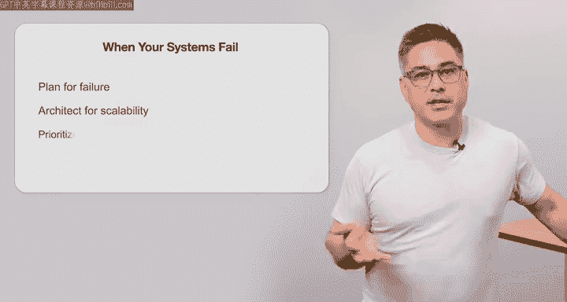
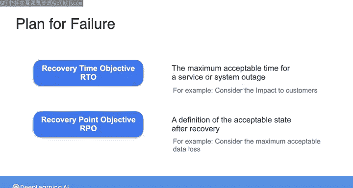
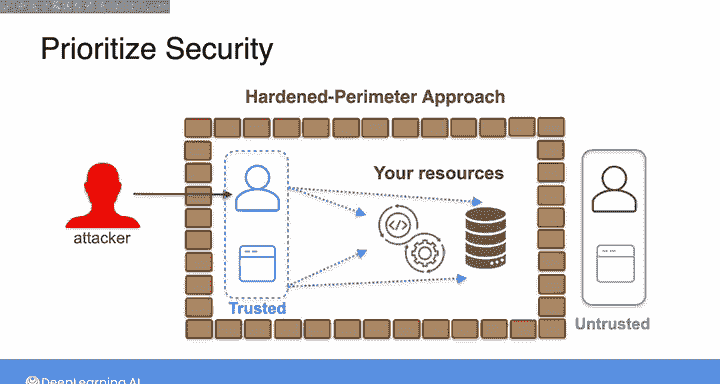
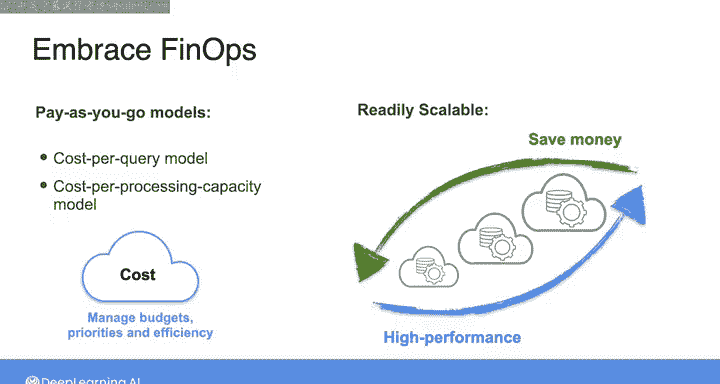
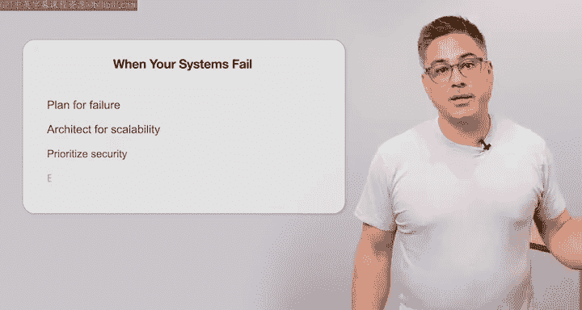

#  044：系统故障应对 🛡️

在本节课中，我们将学习如何为数据系统可能出现的故障做好准备。我们将探讨几个关键原则：为故障做计划、为可扩展性设计架构、优先考虑安全性以及拥抱FinOps（财务运营）。理解这些概念将帮助你构建不仅功能强大，而且在面对意外时依然稳健的系统。

除了构建满足利益相关者需求、打破团队间壁垒并能随组织需求变化而演进的数据系统外，如果这还不够，你还需要预见当事情出错时会发生什么。请相信，事情总会出错。在接下来的这组原则中，我计划为故障做好准备：为可扩展性设计架构、优先考虑安全性以及拥抱FinOps。

## 量化评估系统故障模式 📊

上一节我们介绍了为故障做计划的总体原则，本节中我们来看看如何具体量化评估系统的故障模式。

对于系统中的故障模式，最好采取务实和量化的方法，就像你对待系统性能的任何其他方面一样。因此，我们现在需要更明确地定义描述系统指标术语的含义，例如数据系统的可用性、可靠性和持久性。

以下是几个核心系统指标的定义：

*   **可用性**：通常称为正常运行时间，是指服务或组件预期处于可操作状态的时间百分比。例如，查看Amazon S3对象存储的不同存储类别，你会发现它们的年可用性范围从99.5%到99.99%。99.5%和99.99%听起来都是高可用性，甚至数字很相似，但请记住，99.5%的年可用性意味着你的存储系统每年预计会有大约44小时不可用，而99.99%的可用性意味着每年预计只有大约1小时的停机时间。不幸的是，100%的可用性永远无法保证，因为故障场景可能包括意外的停电或网络设备故障。但根据系统的需求，你可以选择具有所需可用性的存储类别。
*   **可靠性**：与可用性类似，但它是指在明确定义的性能标准内，特定服务或组件在给定时间间隔内执行其预期功能的概率。
*   **持久性**：指存储系统承受因硬件故障、软件错误或自然灾害导致数据丢失的能力。在云环境中，持久性至关重要，因为企业依赖云服务来存储和访问关键数据。例如，Amazon S3宣称具有极高的持久性，达到99.999999999%（11个9），这意味着Amazon S3中对象丢失的情况极为罕见。

与可用性、可靠性和持久性相关的概念还有恢复时间目标（RTO）和恢复点目标（RPO）。

*   **恢复时间目标**：是你的服务或系统中断可接受的最长时间。为你的应用程序建立RTO时，你需要考虑该应用程序不可用对内部和外部客户的影响，然后你可以据此选择满足此目标的S3存储类别。
*   **恢复点目标**：定义了恢复后可接受的状态。例如，对于数据存储系统，RPO可能指你的系统可以容忍的最大可接受数据丢失。

为你构建的系统明确制定RTO和RPO，将帮助你选择具有适当可用性、可靠性和持久性规格的组件来满足需求。这是“为故障做计划”的一个方面。

## 安全漏洞与零信任模型 🔐

你的系统可能失败的另一种方式是通过安全漏洞。这就是为什么“为故障做计划”的原则与“优先考虑安全性”的原则是齐头并进的。我们已经讨论过培养安全文化和最小权限原则。

这里我还想介绍所谓的**零信任安全**。要理解零信任的核心，先看看你可能称之为更传统安全方法的东西会很有用，即**强化边界安全**。采取强化边界方法相当于在你的系统周围建造一堵高墙，墙外的所有人和事物都是不受信任的，而墙内的所有人和事物在访问敏感数据和系统方面都是受信任的。强化边界方法的问题在于，攻击者只需突破这堵墙，就能获得对你所有数据和系统的无限制访问。在云时代，构建强化边界还有一个额外问题，即数据与系统通过互联网连接，实际上并不存在物理边界。相比之下，**零信任**意味着每个操作都需要身份验证。

你构建系统的方式应确保没有任何人或应用程序（无论是内部还是外部）被默认信任，相反，访问权限仅在需要时才被授予。

## 成本失控与可扩展性失败 💸

当发生诸如产生不可预见的高额成本或错失收入机会等情况时，你的系统也可能失败。

例如，在不可预见的成本方面，我指的是意外运行昂贵的云服务，导致你整个年度的预算在一个月或更短时间内被消耗殆尽。信不信由你，我见过很多这种情况发生。相反，错失的机会可能是你的产品需求突然激增，而你的整个系统因为未能做好快速扩展的准备而崩溃。因此，从这个意义上说，“拥抱FinOps”和“为可扩展性设计架构”的原则与“为故障做计划”的原则是相连的。

作为数据工程师，你需要考虑云系统的成本结构。例如，在运行分布式集群时，AWS按需EC2实例与Spot实例（顺便说一下，Spot实例是AWS上以大幅折扣提供的闲置EC2实例）的适当混合比例是什么？在成本效益和性能方面，运行一个规模可观的日常作业最合适的方法是什么？在云时代，大多数数据系统都是按需付费且易于扩展的，系统可以按查询成本模型、处理能力成本模型或其他按需付费模型的变体运行。现在可以为了高性能而扩展，然后为了省钱而缩减。然而，按需付费的方法使得支出更加动态，因此数据工程师面临的新挑战是在构建和维护系统时管理预算、优先级和效率。

## 课程总结 📝

本节课中我们一起学习了为数据系统故障做准备的几个核心原则。主要要点是，如果你**为故障做计划**、**为可扩展性设计架构**、**优先考虑安全性**并**拥抱FinOps**，你将能更好地满足组织的需求，不仅在你构建的系统按预期运行时如此，在故障发生时也是如此。

接下来，我们将深入探讨针对不同类型数据系统的一些具体架构方法的细节。请在下一个视频中与我一起仔细了解批处理架构。