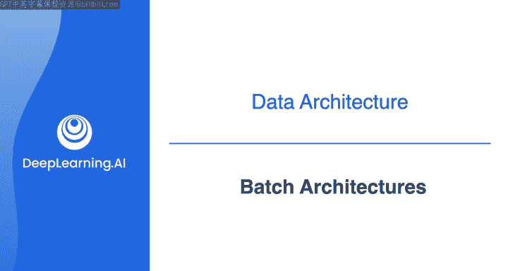
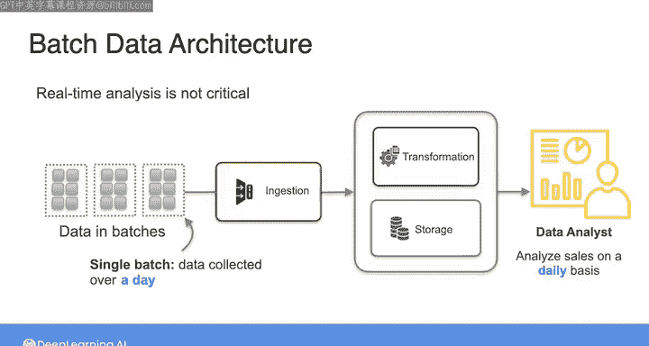
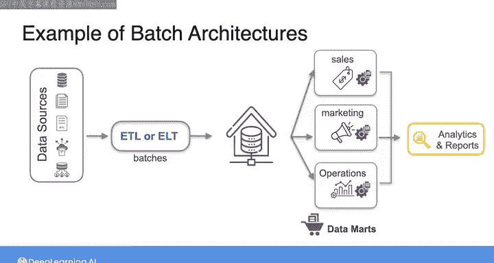
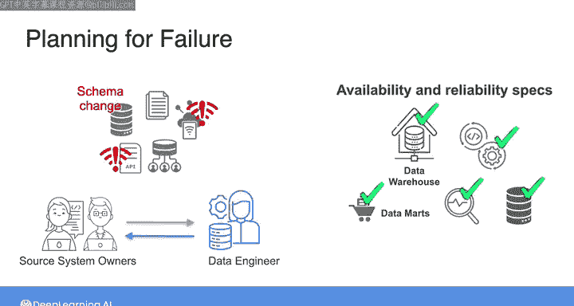
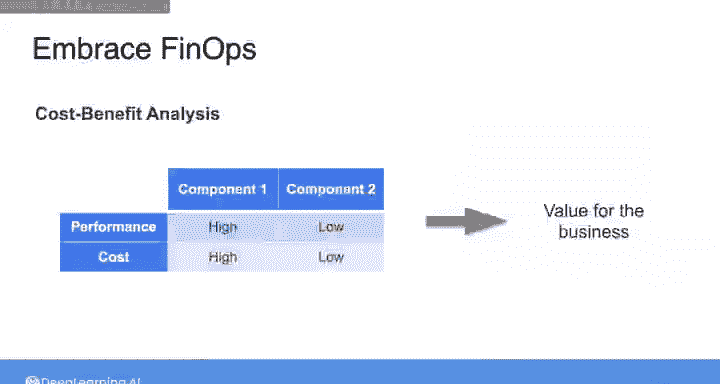

#  045：批处理架构 🏗️

在本节课中，我们将深入学习批处理架构。这是数据处理的一种传统方法，涉及以批次或块的形式进行数据摄取、转换和存储。我们将探讨其核心概念、常见模式以及设计时需要考虑的关键原则。

---

上周我们简要介绍了数据摄取背景下的批处理与流处理概念。现在，我们将聚焦于这些概念如何体现在一些成熟的数据工程架构模式中。

本节的目标是让你思考不同架构选择所带来的权衡与影响。

在本视频中，我们将详细审视批处理架构。在下一个视频中，我们将探讨流处理架构。

## 什么是批处理架构？📦

批处理架构是数据处理的传统方法。在这种架构中，你以批次或数据块的形式进行数据摄取、转换和存储。

当实时分析并非关键需求时，批处理最为实用。通常，一个数据批次包含在某个固定时间段内收集的数据，例如一天。

例如，在一家电子商务公司，数据分析师可能希望按日分析特定产品的销售历史。因此，你可以建立一个批处理架构，每天一次性地摄取和处理这些数据。

## 典型批处理流程：ETL与ELT 🔄

那么，这可能是什么样子呢？这可能是所谓的**提取-转换-加载**或**ETL**管道的开端。

以下是其基本步骤：

1.  首先，从一个或多个数据源**提取**数据批次，可能存入一个暂存区。
2.  然后，应用一些**转换**来清理、标准化和建模数据。
3.  最后，将数据**加载**到数据仓库中进行存储和提供服务。

这个模式还有一个变体，称为**提取-加载-转换**或**ELT**。

在ELT中，思路是在摄取数据后，先将其**加载**到数据仓库中，然后直接在数据仓库内部执行**转换**。

鉴于许多现代云数据仓库和其他存储抽象层计算能力的扩展，这种ELT架构或模式如今正变得越来越流行。

## 下游用例与数据服务 🎯

接下来，无论你使用ETL还是ELT架构，你都需要为下游用例提供数据服务，这些用例通常体现在数据仓库的右侧。

这些用例通常是分析或机器学习。但正如我之前提到的，另一种可能性是你的最终用例是所谓的**反向ETL**，即执行一些分析，然后将处理后的数据实际发送回数据管道起点的源系统。

你还可以在数据仓库和最终用例之间添加一个额外的层，称为**数据集市**。

数据集市是数据仓库的一个更精细的子集，专注于特定的部门、职能或业务领域。它旨在服务于分析和报告。

例如，你可以有一个专注于销售的数据集市，另一个用于市场营销，还有一个用于运营。这种设置可以使分析师和需要创建报告的人员更容易地访问数据。

通过数据集市，你还可以在初始ETL或ELT管道提供的转换之外，提供额外的转换阶段。这些额外的转换可能包括表之间的额外连接或聚合，有助于提高实时查询的性能。

## 设计批处理架构的考量 🤔

以上是一些典型的批处理架构示例。

如果你正在为你的组织建立这样的架构，那么根据良好数据架构的原则，有许多事情需要考虑。

以下是几个关键考量点：

*   **协作与互操作性**：如果你为不同的团队或部门服务多个最终用例，你如何为数据仓库和数据管道选择通用组件，以促进团队间的协作和互操作性？
*   **故障规划**：在规划容错时，你需要思考如果源系统离线或上游数据模式发生变化会发生什么。与源系统所有者建立联系是构建能够处理源变更的系统的良好第一步。
*   **组件可靠性**：你需要查看管道中每个组件的可用性和可靠性规格。
*   **系统灵活性**：你需要弄清楚如何构建系统的灵活性。例如，如果你决定稍后更改摄取频率，或者你预计每批数据的量会随时间发生巨大变化。
*   **成本效益分析**：为了拥抱灵活性，你还需要进行一些成本效益分析，以了解在系统不同组件的性能方面可能需要考虑哪些权衡，以及在不同场景下你能为业务提供何种价值。

我们将在整个课程中牢记这些原则。请记住，在构建数据系统时，你选择的技术总会带来一系列风险，同时也带来能为组织增加价值的机会。

---

## 总结 📝

本节课中，我们一起学习了批处理架构。我们了解到批处理是一种按固定周期处理数据块的传统方法，适用于非实时分析场景。我们探讨了其核心流程，包括**ETL**和**ELT**两种主要模式，并介绍了数据仓库、数据集市和反向ETL等下游服务概念。最后，我们讨论了设计批处理架构时需要权衡的关键原则，如协作性、可靠性、灵活性和成本效益。

接下来，我们将看看一些常见的流处理架构。下个视频见。

